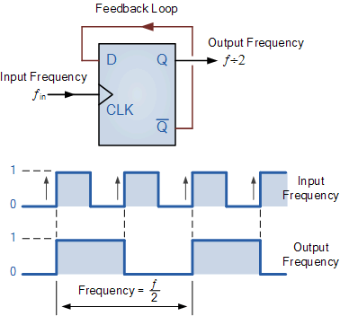

# Lecture 15, Oct 13, 2022

## Clock Dividers (Prescalers)

* How do we generate a different clock frequency from what's given?

{width=30%}

* Example: Given a $100\si{MHz}$ clock, derive a circuit using D-flip flops to generate $50\si{MHz}$ and $25\si{MHz}$ clocks
	* The $50\si{MHz}$ clock can be made by tying the input clock into the clock of a T-flip flop
	* The $25\si{MHz}$ clock can be made by putting the $50\si{MHz}$ clock into the clock of a T-flip flop
	* This method is restricted to clock divisions by powers of two
* More generally we can use a counter in order to divide by any factor
	* A NOR gate over all the counter bits can be used as a comparator to check for 0
	* The comparator output can be ANDed together with some signal so the signal only passes through when the counter reaches the desired value

## Finite State Machines (FSM)

* Any sequential circuit can be modelled by some set of inputs $w_i$ \textrightarrow combinational circuit $A$ \textrightarrow set of flip flops \textrightarrow combinational circuit $B$ \textrightarrow output
* A finite state machine is so named because a circuit with $k$ registers (flip flops) can only be in one of a finite number of states ($2^k$ states)

### Example FSM

* Motor outputs its status on $w$
* If status is ok, the FSM should maintain $z = 0$
* If motor outputs a sequence of $1, 0, 1$ then an error is occurred, so the FSM should output $z = 1$
* $z$ is determined by the history of $w$
* First we need a state diagram:

{width=70%}

* From this state diagram we can make a state table:

| State | Next $w = 0$ | Next $w = 1$ | $z$ |
|-------|--------------|--------------|-----|
| $A$   | $A$          | $B$          | 0   |
| $B$   | $C$          | $B$          | 0   |
| $C$   | $A$          | $D$          | 0   |
| $D$   | $C$          | $B$          | 1   |

* Now we need to assign states
	* There are 4 states, so we need 2 flip-flops $y_2, y_1$
	* Choose state codes: $A = 00, B = 01, C = 10, D = 11$
* Now make the state-assigned table:

| $y_2y_1$ | $Y_2Y_1$ for $w = 0$ | $Y_2Y_1$ for $w = 1$ | $z$ |
|----------|----------------------|----------------------|-----|
| 00       | 00                   | 01                   | 0   |
| 01       | 10                   | 01                   | 0   |
| 10       | 00                   | 11                   | 0   |
| 11       | 10                   | 01                   | 1   |

* Now we basically have a truth table, we can synthesize the circuit:
	* $Y_1 = w$
	* $Y_2 = \bar wy_1 + wy_2\bar y_1$ (can be found through a 3-variable K-map with $w, y_1, y_2$)
	* $z = y_2y_1$

