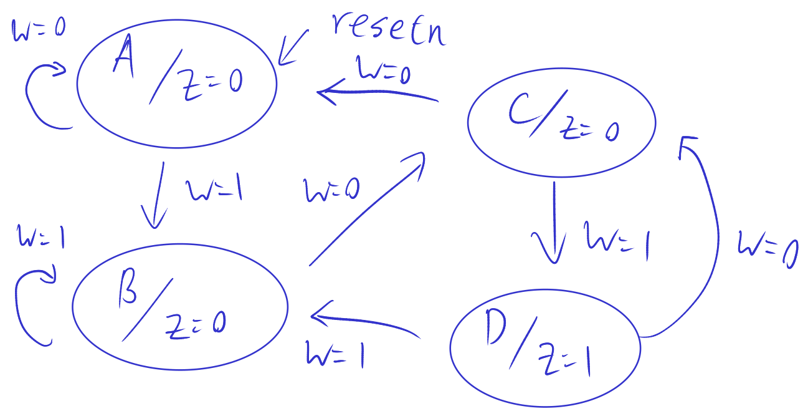

# Lecture 16, Oct 17, 2022

## Alternative Design for Example FSM

* State machine designs are not unique

{width=70%}

* From this state diagram we can make a state table:

| State | Next $w = 0$ | Next $w = 1$ | $z$ |
|-------|--------------|--------------|-----|
| $A$   | $A$          | $B$          | 0   |
| $B$   | $C$          | $B$          | 0   |
| $C$   | $A$          | $D$          | 0   |
| $D$   | $C$          | $B$          | 1   |

* Instead of using 2 flip flops we can use 4 flip flops $y_4y_3y_2y_1$
	* Assign state codes as $A = 0001, B = 0010, C = 0100, D = 1000$
	* This is a *one-hot encoding*, where for each state there is only 1 bit that's 1
* State-assigned table:

| $y_4y_4y_2y_1$ | $Y_4Y_3Y_2Y_1$ for $w = 0$ | $Y_4Y_3Y_2Y_1$ for $w = 1$ | $z$ |
|----------------|----------------------------|----------------------------|-----|
| 0001           | 0001                       | 0010                       | 0   |
| 0010           | 0100                       | 0010                       | 0   |
| 0100           | 0001                       | 1000                       | 0   |
| 1000           | 0100                       | 0010                       | 1   |

* We can synthesize the circuit simply by inspecting the state diagram
	* $Y_4$ is 1 in state $D$; transition to state $D$ is from state $C$ with $w = 1$, so $Y_4 = y_3w$
	* Similar for $Y_3$: transitions are from state $D$ with $w = 0$ and from state $B$ with $w = 0$ so $Y_3 = (y_4 + y_2)\bar w$
	* For $Y_2$: transitions are from $A$ with $w = 1$, $B$ with $w = 1$, $D$ with $w = 1$ so $Y_2 = (y_1 + y_2 + y_4)w$
	* For $Y_1$: transitions are from $A$ with $w = 0$, $C$ with $w = 0$ so $Y_1 = (y_1 + y_3)\bar w$
	* Finally $Z = y_4$
* This different circuit will produce the same behaviour as the one from the previous lecture
* We can do another alternative design in which each state represents the last 3 values of $w$
	* This simply produces a 3-bit shift register with a comparator
	* A shift register consists of flip-flops chained together

## Verilog Code for Example FSM

* All we need to do in Verilog is to specify the state table (using a `case` statement)
* Separate the code into 3 sections:
	1. Flip-flops (reset + update to new value)
	2. State table
	3. Output

```sv
module fsm(input logic w, clock, resetn,
		   output logic z);
	// Define states
	typedef enum logic [1:0] (A, B, C, D) statetype;
	statetype ps, ns;
	// 1. Flip flops
	always_ff @(posedge clock, negedge resetn)
		if (!resetn)
			// Make present state A on reset
			ps <= A;
		else
			// Otherwise, make the present state take the next state's value
			ps <= ns;
	// 2. State table
	always_comb
		// Determine next state from the present state
		case (ps)
			A: ns = w ? B : A;
			B: ns = w ? B : C;
			C: ns = w ? D : A;
			D: ns = w ? B : C;
		endcase
	// 3. Assign output
	assign z = (ps == D);
endmodule
```

* `enum` defines an *enumeration*, which makes the compiler encode the state for us
	* The type after `enum` is the underlying type, in this case a 2-bit logic value
	* The symbols in brackets after are the possible values for the enum; in this case we can refer to the states now as $A, B, C, D$
	* By default, these are in numerical order, but the compiler sees this only as a suggestion (if it can optimize by changing the encodings, then it will do so)
* `typedef <type> <name>` defines a type alias, in this case `statetype` for the enum type

