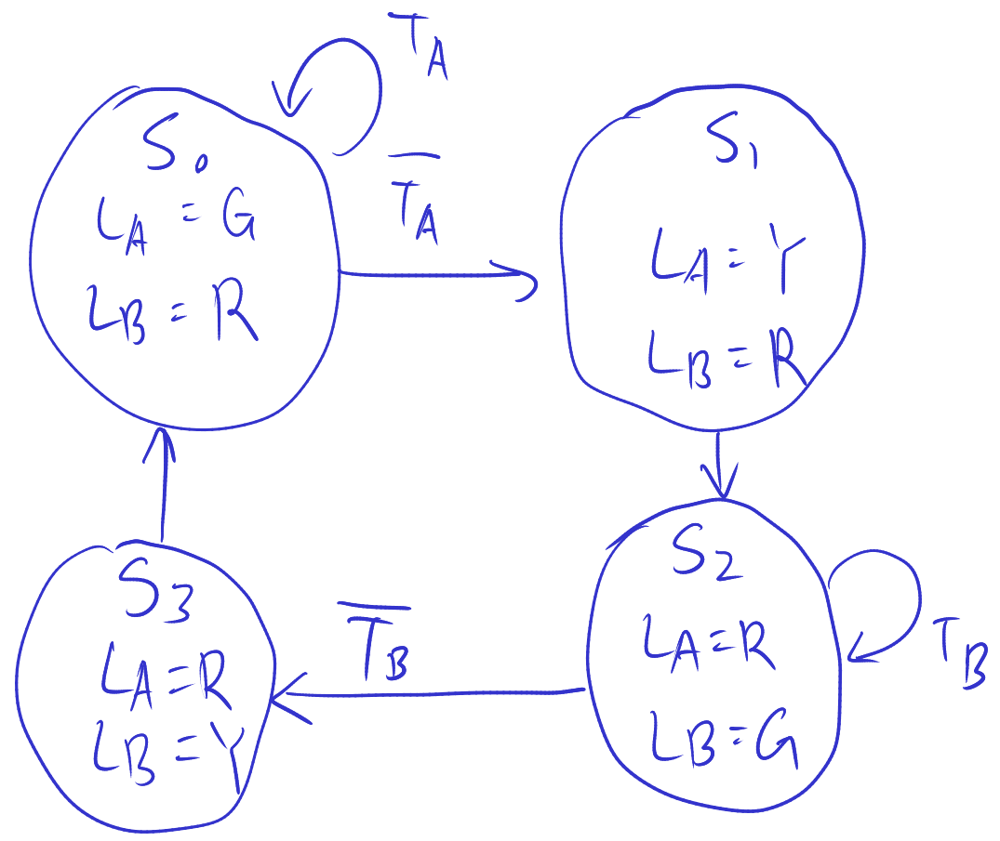

# Lecture 17, Oct 18, 2022

## Verilog For Shift Register State Machine

```sv
module fsm_shift(input logic lo, clock, resetn,
				 output logic z);
	// State of the 3 flip flops
	logic [3:1] y;
	always_ff @(posedge clk, negedge resetn)
		if (!resetn)
			y <= 3'b000;
		else
		begin
			y[3] = w;
			y[2] = y[3];
			y[1] = y[2];

			// Equivalently:
			// y <= y >> 1;
			// y[3] <= w;
		end
	assign z = y[3] & ~y[2] & y[1];
endmodule
```

* Note again `<=` is a nonblocking assignment, which all happen at the same time
	* This important because otherwise when `y[2] = y[3];` happens, `y[3]` will already have been updated!

## Example: Traffic Light Controller

* On reset, Light $A$ is green, Light $B$ is red
* Every clock cycle, traffic sensors $T_A, T_B$ make a decision:
	* If traffic on $T_A$, light $A$ stays green, otherwise light $A$ goes to yellow and then red; light $B$ stays red and then transitions to green
	* Same scenario for $T_B$ and light $B$
* State diagram:

{width=50%}

* State table:

| Present | 00    | 01    | 10    | 11    | $L_A$ | $L_B$ |
|---------|-------|-------|-------|-------|-------|-------|
| $S_0$   | $S_1$ | $S_1$ | $S_0$ | $S_0$ | G     | R     |
| $S_1$   | $S_2$ | $S_2$ | $S_2$ | $S_2$ | Y     | R     |
| $S_2$   | $S_3$ | $S_2$ | $S_3$ | $S_2$ | R     | G     |
| $S_3$   | $S_0$ | $S_0$ | $S_0$ | $S_0$ | G     | R     |

* State assignment:
	* $S_0 = 00, S_1 = 01, S_2 = 10, S_3 = 11$
	* Output encoding: $G = 00, Y = 01, R = 10$
* State assigned table:

| $y_2y_1$ | 00   | 01   | 10   | 11   | $L_A$ | $L_B$ |
|----------|------|------|------|------|-------|-------|
| $00$     | $01$ | $01$ | $00$ | $00$ | G     | R     |
| $01$     | $10$ | $10$ | $10$ | $10$ | Y     | R     |
| $10$     | $11$ | $10$ | $11$ | $10$ | R     | G     |
| $11$     | $00$ | $00$ | $00$ | $00$ | G     | R     |

* Derive logic expressions:
	* Use a 4-variable K-map
	* $Y_2 = \bar y_2y_1 + y_2\bar y_1 = y_2 \xor y_1$
	* $Y_1 = \bar y_2\bar y_1\bar T_A + y_2\bar y_1\bar T_B$
	* Output: $L_{A,1} = y_2, L_{A,0} = \bar y_2y_1, L_{B,1} = \bar y_2, L_{B,0} = \bar y_2\bar y_1$

## Key Take-Aways

* FSM consists of 2 blocks of combinational logic: calculating the next state from the current state, and calculating the output from the current state
* On each clock edge the FSM advances to the next state, computed based only on the input and present state
* There are multiple ways to specify/assign states; some are more efficient than others
	* Minimal encoding: Minimum number of flip-flops
	* One-hot encoding: One flip-flop for each possible state
* In Verilog, code is divided into 3 sections: the flip flops, the state table, and the output assignment

