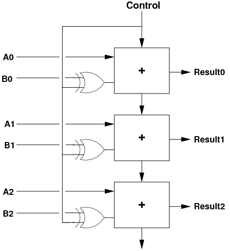

# Lecture 18, Oct 20, 2022

## Two's Complement System

* Two's complement is a way to represent negative numbers in binary
* Example: if we have a 4 bit number, if we add $1111_2$ to it, this turns out to reduce its value by 1, so in 4 bits, $1111_2$ represents $-1$
* Given a number $k$ represented with $n$ bits, $-k$ is represented as $2^n - k$
	* We can check for correctness by verifying that $k + -k = 1$ (after truncating the carry out)
	* Example:
		* $n = 4, k = 1 \implies k = 0001_2, -k = 1111_2$
		* $n = 4, k = 6 \implies k = 0110_2, -k = 1010_2$
			* Check: $0110_2 + 1010_2 = 10000_2 = 0$ when carry out is dropped
		* $n = 5, k = 13 \implies k = 01101_2, -k = 10011_2$
			* Check: $01101_2 + 10011_2 = 100000_2 = 0$
* Shortcut: Invert all the bits and add 1
	* This is because inverting all the bits is equivalent to calculating $(2^n - 1) - k$, so adding 1 to it is equal to $2^n - k$
	* We can simply do this again to get from $-k$ back to $k$!
* With two's complement, the maximum value representable with $n$ bits is reduced by half to make room for the negative numbers
	* e.g. for 4 bits we used to be able to represent up to $1111_2 = 15$, with two's complement we can only go up to $0111_2 = 7$, since $1111_2$ will now represent -1
		* However now we can represent down to $1000_2 = -8$
* The MSB is 0 for positive numbers and 1 for negative numbers; we can use it as a sign indicator (the sign bit)
* Sign extension: if we want to represent the same number with more bits, we simply duplicate the sign bit into the new MSB bit positions
	* Example:
		* $-1$ represented with 4 bits is $1111_2$, if we want to expand it to 8 bits, we duplicate the sign bit as $11111111_2$
		* $1$ represented with 4 bits is $0001_2$, extend to 8 bits is $00000001_2$
* Two's complement allows us to do subtraction with the same hardware as addition -- just add the negative!
	* XOR all the input bits by 1 to invert, and then utilize the carry-in to the full adder to add 1 in order to convert the operand to its negative

{width=30%}

## Overflow

* If we add two numbers that are too large, we get an arithmetic overflow
	* e.g. $0111_2 + 0001_2$ is $7 + 1$, but the sum is $1000_2$, which in 4-bit two's complement is $-8$; this is because $8$ can't be represented in a signed 4-bit number
* When our result overflows the range of the output
* How do we detect overflow?
	* Positive number plus positive number should have positive result
		* Positive plus positive always has a carry out of 0
		* When positive plus positive overflows, MSB (sign bit) would be 1 (since the result will have the wrong sign)
	* Negative number plus negative number should have negative result
		* Negative plus negative always has a carry out of 1
		* When negative plus negative overflows, sign bit would be 0
	* Positive number plus negative number will never overflow
* To detect overflow, consider the MSB (sign bit) of the result and the carry-out; overflow occurs when these have different values
	* $o = s_3 \xor c_{out}$

