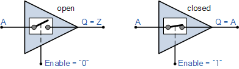

# Lecture 19, Oct 24, 2022

## Processors

* Processes are logic circuits at their core, consisting of both combinational and sequential logic, controlled by an FSM that dictates what operation it does
* Includes a set of $n$-bit general purpose registers to hold values to use
	* RISC-V has 32 registers, each 32 bits (`x0` to `x31`)
	* Registers are very fast to access, but they can only hold a relatively small amount of information
* Includes an ALU
	* Can add, subtract, multiply, AND, OR, XOR, shift, rotate, ...
* Has an external interface (peripherals)
	* Memory to hold data that the registers can't store (DRAM)
	* I/O devices, e.g. keyboard, network, display, etc
	* Address: Who to communicate with
	* Data: What to communicate
	* Control: Whether we're reading or writing

## Simplified Processor Example

* 8 bit bus
* 4 8-bit registers, with enables $R_{i,in}$ and inputs connected to the bus, and the outputs connected to tri-state buffers to the bus with control $R_{i,out}$
	* A tri-state buffer is used to disconnect an input from its output
	* If we want to load a value into a register, we write the value to the bus, and enable the register we want
	* If we want to use the value from a register, we enable the correct tri-state buffer
	* These hold the values we want to use in a computation or the result of a computation

{width=30%}

* ALU with addition, subtraction operations
	* Since we can only read one 8-bit value from a register per clock cycle, we need a register to hold the inputs to the ALU
	* 8-bit $A$ register with enable $A_{in}$, input from bus and output to the ALU input; input $B$ comes directly from the bus
	* Output is written to another register $G$ with enable $G_{in}$, output connected via a tri-state buffer back to the bus with control $G_{out}$
* An external interface, a tri-state buffer connected to the main bus
* A control FSM, which produces the right values for all the enables -- $R_{i,in}, R_{i,out}, A_{in}, \cdots$
	* Inputs $w$, function, where $w$ tells it to start an operation, and function is the operation it should do
	* An output done is asserted when operation is complete

