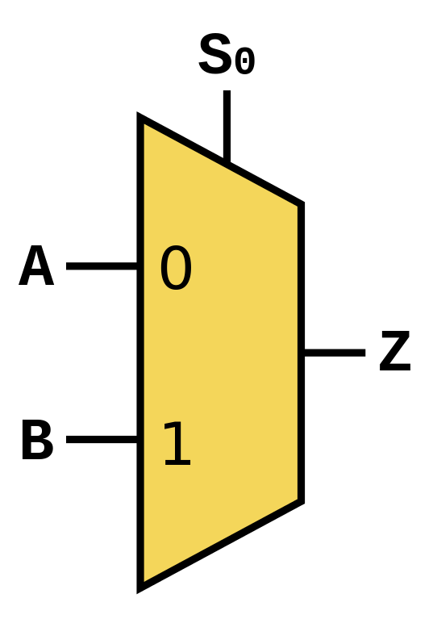

# Lecture 7, Sep 22, 2022

## SystemVerilog HDL

* SystemVerilog is a hardware description language that allows the specification of logic functions using high level abstractions
* Modules are blocks of hardware with inputs and outputs
* Example:

```Verilog
module basic_logic(input logic a, b, // logic: type - indicates boolean variables
				   output logic w, x, y, z);
	// All these things happen at the same time -- not sequentially
	// assign: describes combinational logic
	assign w = a & b; // bitwise AND
	assign x = a | b; // bitwise OR
	assign y = ~a; // bitwise NOT
	assign z = a ^ b; // bitwise OR
endmodule
```

* Modules are not functions -- they cannot call themselves

## Multiplexers (Mux)

{width=20%}

* A circuit that has an output $f$, controlled by either of two inputs $x, y$, based on an input $s$
	* If $s$ is 0, then $f$ is controlled by $x$, else $y$
* Truth table:

| $sxy$ | $f$ |
|:-----:|:---:|
| 000   | 0   |
| 001   | 0   |
| 010   | 1   | 
| 011   | 1   |
| 100   | 0   |
| 101   | 1   |
| 110   | 0   |
| 111   | 1   |

* Verilog:

```verilog
module mux2to1(input logic x, y, s,
			   output logic f);
	assign f = (~s & x) | (s & y);
endmodule
```

* Muxes can be extended to multiple inputs, and also multi-bit signals (buses)
	* A slash with a number is drawn on a wire to indicate that it is a bus
* Example: 2-bit mux
	* $x$ and $y$ are now 2-bit buses
	* Implemented with 2 muxes

```verilog
module mux2to1_2bit(input logic [1:0] x, y, // The [1:0] indicates a 2-bit bus
					input logic s,
					output logic [1:0] f);
	// Note we cannot use a single assign statement
	// since s is a scalar, x is a vector, so s & x would be a mismatch
	assign f[1] = (~s & x[1]) | (s & y[1]);
	assign f[0] = (~s & x[0]) | (s & y[0]);
endmodule
```

## Adders

* Half adder: adding two one-bit numbers
	* Max result can be 2, so output from the half adder is 2 bits $s_1, s_0$
* $s_1 = ab, s_2 = a\oplus b$ where $\oplus$ is the XOR operator

```verilog
module ha(input logic a, b,
		  output logic [1:0] s);
	assign s[1] = a & b;
	assign s[0] = a ^ b;
endmodule
```

* Full adder: includes a carry input
	* Adding multiple bits involves inputs $a_i, b_i$ and also a carry $c_i$
	* Each column (except for the rightmost bit) adds 3 bits (2 inputs plus a carry)
	* Leftmost column produces a $c_{out}$

| $c_i\ a_i\ b_i$ | $c_{i + 1}$ | $s_i$ |
|:---------------:|:-----------:|:-----:|
| $000$           | $0$         | $0$   |
| $001$           | $0$         | $1$   |
| $010$           | $0$         | $1$   |
| $011$           | $1$         | $0$   |
| $100$           | $0$         | $1$   |
| $101$           | $1$         | $0$   |
| $110$           | $1$         | $0$   |
| $111$           | $1$         | $1$   |

* $c_{i + 1} = c_ia_i + c_ib_i + a_ib_i$ (carry is 1 if at least 2 inputs are 1, aka a *majority function*), $s_i = a_i \xor b_i \xor c_i$
	* $s_i$ is a three-input XOR, equivalent to $(a_i \xor b_i) \xor c_i$, which produces 1 if an odd number of inputs is 1 (aka an *odd function*)
* The carry-out of each full adder is connected to the carry-in of the next bit (known as a ripple carry adder)
* Verilog:

```verilog
// Single bit full adder module
module fa(input logic a, b, cin,
		  output logic s, cout);
	assign s = a ^ b ^ cin;
	assign cout = (cin & a) | (cin & b) | (a & b);
endmodule
```

