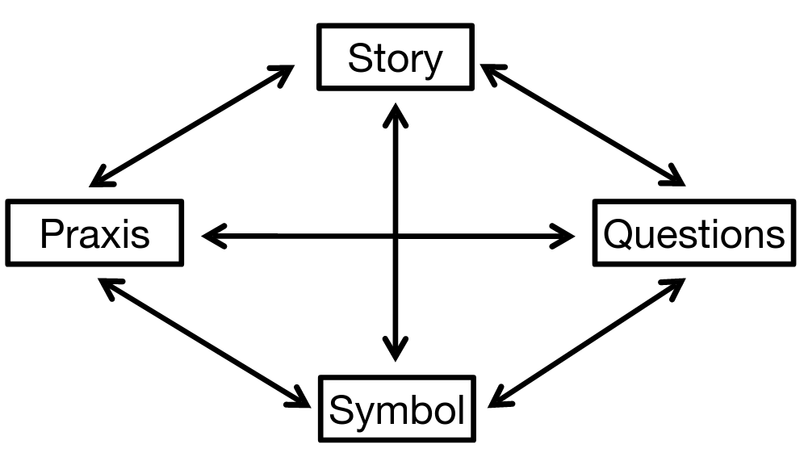

# Lecture 1, Sep 8, 2022

## Worldview

* What is a worldview?
	* The lens through which we see the world
	* A set of assumptions we hold about the world
	* Implicit in almost every act, vital but invisible
	* Can be understood on the societal or individual level

{width=50%}

* Wright's Model of World View:
	* Questions
	* Story
		* Answers to questions are influenced by personal stories
	* Praxis
		* The behaviour that plays out, influenced by the worldview
	* Symbol
		* e.g. displayed certificates etc symbolizing values
* Confirmation bias: Our worldview inclines us towards motivated reasoning that seeks to confirm what we already believe
	* Positive bias: What can I believe? How can I affirm this position?
	* Negative bias: What must I believe? How can I reject this position?
* To reach a better world, we must face up to our challenges

## Where is "Here"?

* Foundations of our era:
	* Secularism
	* Observable science
	* Colonialism
	* Industrialization
	* Capitalism
	* Consumerism
* After WWII, two competing ideologies appeared:
	* Keynesian Economics:
		* Government mitigates the market, prevents it from crashing
		* Government fills gaps in employment
		* Social responsibility to the disadvantaged
	* Neoliberalism:
		* Government frees the market by eliminating regulation
		* Government spends less
		* Freed capital will "trickle down" to all
		* IMF and World Bank are highly influenced and then influenced others

## Neoliberalism

* Beliefs of neoliberalism in the West:
	1. Progress is inevitable
	2. Value is defined in the marketplace
	3. Human potential rests with the individual
	4. Capital freed of regulation will find its own best way forward
* Neoliberalism has become the dominant ideology in the recent era
* The legacy of neoliberalism:
	1. Increased tax burden on the individual rather than corporation
		* Corporate tax has fallen, payroll tax has risen
		* Less sense of corporate responsibility
	2. Increased wealth disparity (between and within countries)
		* Growth used to be more on the poor, but now the rich experience more growth
	3. Increased pace of extraction, production, and waste
	4. Unsustainable dependency on nonrenewable energy
* As a result there is a growing disillusionment with neoliberalism

## The Crises of the Age

* The crises of the age proposed by MacLaren:
	1. Sustainability crisis
		* We're using resources too fast
	2. Equity crisis
		* Some of us are using far more resources are others
	3. Security crisis
		* People are radicalized by inequity
	4. Spiritual crisis
* How do we respond to them?

