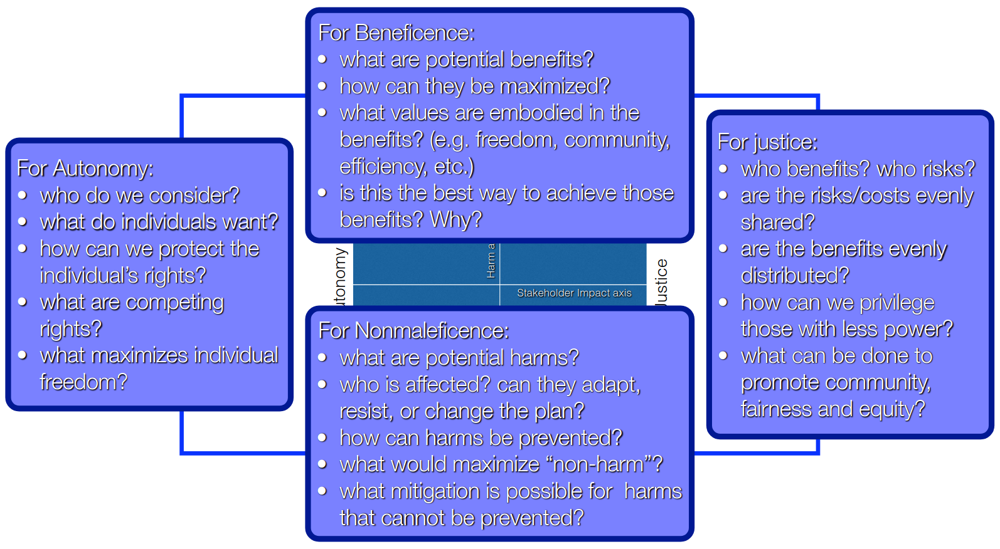
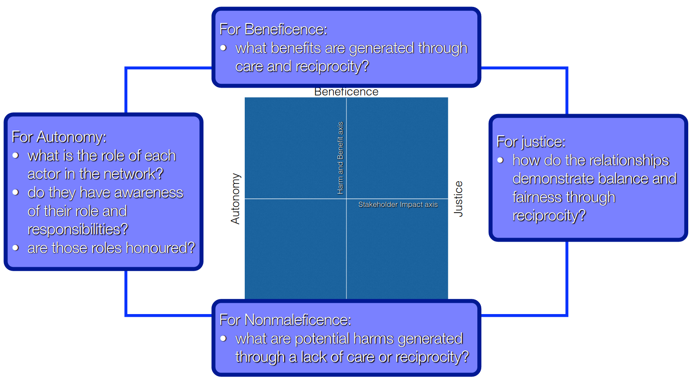
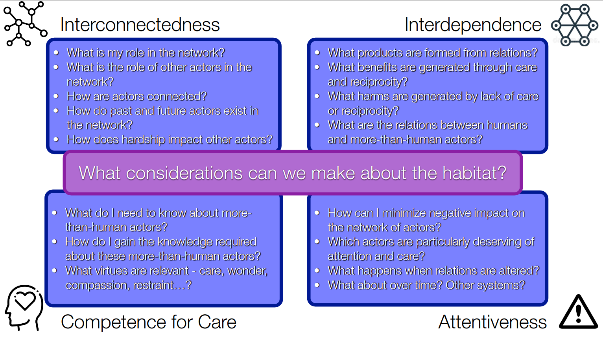

# Lecture 6, Sep 23, 2022

## Rawls' Veil of Ignorance

* What do you want in a society if you don't get to choose your role in it?
* A sense of principled "duty" -- doing what is necessary

## Reflexive Principlism

* Objective: Determine a pragmatic ethical approach for engineers
* Assumptions:
	1. Theoretical approaches do not sufficiently empower action
		* We make our ethical decisions before we apply ethical reasoning
	2. Case-based approaches do not enable flexibility in new situations

### Principlism

* Originating from biomedical ethics
* Consider 4 principles:
	1. Autonomy
		* Supporting and respecting people making their own decisions
	2. Beneficence
		* How much good is the decision going to yield?
	2. Justice
		* Who takes the risks and who gets the benefits?
		* Those who benefit from something should also pay the costs
	3. Nonmaleficence
		* Avoiding the causation of harm

* Principles guide ethical reasoning, allow for flexibility in ethical reasoning, and also provide a backdrop against which to evaluate codes and guidelines
	* Can be used in conjuction with codes
* Tries to satisfy the universal ethics, but also uses principles to negotiate an agreed course of action
	* Tries to reconcile relative and absolute ethics
* Autonomy and justice, and nonmaleficence and beneficence make up 2 axes

### Reflectivity and Reflexivity

* Reflective is consciously reflecting between normative judgements and ethical principles
* Reflexive is unconsciously relying on ethical reasoning skills and intuition developed over time to reach ethical conclusions
* Reflexivity is needed because reflectivity is done after the fact as a process of justification

### The Ethical Reasoning Process

1. Specification: narrowing the scope of principles and figuring out how they apply to a situation
2. Balancing: adjudicating conflicts between the principles (figure out which one to emphasize)
3. Justification: evaluating the coherence and completeness of an ethical reasoning decision

## Core Premises of the Ethics of Care

1. Interconnectedness: awareness of one's place in a web of actors
2. Interdependence: relationships that motivate reciprocal responsibilities and beneficial care
3. Competence for care: virtues, skills and knowledge required for beneficial caring relationships to flourish
4. Attentiveness: to the context of moral questions and problems

