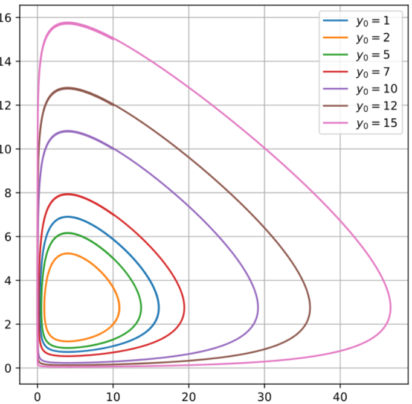

# Lecture 11, Sep 30, 2022

## Lotka-Volterra (Predator-Prey)

* $\twopiece{x' = \alpha x - \beta xy}{y' = -\gamma y + \delta xy}$
* Equilibrium point exists at $\cvec{x}{y} = \cvec{\frac{\gamma}{\delta}}{\frac{\alpha}{\beta}}$

{width=33%}

* This system is nonlinear, so we have to linearize it
* We will linearize around the equilibrium
* The Jacobian evaluated is $J = \mattwo{\alpha - \beta y}{-\beta x}{\delta y}{\delta x - \gamma}$
	* At equilibrium this is $\mattwo{0}{-\frac{\beta\gamma}{\delta}}{\frac{\alpha\gamma}{\beta}}{0}\cvec{x}{y}$
* The eigenvalues of this system are complex! $\lambda = \pm\sqrt{\alpha\gamma}$
	* When eigenvalues are complex, solutions have spirals

## Complex Eigenvalues

* Theorem: If $A$ is a real matrix, then its eigenvalues come in complex conjugate pairs
	* Eigenvalues also come in complex conjugate pairs, e.g. if $v_1 = \cvec{1 - i5}{2 + i}$ then $v_2 = \cvec{1 + i5}{2 - i}$
* Suppose $\diff{\bm x}{t} = \bm A\bm x$ and $\bm A$ has complex eigenvalues
	* If we follow our usual approach we would get $\bm x_1(t) = e^{(\mu + i\nu)t}\bm v_1, \bm x_2(t) = e^{(\mu - i\nu)t}\bar{\bm v_1}$, but these are not real solutions
* Let $\bm v_1 = \bm a + i\bm b \implies \alignedeqntwo[t]{\bm x_1(t)}{e^{\mu t}(\cos(\nu t) + i\sin(\nu t))(\bm a + i\bm b)}{e^{\mu t}(\bm a\cos\nu t - \bm b\sin\nu t) + ie^{\nu t}(\bm a\sin\nu t + \bm b\cos\nu t)}{\bm u(t) + i\bm w(t)}$
* $\bm u(t)$ and $\bm w(t)$ form the fundamental set of solutions: $\bm x = c_1\bm u(t) + c_2\bm w(t)$
	* To verify this, we need to verify that they're both solutions and the Wronskian is nonzero (for now we will take this as a given)
* Example: $\bm x' = \mattwo{\frac{1}{2}}{-\frac{5}{4}}{2}{-\frac{1}{2}}\bm x \implies \lambda _1 = \frac{3i}{2}, \vec v_1 = \cvec{5}{2 - 6i}, \lambda _2 = -\frac{3i}{2}, \vec v_2 = \cvec{5}{2 + 6i}$
	* $\bm a = \cvec{5}{2}, \bm b = \cvec{0}{-6}$
	* $\nu = \frac{3}{2}, \mu = 0$
	* $u(t) = \cvec{5}{2}\cos\left(\frac{3}{2}t\right) - \cvec{0}{-6}\sin\left(\frac{3}{2}t\right)$
	* As $t \to \infty$ the solutions go in a cycle
	* There is a stable equilibrium at 0
	* Distinct complex eigenvalues with zero real part creates perfectly cyclical solutions

## Complex Eigenvalues Cases

* Zero real part: circular solution that go nowhere as $t \to \infty$
	* Stable equilibrium at the origin
* Negative real part: solution spirals towards the origin as $t \to \infty$
	* Stable equilibrium at the origin
* Positive real part: solution spirals outwards from the origin as $t \to \infty$
	* Unstable equilibrium at the origin

