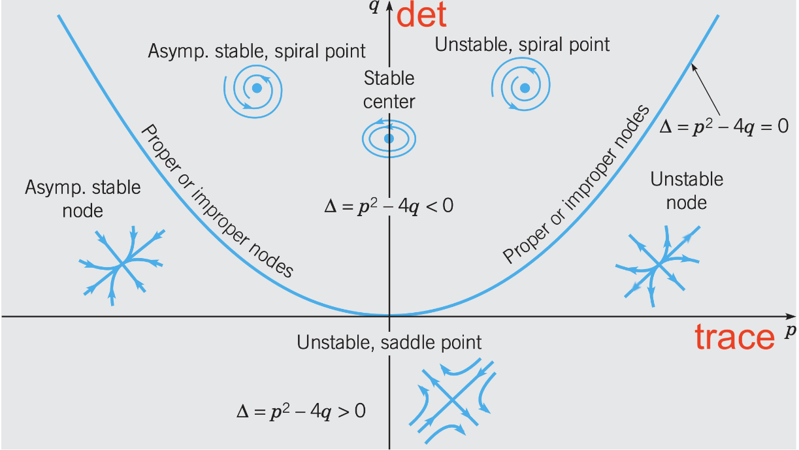
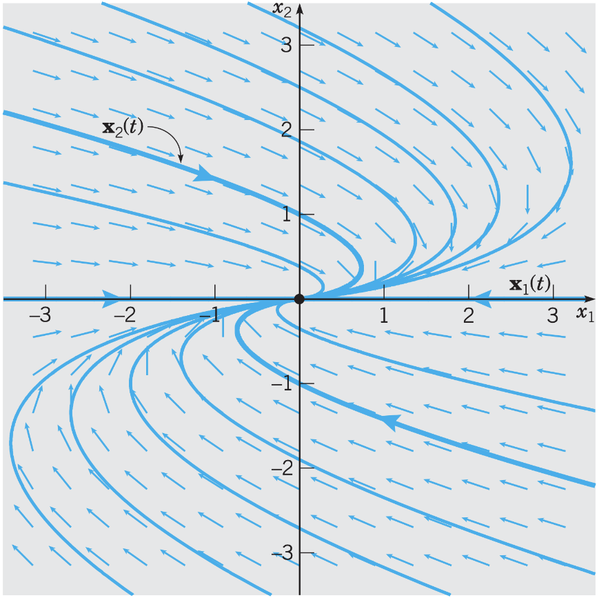

# Lecture 12, Oct 3, 2022

## Summary of Cases of Eigenvalues

* Consider $A = \mattwo{a}{b}{c}{d}$
	* The characteristic equation is $\lambda^2 - (a + d)\lambda + ad - bc = 0 \implies \lambda^2 - \tr(A)\lambda + \det(A) = 0$
	* Therefore $\lambda = \frac{\tr(A) \pm \sqrt{(\tr(A))^2 - 4\det(A)}}{2}$
* Let $p = \tr A, q = \det A$, then the sign of $p^2 - 4q$ determines the behaviour of the ODE:
	* On the parabola, $p^2 = 4q$, we get two real, equal eigenvalues
	* Below the parabola $4q < p^2$, we get two real, distinct eigenvalues
	* Above the parabola $4q > p^2$, we get two complex eigenvalues that are complements
* Recall $\det A = \lambda _1\lambda _2$, so if $\det A < 0$ the eigenvalues have different signs; if $\det A > 0$ they have the same sign
	* Below the $p$ axis the determinant is negative so the eigenvalues have different signs, so we get saddle points (semistable equilibria)
	* Above it we get either stable or unstable equilibrium since eigenvalues have the same sign
		* Between the $p$ axis and parabola, on the right, the trace is positive, so both eigenvalues must be positive, leading to an unstable equilibrium
		* On the left the trace is negative, so both eigenvalues must be negative, leading to a stable equilibrium

{width=75%}

## Repeated Eigenvalues (and Eigenvectors)

* On the parabola we have repeated eigenvalues, e.g. $\bm x' = \mattwo{-1}{0}{0}{-1}\bm x$ 
	* In this case we have repeated eigenvalues, but two distinct eigenvectors
* Another example: $\bm x' = \cvec{m'}{w'} = \mattwo{-\frac{1}{2}}{1}{0}{-\frac{1}{2}}\cvec{m}{w}$
	* In this case we have $\lambda _1 = \lambda _2 = -\frac{1}{2}$, but only one eigenvector $\cvec{1}{0}$
	* Such matrices are *defective*; if we follow our usual procedure we only get one solution, which does not span the full solution space
* Notice in this system $w'$ does not depend on $m$, so we can solve it independently to get $w = c_2e^{-\frac{t}{2}}$
	* Substituting this back in we get $m' = -\frac{1}{2}m + c_2e^{-\frac{t}{2}}$ which is a FO linear ODE
	* Using integrating factors we get $m = c_2te^{-\frac{t}{2}} + c_1e^{-\frac{t}{2}}$
	* The final solution is $\bm x = c_1e^{-\frac{t}{2}}\cvec{1}{0} + c_2\left(te^{-\frac{t}{2}}\cvec{1}{0} + e^{-\frac{t}{2}}\cvec{0}{1}\right)$
		* But wait, where did $\bm w = \cvec{0}{1}$ come from? What does it mean?
* Our solution has the form $\bm x_2 = te^{-\frac{t}{2}}\bm v + te^{-\frac{t}{2}}\bm w$
	* Substituting this in: $e^{-\frac{t}{2}}\bm v - \frac{1}{2}te^{-\frac{t}{2}}\bm v - \frac{1}{2}e^{-\frac{t}{2}}\bm w = \bm A\left(te^{-\frac{t}{2}}\bm v + te^{-\frac{t}{2}}\bm w\right)$
	* Notice for this to hold we must have $-\frac{1}{2}te^{-\frac{t}{2}}\bm v = \bm Ate^{-\frac{t}{2}}$ and $e^{-\frac{t}{2}}\bm v - \frac{1}{2}e^{-\frac{t}{2}}\bm w = \bm Ae^{-\frac{t}{2}}\bm w$
	* This gives us $\left(\bm A + \frac{1}{2}\bm I\right)\bm v = 0$ and $\left(\bm A + \frac{1}{2}\bm I\right)\bm w = \bm v$
		* $\left(\bm A + \frac{1}{2}\bm I\right)\bm w = \bm v$ is a *generalized eigenvector equation*, where $\bm w$ is the *generalized eigenvector*
		* Solving this gives us $\bm w = \cvec{k}{1}$, so we can choose $k = 0$ and form our solution

{width=50%}

\noteDefn{The generalized eigenvector is a vector that satisfies $(\bm A - \lambda\bm I)\bm w = \bm v$, where $\bm v$ is the repeated eigenvector and $\lambda$ is the repeated eigenvalue}

\begin{note-summary}
When eigenvalues and eigenvectors are equal:
\begin{enumerate}
	\item Write the first solution $\bm x_1(t) = e^{\lambda t}\bm v$ where $(\bm A - \lambda\bm I)\bm v = 0$
	\item Write the second solution $\bm x_2(t) = te^{\lambda t}\bm v + e^{\lambda t}\bm w$ where $(\bm A - \lambda\bm I)\bm w = \bm v$
	\item The general solution is then $\bm x = c_1\bm x_1(t) + c_2\bm x_2(t)$
\end{enumerate}
This works even when $A$ is not triangular
\end{note-summary}

