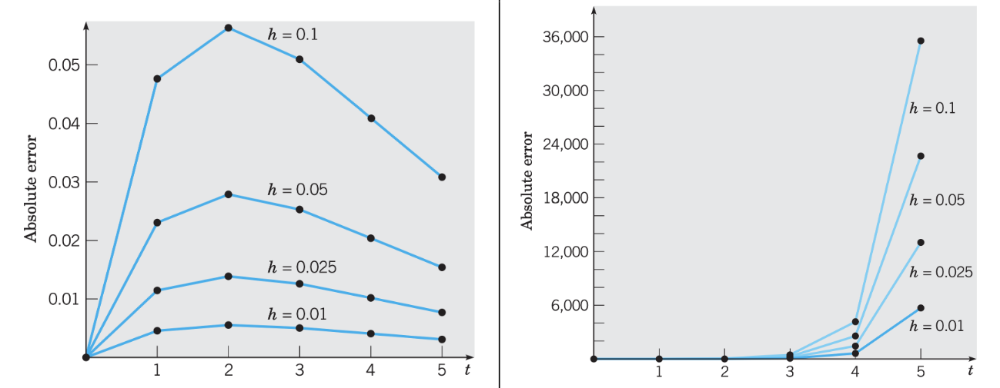
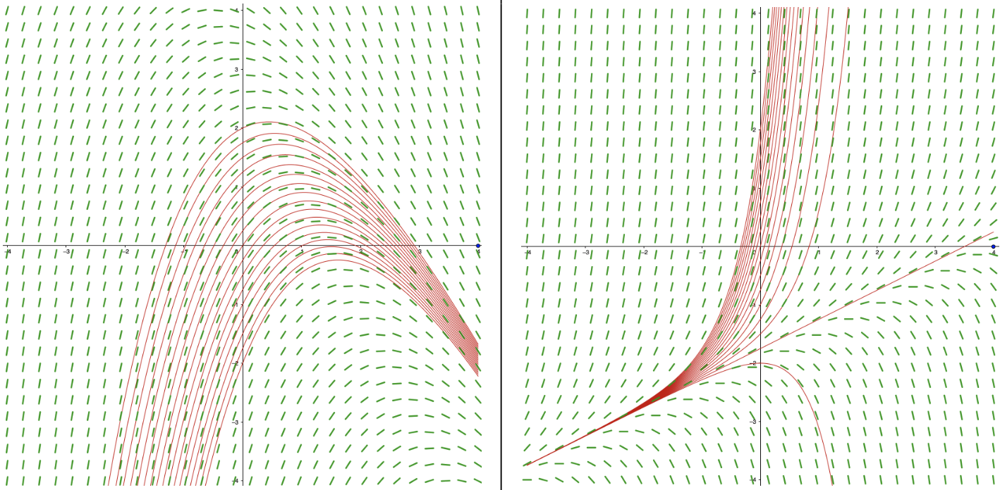

# Lecture 14, Oct 7, 2022

## Euler's Method

* Iterative method: Solve $y' = f(t, y)$ by $y_{n + 1} = y_n + hf(t_n, y_n)$

{width=80%}

* A larger step size always increases the error in Euler's method
* Error accumulates in Euler's method, but this is not always the case -- sometimes the absolute error can decrease
	* Why do approximations work better sometimes?

{width=80%}

* Notice the left has a solution of $y(t) = 7 - 2t - Ce^{-\frac{t}{2}}$ and the right has a solution of $y(t) = -\frac{7}{4} + \frac{1}{2}t + Ce^{2t}$
	* In the left one, all solutions converge towards $y(t) = 7 - 2t$, while in the right solution diverge
	* A small error in the left eventually decays away, while a small error in the right blows up

