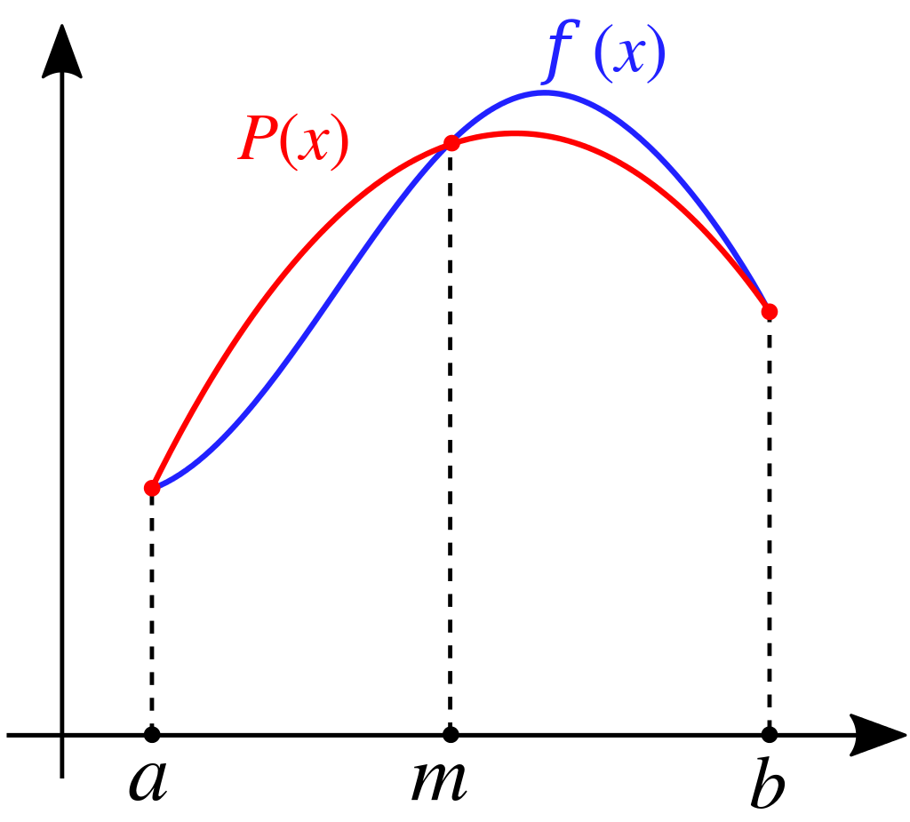

# Lecture 16, Oct 14, 2022

## Numerical Integration Methods

* Riemann sums approximates the function as a series of constant value segments
* Trapezoidal rule approximates the function as a number of linear segments
* Simpson's one-third rule approximates the function as a series of parabolas
	* Take the current point, the next point, a point halfway, and fit a parabola
	* $\int _a^b f(x)\,\dx \approx \int a^b P(x)\,\dx = \frac{b - a}{6}\left(f(a) + 4f\left(\frac{a + b}{2}\right) + f(b)\right)$
		* This is just a closed-form solution for the integral of the parabola that passes through these 3 points

{width=50%}

## Improved Euler Method

* When we solve an ODE, we are essentially integrating: $\phi(t_{n + 1}) = \phi(t_n) + \int _{t_n}^{t_{n + 1}} f(t, \phi(t))\,\dt$
* Euler's method, $y_{n + 1} = y_n + hf(t_n, y_n)$ is essentially approximating $f$ as a constant value $f(t, y) = f(t_n, y_n)$
	* This essentially makes a Riemann sum -- so what if we used a trapezoidal sum instead?
* This leads to the improved Euler method $y_{n + 1} = y_n + h\frac{f(t_n, y_n) + f(t_{n + 1}, y_{n + 1})}{2}$
	* However, we can't quite use $y_{n + 1}$ in the right hand side because we haven't found it yet
	* We can use Euler's method to find an estimate for it

\noteDefn{The Improved Euler/Heun/\cancel{Abdullah} Method: $$y_{n + 1} = y_n + h\frac{f(t_n, y_n) + f(t_n + h, y_n + hf(t_n, y_n))}{2}$$}

* IEM is a *second order* method -- local truncation error is $O(h^3)$ and global truncation error is $O(h^2)$
	* However, IEM requires two function evaluations per step
	* But if $h \ll \frac{1}{2}$ this still makes IEM much more efficient

## Runge-Kutta Method

\noteDefn{The Runge-Kutta Method: $$y_{n + 1} = y_n + h\frac{s_{n1} + 2s_{n2} + 2s_{n3} + s_{n4}}{6}$$ where $$\alignedlines{}{s_{n1} = f\left(t_n, y_n\right)}{s_{n2} = f\left(t_n + \frac{1}{2}h, y_n + \frac{1}{2}hs_{n1}\right)}{s_{n3} = f\left(t_n + \frac{1}{2}h, y_n + \frac{1}{2}hs_{n2}\right)}{s_{n4} = f\left(t_n + h, y_n + hs_{n3}\right)}$$}

* The Runge-Kutta method essentially approximates with a parabola (Simpson's Rule)
* The derivative is evaluated at the current point, the next point, and also the point in the middle
* Runge-Kutta is a *fourth order* method -- local truncation error is $O(h^5)$ and global truncation error is $O(h^4)$
	* Each step requires 4 function evaluation

## Adaptive Step Sizes

* What if we could use smaller step sizes where it's needed?
* Run a standard step of Euler's method, and one IEM step; if we assume that the IEM gives the absolute truth, then the difference between the two approximations is the error
* The local truncation error should scale like $h^2$
	* $\frac{e^{\text{est}}_{n + 1}}{h^2} = \frac{\abs{y^{\text{euler}}_{n + 1} - y^{\text{IEM}}_{n + 1}}}{h^2} \approx \text{const}$
* If we adjust the step size to $h_{\text{new}}$, with some new local truncation error $\epsilon$, then $\frac{\epsilon}{h_{\text{new}}^2} \approx \text{const}$
* Therefore if we want to keep the local truncation error $\epsilon$ constant, then we can have $\frac{e^{\text{est}}_{n + 1}}{h^2} = \frac{\epsilon}{h_{\text{new}}^2}$

\noteImportant{To keep the error rougly fixed at $\epsilon$, adjust the step size as $$h_{\text{new}} = h\sqrt{\frac{\epsilon}{e^{\text{est}}_{n + 1}}}$$ where $e^\text{est}_{n + 1} = \abs{y^{\text{euler}}_{n + 1} - y^{\text{IEM}}_{n + 1}}$}

