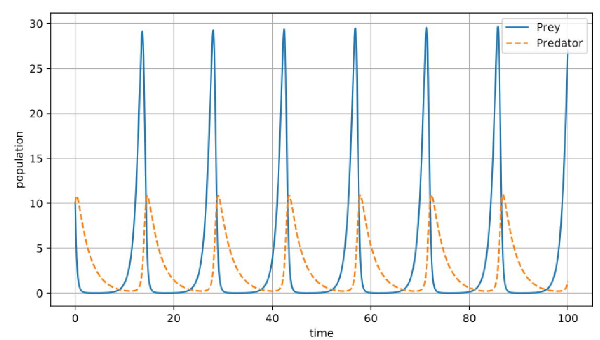

# Lecture 2, Sep 9, 2022

## Classification of Differential Equations

* Ordinary vs Partial Differential Equations
	* PDEs have partial derivatives, resulting from the presence of multiple independent variables
* Order
	* The highest derivative that appears in the equation
* Linear vs Nonlinear
	* The most general nth order ODE can be expressed as $F(t, y, y', \cdots, y^{(n)}) = 0$
	* A linear ODE can be written as $a_0(t)y^{(n)} + a_1(t)y^{(n - 1)} + \cdots + a_n(t)y = g(t)$
		* $a_n$ can depend on $t$ and $t$ alone
	* The linear DE is homogeneous if $g(t) = 0$
* Autonomous vs Nonautonomous
	* An autonomous ODE does not explicitly depend on $t$, e.g. $y' = y$ is autonomous, $y' = ty$ is not
* Separable vs Nonseparable
	* A first order ODE $\diff{y}{t} = f(t, y)$ is separable if we can decompose $f(t, y) = p(t)q(y)$
* Example: $\diff{u}{t} = -k(u - T_0)$ is a first order, linear, nonhomogeneous, autonomous, separable ODE

## Lotka-Volterra (Predator-Prey)

* Modelling the number of zombies in an apocalypse, where $x$ is the number of people and $y$ is the number of zombies, assumptions:
	1. Zombies eat people
		* $x' = -\beta xy$
		* The rate at which people get eaten is proportional to the number of zombies and people
	2. People reproduce
		* $x' = \alpha x$
	3. Zombies suffer natural death and emigration
		* $y' = \delta xy - \gamma y$
		* Zombies flourish when they're being fed; the more there are, the more are dying of natural causes
* This is summarized in the system: $\twopiece{\diff{x}{t} = \alpha x - \beta xy}{\diff{y}{t} = -\gamma y + \delta xy}$

{width=50%}

