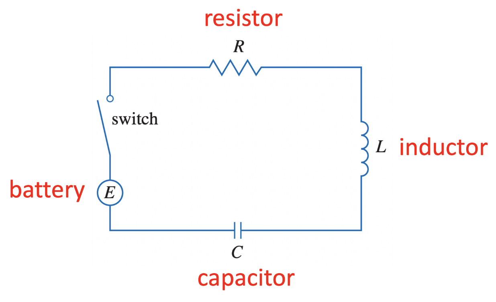

# Lecture 21, Oct 27, 2022

## Second Order Linear Nonhomogeneous ODEs

* Recall: All solutions to $\bm A\bm x = \bm b$ can be constructed by taking a particular solution to it and adding a solution to $\bm A\bm x = \bm 0$
* Consider a nonhomogeneous second order linear ODE $ay'' + by' + cy = g(t)$ and its homogeneous counterpart $ay'' + by + cy = 0$
* 2 observations:
	1. Let $y_h$ be a solution to the homogeneous ODE and $y_p$ be a particular solution to the nonhomogeneous ODE, then $y_h + y_p$ solves the nonhomogeneous ODE
	2. Let $y_p, \hat y_p$ be two particular solutions to the nonhomogeneous ODE, then $\hat y_p - y_p = y_h$ solves the homogeneous ODE
* This means that given a nonhomogeneous ODE, we simply have to find a particular solution to it $y_p$, and the general solution $y_h$ to the homogeneous ODE; then the general solution to the nonhomogeneous ODE is the sum of the two

\noteImportant{Given $$ay'' + by' + cy = g(t)$$ the general solution can be found by $$y_g = y_h + y_p$$ where $y_h$ is the general solution to the homogeneous ODE $ay'' + by + cy = 0$ and $y_p$ is one particular solution to the homogeneous ODE}

## Method of Undetermined Coefficients

* Involves guessing "trial solutions" based on the form of $g(t)$
	* For $e^{rt}$ we guess $Ae^{rt}$
	* For $\sin(\omega t)$ or $\cos(\omega t)$ we guess $A\sin(\omega t) + B\cos(\omega t)$
	* For degree $n$ polynomial we guess $B_0 + B_1t + B_2t^2 + \cdots + B_nt^n$
	* For a combination of these, we guess a combination of the corresponding guesses
	* If the guess solution appears in the homogeneous solution, multiply by $t$
* Example: $y'' - 3y - 4y = 3e^{2t}$
	* $\lambda = -1, 4$
	* General homogeneous solution: $y_h(t) = c_1e^{-t} + c_2e^{4t}$
	* Guess: $y = Ae^{2t}$
		* Plug this in we get $4Ae^{2t} - 6Ae^{2t} - 4Ae^{2t} = 3e^{2t}$
		* $-6A = 3 \implies A = -\frac{1}{2}$
	* Particular solution: $y_p = -\frac{1}{2}e^{2t}$
	* General solution: $y = -\frac{1}{2}e^{2t} + c_1e^{-t} + c_2e^{4t}$
* Example: $y'' - 3y' - 4y = 2e^{-t}$
	* General homogeneous solution: $y_h(t) = c_1e^{-t} + c_2e^{4t}$
	* Guess: $y = Ae^{-t}$
		* Plugging this in: $Ae^{-t} + 3Ae^{-t} - 4Ae^{-t} = 2e^{-t}$
		* However this is equal to zero! This is because $e^{-t}$ is already in our homogeneous solution
	* Guess: $y = Ate^{-t}$
		* $y' = Ae^{-t} - Ate^{-t}$
		* $y'' = -2Ae^{-t} + Ate^{-t}$
		* Plugging this in and solving we get $A = -\frac{2}{5}$

## Example Problem: RLC Circuit

{width=70%}

* Voltage across the inductor is $L\diff{I}{t}$; voltage across a capacitor is $\frac{Q}{C}$
* From Kirchhoff's Voltage Law: $L\diff{I}{t} + RI + \frac{Q}{C} = E(t)$
	* Since $I = \diff{Q}{t}$ we can transform this into $L\diffn{2}{Q}{t} + R\diff{Q}{t} + \frac{Q}{C} = E(t)$
	* This is a second order linear nonhomogeneous ODE

