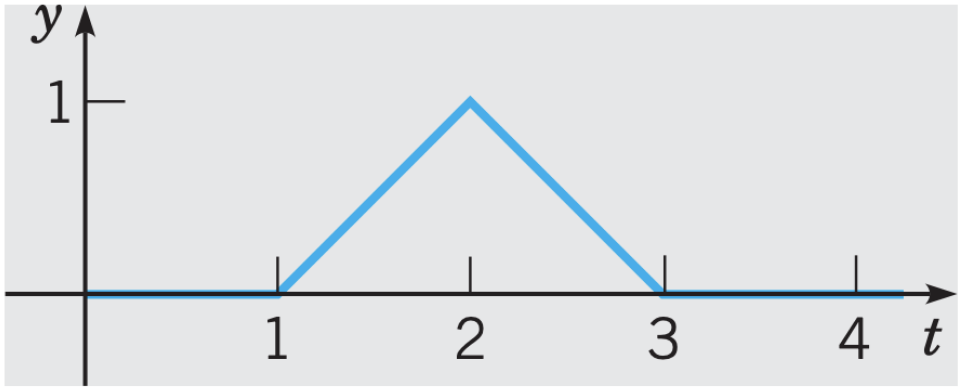

# Lecture 27, Nov 17, 2022

## Unit Step Function (Heaviside Function)

* Heaviside step function (aka indicator function): $u(t) = \twocond{0}{t < 0}{1}{t \geq 0}$
* Translated step function: $u_c(t) = \twocond{0}{t < c}{1}{t \geq c}$
* Indicator step function: $u_{cd}(t) = u_c(t) - u_d(t) = \twocond{0}{t < c, t \geq d}{1}{c \leq t < d}$
* From the step function we can construct other functions, e.g. a triangular pulse is $(-1 + t)u_{12}(t) + (3 - t)u_{23}(t)$

{width=30%}

## Laplace Transform of the Step Function

* If $\laplace{f(t)} = F(s), s > a \geq 0$, then $\laplace{u_c(t)f(t - c)} = e^{-cs}F(s), s > a$
	* This is the dual of $\laplace{e^{ct}f(t)} = F(s - c)$
* An exponential in the time domain is a shift in the $s$ domain; an exponential in the $s$ domain is also a shift in the time domain
* $\laplace{u(t)} = \frac{1}{s}, s > 0$
* $\laplace{u_c(t)} = \frac{e^{-cs}}{s}, s > 0$
* $\laplace{u_{cd}(t)} = \laplace{u_c(t)} - \laplace{u_d(t)} = \frac{e^{-cs} - e^{-ds}}{s}, s > 0$

## Periodic Functions

\noteDefn{A function $f$ is periodic if $$f(t + T) = f(t)$$ where $T$ is the period}

* The window function: $f_T(t) = f(t)(1 - u_T(t)) = \twocond{f(t)}{t \leq T}{0}{\text{otherwise}}$
* We can use it to construct periodic functions as $f(t) = \sum _{n = 0}^\infty f_T(t - nT)u_{nT}(t)$
* Using this, we can Laplace transform any periodic function
	* $\alignedeqntwo[t]{\laplace{f(t)}}{\sum _{n = 0}^\infty \laplace{f_T(t - nT)u_{nT}(t)}}{\sum _{n = 0}^\infty e^{-nTs}\laplace{f_T(t)}}{\laplace{f_T(t)}\frac{1}{1 - e^{-Ts}}}$

\noteThm{If $f$ is periodic with period $T$ and is piecewise continuous on $[0, T]$, then $$\laplace{f(t)} = \frac{F_T(s)}{1 - e^{-Ts}}$$ where $F_T(s) = \laplace{f_T(t)} = \laplace{f(t)(1 - u_T(t))}$}

