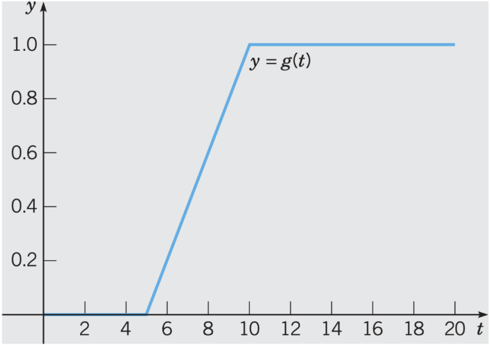

# Lecture 28, Nov 18, 2022

## Differential Equations With Discontinuous Forcing Functions

* Example: flipping a switch, or turning a knob are all examples of discontinuous forcing functions
* Example 1: $y'' + 4y = g(t), y(0) = 0, y'(0) = 0, g(t) = \threecond{0}{0 \leq t < 5}{\frac{t - 5}{5}}{5 \leq t < 10}{1}{t \geq 10}$
	* This forcing function is known as a *ramp*
	* First express $g(t)$ in terms of step functions: $g(t) = \frac{t - 5}{5}u_5(t) - \frac{t - 10}{5}u_{10}(t)$
	* $\laplace{g} = \frac{1}{5}\laplace{(t - 5)u_5(t) - (t - 10)u_{10}(t)} = \frac{1}{5s^2}(e^{-5s} - e^{-10s})$
	* $\laplace{y'' + 4y} = s^2Y(s) + 4Y(s) = \laplace{g}$
	* $Y(s) = (e^{-5s} - e^{-10s})\frac{1}{5s^2(s^2 + 4)}$
	* Let $H(s) = \frac{1}{s^2(s^2 + 4)}$, then $y(t) = \frac{u_5(t)h(t - 5) - u_{10}(t)h(t - 10)}{5}$ where $h(t) = \ilaplace{H(s)}$
	* By partial fractions $H(s) = \frac{\frac{1}{4}}{s^2} - \frac{\frac{1}{4}}{s^2 + 4} \implies h(t) = \frac{1}{4}t - \frac{1}{8}\sin(2t)$

{width=50%}

{width=50%}

* Example 2: $y'' + \pi^2y = f(t), y(0) = 0, y'(0) = 0$ where $f(t)$ is a square wave
	* Use the periodic function Laplace transform formula
	* We need a window function $f_2$ which we could construct as $f_2 = u_0(t) - u_1(t)$
	* $F_2(s) = \frac{1}{s}(1 - e^{-s})$
	* From the previous lecture $F(s) = \frac{F_2(s)}{1 - e^{-st}} = \frac{1 - e^{-s}}{s(1 - e^{-2s})} = \frac{1 - e^{-s}}{s(1 - e^{-2s})(1 + e^{-2s})} = \frac{1}{s(1 + e^{-s})}$
	* $\laplace{y'' + \pi^2y} = (s^2 + \pi^2)Y(s) = F(s) \implies Y(s) = \frac{1}{s(1 + e^{-s})(s^2 + \pi^2)} = \frac{1}{s(s^2 + \pi^2)}\frac{1}{1 + e^{-s}}$
	* Let $H(s) = \frac{1}{s(s^2 + \pi^2)}$
	* $Y(s) = \sum _{k = 1}^\infty (-1)^ke^{-ks}H(s)$
	* By partial fractions $h(t) = \frac{1}{\pi^2}(1 - \cos(\pi t))$
	* Therefore $y(t) = \sum _{k = 0}^\infty (-1)^k\frac{1}{\pi^2}(1 - \cos(\pi(t - k)))u_k(t)$

{width=40%}

{width=50%}

