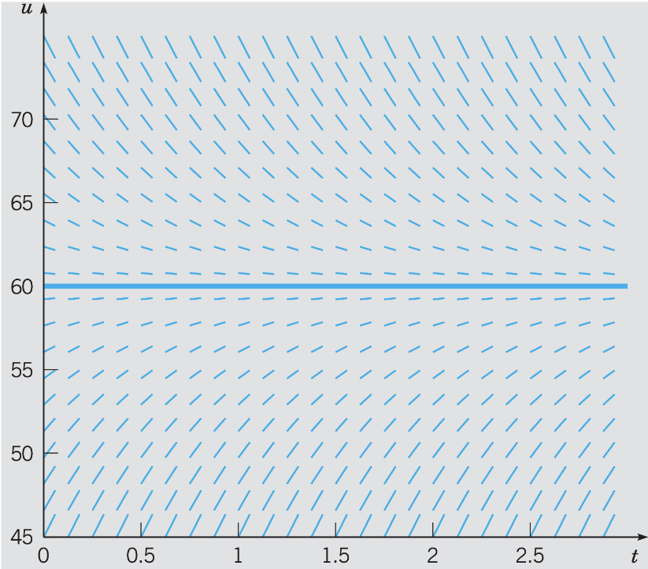
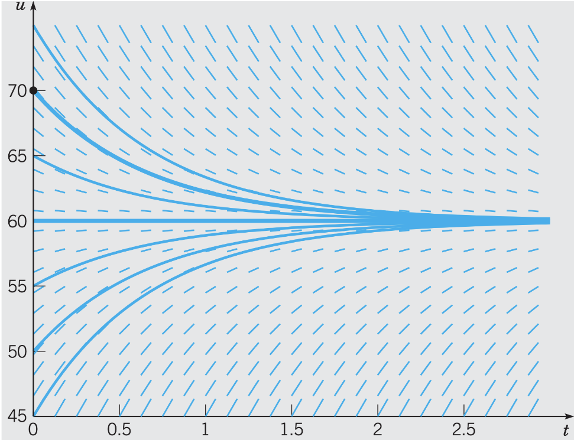
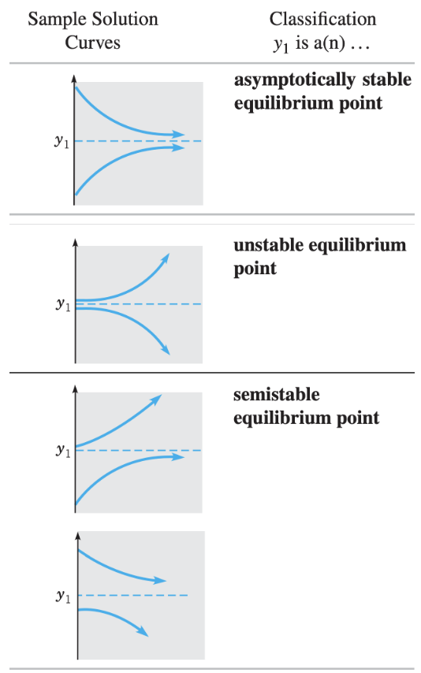
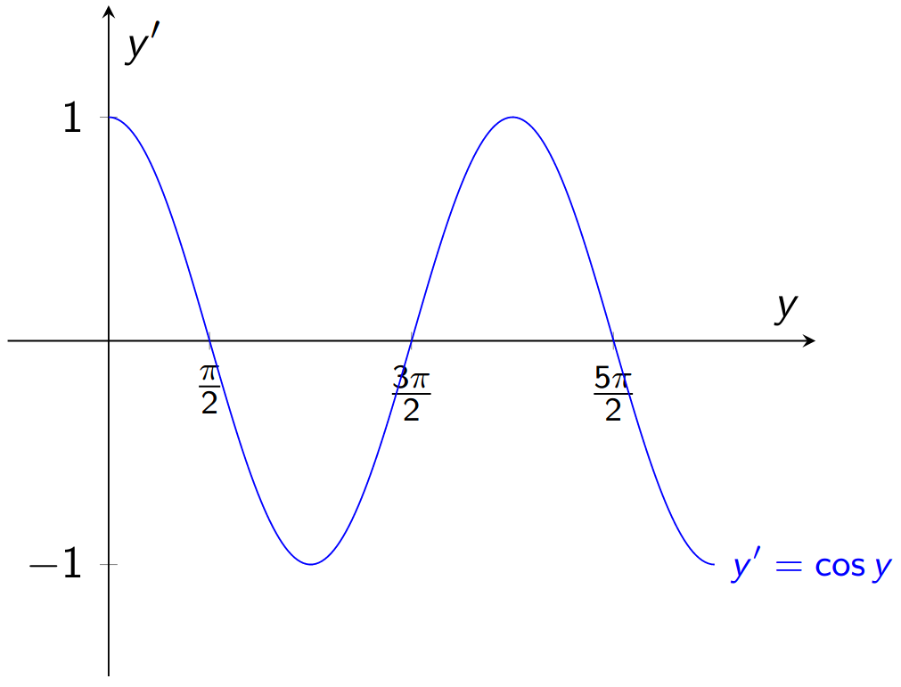

# Lecture 3, Sep 12, 2022

## Direction Fields

* Consider the DE $\diff{u}{t} = f(t, u)$
	* We can interpret this as the slope at each point is equal to some function of $t$ and $u$
* We can draw a direction field, at each point $(t, u)$ draw the slope $f(t, u)$

{width=50%}

* Using a direction field, for any starting point we can follow it to trace out a solution to our ODE

{width=50%}

* Direction fields allow us to visualize solutions to DEs without having to actually solve it

## Equilibria

* Notice for this DE, all solutions tend towards the **equilibrium** $u = 60$
	* If we start from the equilibrium, we never move away from it, which lends to the definition:

\noteDefn{Given a first order autonomous DE $\diff{y}{t} = f(y)$, equilibrium solutions are those satisfying $f(y) = \diff{y}{t} = 0$ \tcblower Equilibrium points are also known as critical points, fixed points, stationary points, etc}
\begin{note-definition}
3 types of equilibria:
\begin{itemize}
	\item Stable equilibrium: other solutions tend towards the equilibrium solution
	\item Unstable equilibrium: other solutions diverge from the equilibrium solution
	\item Semi-stable equilibrium: other solution tend towards the equilibrium on one side and diverge from it on the other
\end{itemize}
\end{note-definition}
* For this DE, we have a stable equilibrium since all solutions approach the equilibrium solution $u = 60$
* $\diff{p}{t} = rp - a$ has an unstable equilibrium of $p = \frac{a}{r}$, since all other solutions diverge from this point

{width=30%}

* Example: Find and classify equilibria of $y' = \cos y$:
	* $y' = 0 \implies \cos y = 0 \implies y = \frac{\pi}{2} + k\pi, k \in \integers$
	* The equilibrium at $\frac{\pi}{2}$ is stable, then $\frac{3\pi}{2}$ is unstable, $\frac{5\pi}{2}$ is stable, and so on

{width=40%}

* On the plot, points where $y'$ crosses from positive to negative are stable; points where $y'$ crosses from negative to positive are unstable

