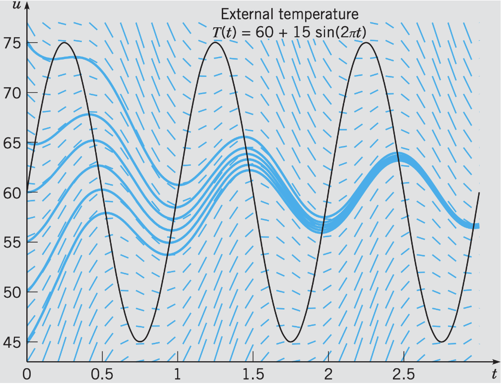

# Lecture 4, Sep 15, 2022

## Method of Integrating Factors

* Consider a first order linear ODE: $\diff{u}{t} + p(t)u = g(t)$:
	* Assume we have a function $\mu(t)$ such that $\mu(t)p(t) = \diff{\mu}{t}$
	* Multiply by $\mu$: $\mu(t)\diff{u}{t} + \mu(t)p(t)u = \mu(t)\diff{u}{t} + \diff{\mu}{t}u = \mu(t)g(t)$
	* $\diff{}{t}(\mu u) = \mu(t)g(t) \implies u = \frac{\int \mu(t)g(t)\,\dt}{\mu(t)}$
	* Choose $\mu$: $\diff{\mu}{t} = \mu(t)p(t) \implies \frac{1}{\mu}\diff{\mu}{t} = \mu(t)p(t) \implies \mu(t) = e^{\int p(t)\,\dt}$

\noteImportant{Method of integrating factors: The solution to $\diff{u}{t} + p(t)u = g(t)$ is $u(t) = \frac{1}{\mu}\left(\int \mu(t)g(t)\,\dt + C\right)$, where the integrating factor $\mu(t) = \exp\left(\int p(t)\,\dt\right)$}

### Example

* Example: $u' = -k(u - T_0 - A\sin(\omega t))$
	* The $A\sin(\omega T)$ term represents seasonal temperature variations
	* Put in standard form: $u' + ku = kT_0 + kA\sin(\omega t)$
	* Calculate integrating factor: $\mu = \exp\left(\int k\,\dt\right) = e^{kt}$
	* General solution: $\alignedeqntwo[t]{u(t)}{\frac{1}{e^{kt}}\left(\int e^{ks}(kT_0 + kA\sin(\omega s))\,\ds + C\right)}{T_0 + \frac{1}{e^{kt}}\left(\int e^{ks}kA\sin(\omega s)\,\ds\right) + C\frac{1}{e^{kt}}}{\cdots}{T_0 + \frac{kA}{k^2 + \omega^2}(k\sin(\omega t) - \omega\cos(\omega t)) + C\frac{1}{e^{kt}}}$

{width=45%}

* Notice all solutions converge to a single solution $u(t) = T_0 + \frac{kA}{k^2 + \omega^2}(k\sin(\omega t) - \omega\cos(\omega t))$
	* The dominant term is completely independent of initial condition $C$
* However, this is not an equilibrium because $\diff{u}{t} \neq 0$

