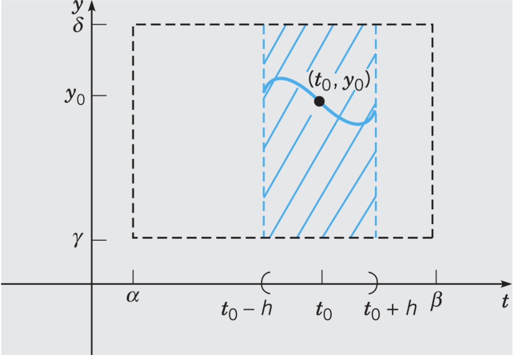

# Lecture 6, Sep 19, 2022

## Existence and Uniqueness of Solutions

* Given an ODE, does a solution exist, and is the solution unique?

\noteThm{Given $y' + p(t)y = g(t), y(t_0) = y_0$, and $p, g$ continuous over $t_0 \in (\alpha, \beta)$, then there exists a unique solution in the interval $(\alpha, \beta)$}
\noteThm{Given $y' = f(t, y), y(t_0) = y_0$, and $f, \pdiff{f}{y}$ continuous over $(t_0, y_0) \in (\alpha, \beta) \times (\gamma, \delta)$, then there exists a unique solution in \textbf{some} interval $(t_0 - h, t_0 + h) \in (\alpha, \beta)$ \tcblower The existence (but not uniqueness) of a solution can be established on the continunity of $f$ alone}

{width=50%}

* The first-order nonlinear existence and uniqueness theorem only guarantees the existence and uniqueness of a solution in some interval within $h$, which we don't know
	* The linear version guarantees the entire continuous interval, whereas the nonlinear version only guarantees some smaller interval within the continuous interval
* Examples:
	* $y' + \frac{2}{t}y = 4t, y(1) = 2$
		* Use the linear theorem
		* $p, g$ continuous except where $t = 0$
		* The initial condition lies within the continuous region, so a unique solution exists for $t \in (0, \infty)$
	* $\diff{y}{t} = \frac{3t^2 + 4t + 2}{2(y - 1)}, y(0) = -1$
		* Use the nonlinear theorem
		* $f$ is continuous except where $y = 1$
		* $f_y$ is continuous except where $y = 1$
		* The initial condition lies in the region of continuity, so a unique solution exists for some region $t \in (-h, h)$
	* $\diff{y}{t} = \frac{3t^2 + 4t + 2}{2(y - 1)}, y(0) = 1$
		* Since $f$ is not continuous at the initial condition, the theorem does not apply
		* Even though it's not guaranteed that a solution will exist, a solution may still exist
		* Solving the DE does yield a solution, but the solution is not unique

\noteImportant{Implication: The graphs of two solutions cannot intersect each other where the theorems hold (because this would violate the uniqueness of solutions)}

"Just because you can't see a solution to an ODE doesn't mean you can't prove it exists." -- Vardan, MAT292 (2022)

