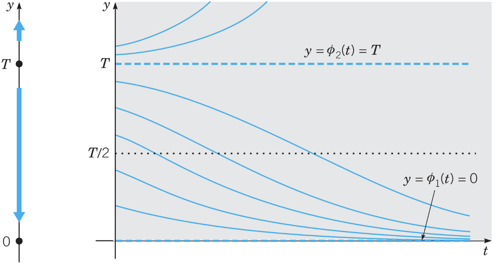
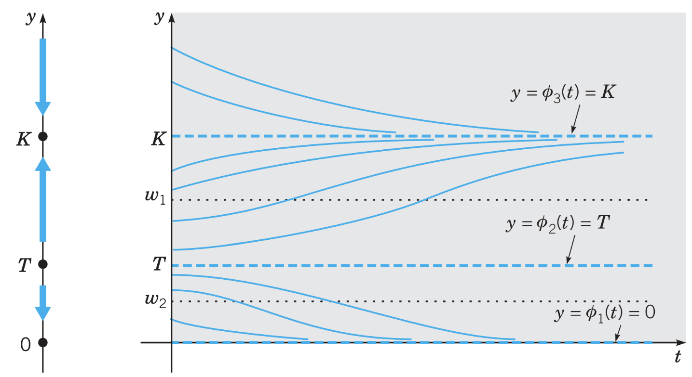

# Lecture 7, Sep 22, 2022

## Logistic Growth

* Simple growth model of $\diff{y}{t} = rt$ is unrealistic, as at some point the population needs to stop growing due to lack of resources
* Growth rate depending on population: $\diff{y}{t} = h(y)y$
	* Growth rate $h(y) = r - ay$
	* If $y$ is small, then $h(y) > 0$ and the population grows
	* If $y$ is large, then $h(y) < 0$ and the population dies off due to lack of resources
* This leads to the logistic equation (Verhulst equation): $\diff{y}{t} = (r - ay)y$
	* Equivalently $\diff{y}{t} = r\left(1 - \frac{y}{K}\right)y, K = \frac{r}{a}$
	* This is a first-order autonomous nonlinear ODE
* $r$ is the intrinsic carrying capacity
* $K$ is the saturation level, or environmental carrying capacity

\noteImportant{Logistic growth model: $$\diff{y}{t} = r\left(1 - \frac{y}{K}\right)y$$ where $K = \frac{r}{a}$; solved by $$y = \frac{y_0K}{y_0 + (K - y_0)e^{-rt}}$$ assuming $y_0 < K$}

{width=80%}

* The line $y = K$ is a stable equilibrium
* $\frac{K}{2}$ is an inflection point, where the population curve goes from concave up to concave down
	* Rate of population growth begins to slow down
* The solution is $y = \frac{y_0K}{y_0 + (K - y_0)e^{-rt}}$, assuming $y_0 < K$

## Growth With a Threshold

* If the initial population is too low, they might all die out before the population can grow
* $\diff{y}{t} = -r\left(1 - \frac{y}{T}\right)y$

{width=80%}

* If $y_0 > T$ then the population keeps growing; if $y_0 < T$ then the population shrinks until everyone dies out
	* $y_0 = T$ is an unstable equilibrium
* Solution: $y = \frac{y_0T}{y_0 + (T - y_0)e^{rt}}$

## Logistic Growth With a Threshold

* Combine the two models: $\diff{y}{t} = -r\left(1 - \frac{y}{T}\right)\left(1 - \frac{y}{K}\right)y$

{width=80%}

