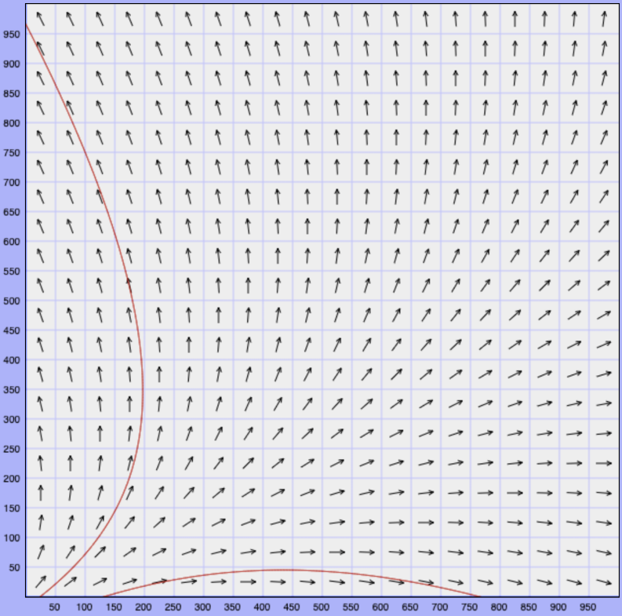
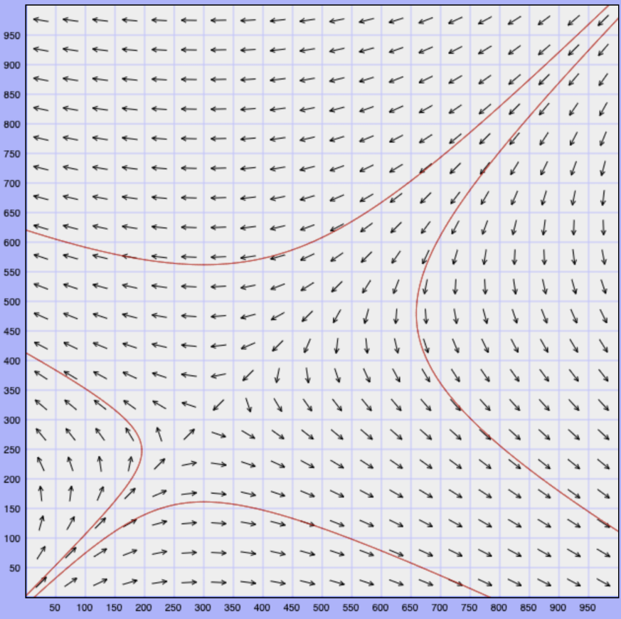

# Lecture 8, Sep 23, 2022

## Systems of Two First Order Linear ODEs

* Every week:
	* McDonald's gains 2 followers for every follower they have
	* Wendy's gains 3 followers for every follower they have
	* McDonald's loses 2 followers for every follower of Wendy's
	* Wendy's loses a follower for every follower of McDonald's
	* Both gain 300 followers
* $\twopiece{m' = 2m - 2w + 300}{w' = 3w - m + 300}$
* As a matrix: $\cvec{m'}{w'} = \mattwo{2}{-2}{-1}{3}\cvec{m}{w} + \cvec{300}{300}$

{width=40%}

{width=40%}

* Notice the diagonal lines of vectors; they correspond to eigenvectors; the directions of arrows on the lines correspond to eigenvalues

## First Order Linear ODEs of Dimension Two

* More generally, we have $\cvec{\diff{x}{t}}{\diff{y}{t}} = \cvec{p_{11}(t)x + p_{12}(t)y + g_1(t)}{p_{21}(t)x + p_{22}(t)y + g_2(t)}$
	* This can be written as $\diff{\vec z}{t} = K(t)\vec z + \vec g(t)$
	* $\vec z = \cvec{x}{y}$ is the *state vector*, where $x, y$ are *state variables*
	* $K(t) = \mattwo{p_{11}}{p_{12}}{p_{21}}{p_{22}}, \vec g(t) = \cvec{g_1(t)}{g_2(t)}$
* If $\vec g(t) = 0$, this system is *homogeneous*

\noteThm{Existence and Uniqueness: Given $$\cvec{\diff{x}{t}}{\diff{y}{t}} = \cvec{p_{11}(t)x + p_{12}(t)y + g_1(t)}{p_{21}(t)x + p_{22}(t)y + g_2(t)}$$ and $$\cvec{x(t_0)}{y(t_0)} = \cvec{x_0}{y_0}$$ if $p_{11}, \cdots, p_{22}, g_1, \cdots, g_2$ are continous on an open interval $t_0 \in (\alpha, \beta)$, then there exists a unique solution in the interval $(\alpha, \beta)$.}

\noteDefn{A first order linear ODE $$\diff{\vec x}{t} = K(t)\vec x + \vec g(t)$$ is autonomous if coefficients do not depend on $t$, i.e. $$\diff{\vec x}{t} = A\vec x + \vec b$$ \tcblower As a consequence, if a first order linear ODE is autonomous, a unique solution exists and is valid for all $t$.}

## Equilibrium Points

* The equilibrium points are where $\diff{\vec x}{t} = 0$; to find these we need to solve the system

\noteDefn{For a first order linear autonomous ODE $$\diff{\vec x}{t} = A\vec x + \vec b$$ the constant solution $\vec x = -A^{-1}\vec b$ is an equilibrium solution/critical point, assuming $A^{-1}$ exists}

* If $A$ is not invertible, there may be either no equilibrium points or an infinite number of equilibrium points, e.g. an entire line of equilibrium points where vectors on both sides point towards the line

