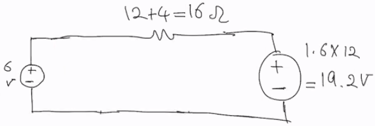

# Lecture 16, Feb 16, 2022

## Source Transformation

* This method is not as strong as nodal analysis or mesh analysis, but gives insight into circuit analysis
* Consider 2 circuits:
  \begin{circuitikz}\draw (0, 0) to[american voltage source=$v_s$, invert] (0, 1.5) to[R=$R$, -o] (1.5, 1.5) -- (3, 1.5) to[R=$R_L$, i=$i_{L1}$] (3, 0) to[short, -o] (1.5, 0) -- (0, 0); \end{circuitikz}
  \begin{circuitikz}\draw (0, 0) to[american current source, l^=$i_s$] (0, 1.5) to[short, -o] (2.0, 1.5) -- (3, 1.5) to[R=$R_L$, i=$i_{L2}$] (3, 0) to[short, -o] (2.0, 0) -- (0, 0); \draw (1.5, 1.5) to[R=$R$] (1.5, 0); \end{circuitikz}
	* For circuit 1, $i_{L1} = \frac{v_s}{R + R_L}$ by Ohm's law
	* For circuit 2, $i_{L2} = i_s\frac{R}{R + R_L}$ by current division
	* If both circuits are equivalent, then we'll get $i_{L1} = i_{L2} \implies \frac{v_s}{R + R_L} = i_s\frac{R}{R + R_L} \implies v_s = i_sR$
* Source transformation: We can transform a voltage source with a resistor in series to a current source with a resistor in parallel if $v_s = Ri_s$
	* The direction of the sources do not follow PSC
* Example circuit: Find the power of the $6\si{V}$ source:
  \begin{circuitikz}
  	\draw (0, 0) to[american voltage source=$6\si{V}$, invert] (0, 1.5) to[R=$4\si{\ohm}$] (1.5, 1.5) to[R=$6\si\ohm$] (3, 1.5) to[R=$5\si\ohm$] (4.5, 1.5) to[american voltage source=$40\si{V}$] (4.5, 0) -- (3, 0) to[R=$10\si\ohm$] (1.5, 0) -- (0, 0);
	\draw (1.5, 1.5) to[R=$30\si{\ohm}$] (1.5, 0);
	\draw (3, 1.5) to[R=$20\si\ohm$] (3, 0);
  \end{circuitikz}
  * Convert voltage source with series resistor to current source with parallel resistor:
	  \begin{circuitikz}
		\draw (0, 0) to[american voltage source=$6\si{V}$, invert] (0, 1.5) to[R=$4\si{\ohm}$] (1.5, 1.5) to[R=$6\si\ohm$] (3, 1.5) -- (4.5, 1.5) to[R=$5\si{\ohm}$] (4.5, 0) -- (3, 0) to[R=$10\si\ohm$] (1.5, 0) -- (0, 0);
		\draw (1.5, 1.5) to[R=$30\si{\ohm}$] (1.5, 0);
		\draw (3, 1.5) to[R=$20\si\ohm$] (3, 0);
		\draw (4.5, 0) -- (6, 0) to[american current source, l_=$8\si{A}$] (6, 1.5) -- (4.5, 1.5);
	  \end{circuitikz}
  * Now we can simplify the two resistors in parallel on the right side:
	  \begin{circuitikz}
		\draw (0, 0) to[american voltage source=$6\si{V}$, invert] (0, 1.5) to[R=$4\si{\ohm}$] (1.5, 1.5) to[R=$6\si\ohm$] (3, 1.5) to[R=$4\si{\ohm}$] (3, 0) to[R=$10\si\ohm$] (1.5, 0) -- (0, 0);
		\draw (1.5, 1.5) to[R=$30\si{\ohm}$] (1.5, 0);
		\draw (3, 0) -- (4.5, 0) to[american current source, l_=$8\si{A}$] (4.5, 1.5) -- (3, 1.5);
	  \end{circuitikz}
  * Now transform the current source and parallel resistor to a voltage source and a series resistor:\
	  {width=50%}
  * Simplify series resistors:\
	  {width=50%}
  * Convert voltage source to current source:\
	  {width=50%}
  * Simplify parallel resistors:\
	  {width=50%}
  * Convert current source to voltage source:\
	  {width=50%}
  * Simplify series resistors:\
	  {width=50%}
  * Now we can use KVL on this loop to find the current in this circuit and get the power
* If we have a voltage source in parallel with a resistor, the value of the resistance does not affect the voltage distributed to the rest of the circuit, so it doesn't impact the rest of the circuit
	* Since the resistor has no affect on the rest of the circuit, we can remove it altogether (open the circuit)
* If we have a current source in series with a resistor, the value of the resistance does not affect the current distributed to the rest of the circuit, so it has no impact either
	* Since it has no affect, we can remove it (short the circuit)

