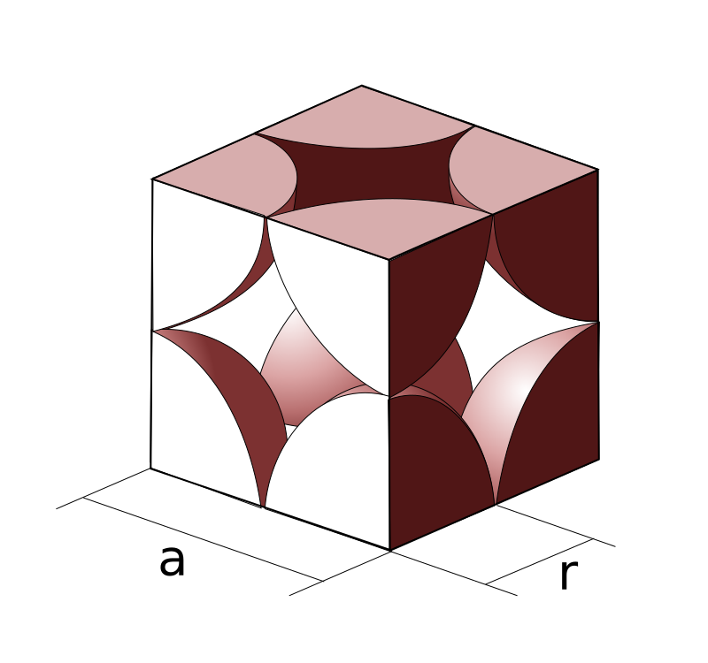
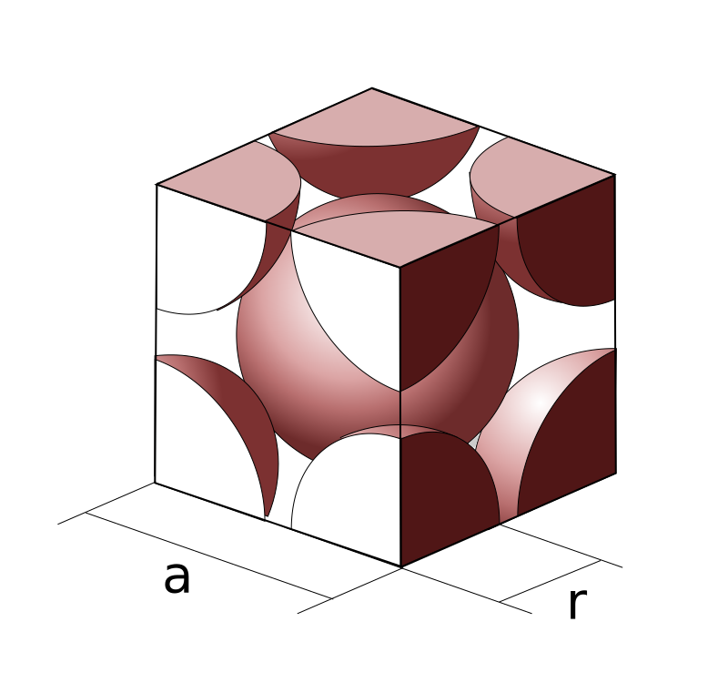
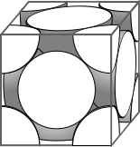
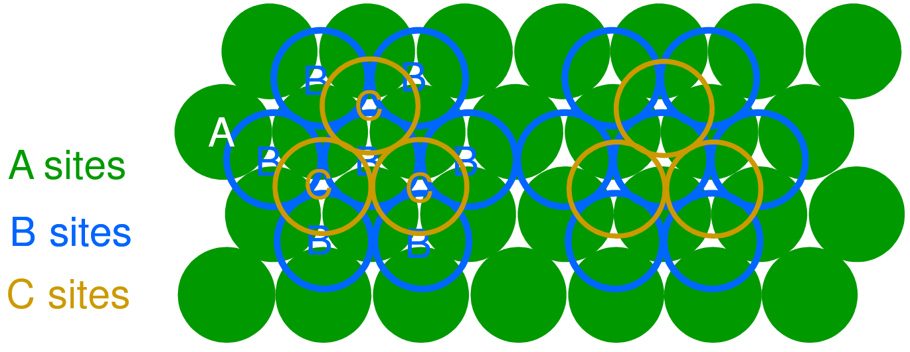
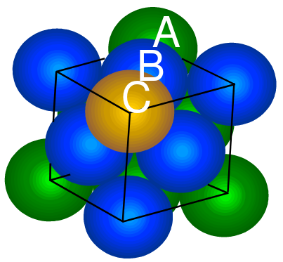
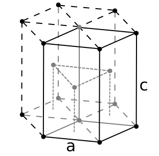

# Lecture 10, Feb 3, 2022

## Crystalline Structures

* Often structures have regular patterns and ordered packing, since this allows the atoms to get closer on average and have lower energy
* Crystalline structures are typical of metals, many ceramics, and some polymers
* Non-crystalline (amorphous) materials have no regular periodic pattern; this occurs when the material has complex structures or undergo rapid cooling so it doesn't have time to settle into patterns
* Metals tend to be densely packed since only one element is present so all radii are identical, bonding is nondirectional, so simple crystalline structures are formed
* Atomic packing factor (APF) is defined as the ratio of the volume of the atoms in a unit cell to the volume of the unit cell (assuming atoms are hard spheres)
* Types of crystalline structures for metals:
	* Simple cubic: close-packed directions are cube edges
		* {width=20%}
		* Coordination number is 6; 1 atom per cell (8 corners of eighth atoms)
		* APF is $\frac{\frac{4}{3}\pi(0.5a)^3}{a^3} = 0.52$
		* Packing density is rather low, so this structure is rare (found in $\ce{Po}$)
	* Body centered cubic (BCC): Atoms touch along the cube diagonals (we still have a cube, but there's one big atom in the middle)
		* {width=20%}
		* Coordination number is 8 (8 other atoms touch each one); 2 atoms per unit cell
		* APF is $\frac{2 \cdot \frac{4}{3}\pi\left(\frac{\sqrt 3}{4}a\right)^3}{a^3} = 0.68$
		* Packing density is higher and is more commonly found, e.g. $\ce{Cr}, \ce{W}, \ce{Fe} (\alpha)$
	* Face centered cubic (FCC): Atoms touch along the atomic diagonals
		* {width=15%}
		* Coordination number is 12, 4 atoms per unit cell (6 faces of half atoms, 8 corners of eighth atoms)
		* APF is $\frac{4 \cdot \frac{4}{3}\pi\left(\frac{\sqrt 2}{4}a\right)^3}{a^3} = 0.74$
		* This is the theoretically maximum achievable APF
		* We can visualize the face-centered packing as hexagonal packing in layers
		* {width=80%}
		* The diagonal of the unit cube is a plane of atoms
		* {width=20%}
		* (ABC) packing sequence
	* Hexagonal close packing (HCP): (AB) packing sequence
		* {width=15%}
		* Unlike FCC there are only 2 types of layers; the third later is directly aligned with the first
		* Same coordination number of 12, 6 atoms per unit cell, and same APF
		* Found in materials such as $\ce{Cd}, \ce{Mg}$

