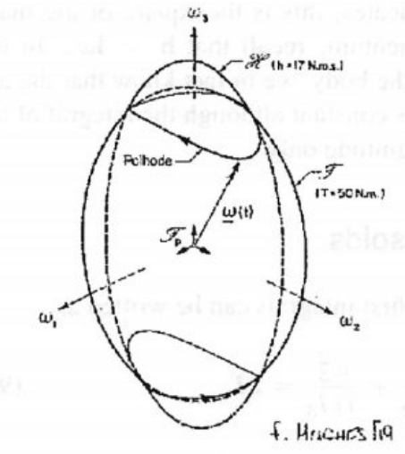
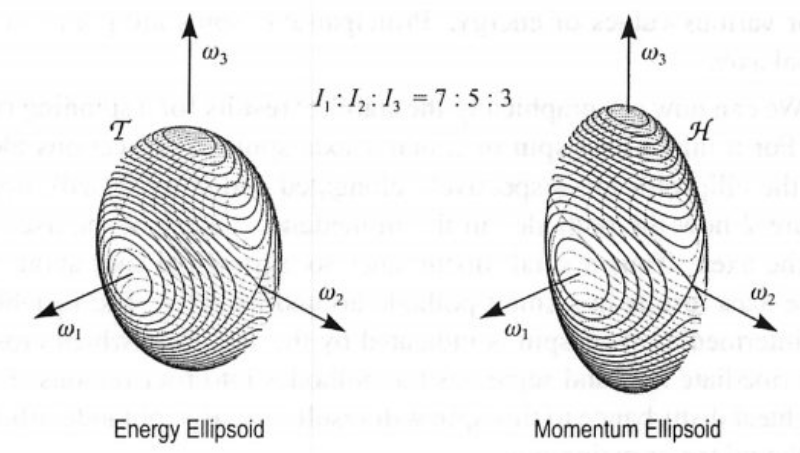
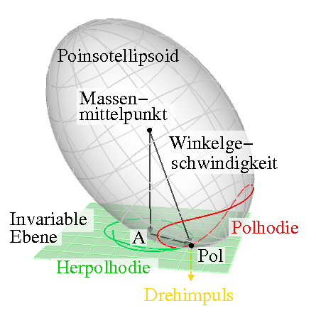

# Lecture 19, Nov 21, 2023

## Spin Stability of Rigid Bodies

* Consider a system with no external torque, spinning at a constant nominal rate $\bm\omega = \cvec{0}{\nu}{0}$; under what conditions is this system stable?
* Consider a small perturbation, such that $\bm\omega(t) = \bm\omega _0 + \Delta\bm\omega(t)$ where $\Delta\bm\omega(t) = \cvec{\Delta\omega _1}{\Delta\omega _2}{\Delta\omega _3}$
* Plugging into Euler's equations: $\threepiece{I_1\Delta\dot\omega _1 - (I_2 - I_3)(\nu + \Delta\omega _1)\Delta\omega _3 = 0}{I_2\Delta\dot\omega _2 - (I_3 - I_1)\Delta\omega _3\Delta\omega _1 = 0}{I_3\Delta\dot\omega _3 - (I_1 - I_2)(\nu + \Delta\omega _2) = 0}$
	* After linearizing: $\threepiece{I_1\Delta\dot\omega _1 - (I_2 - I_3)\nu\Delta\omega _3 = 0}{I_2\Delta\dot\omega _2 = 0}{I_3\Delta\dot\omega _3 - (I_1 - I_2)\nu\Delta\omega _1 = 0}$
	* $\Delta\omega _2$ is then constant, so it is always stable
	* Taking the derivative of the first equation and substituting in $\Delta\dot\omega _3$, we can get a differential equation for $\Delta\omega _1$
	* $\Delta\ddot\omega _1 + \frac{(I_2 - I_3)(I_2 - I_1)}{I_1I_3}\nu^2\Delta\omega _1 = 0 \implies \Delta\ddot\omega _1 + \beta^2\Delta\omega _1 = 0$
		* Note we could do the same to the second equation and we would get something in the exact same form, with the same $\beta^2$
	* This is now an oscillator, so for stability we need $\beta^2 > 0$; $\beta^2 \leq 0$ makes it unstable
* For $\beta^2 > 0$ we need $I_2 - I_3$ and $I_2 - I_1$ to have the same sign, for a rotation about the 2 axis to be stable
	* This requires either $I_2 > I_1, I_3$ or $I_2 < I_1, I_3$ -- it has to be the major (largest inertia) or minor (smallest inertia) axis, but not the intermediate axis
* From the equation of motion: $\bm I\dot{\bm\omega} + \bm\omega^\times\bm I\bm\omega = 0 \implies \bm\omega^T\bm I\dot{\bm\omega} = 0 \implies \diff{}{t}\left(\frac{1}{2}\bm\omega^T\bm I\bm\omega\right) = 0$
	* Note the $\bm\omega^T\bm\omega^\times$ cancels
	* Integrating this, we get $\frac{1}{2}\bm\omega^T\bm I\bm\omega = T$ is a constant -- this is the rotational kinetic energy
	* In the principal axis frame, expanding this out we get $\frac{\omega _1^2}{\frac{2T}{I_1}} + \frac{\omega _2^2}{\frac{2T}{I_2}} + \frac{\omega _3^2}{\frac{2T}{I_3}} = 0$
	* Geometrically, means that $\bm\omega$ must lie on the surface of an ellipsoid -- the energy ellipsoid
* Multiplying instead by $\bm\omega^T\bm I$, we have $\bm\omega^T\bm I^2\dot{\bm\omega} + \bm\omega^T\bm I\bm\omega^\times\bm I\bm\omega = 0 \implies \bm\omega^T\bm I^2\dot{\bm\omega} = 0$
	* Note $\bm z^T\bm\omega^\times\bm z = 0$ for any skew-symmetric $\bm\omega^\times$ (since it is a scalar, and if you transpose it you get its negative)
	* Doing the same and integrating gives us $\bm\omega^T\bm I^2\bm\omega = h^2$, another constant -- this is the square of the angular momentum
	* $\frac{\omega _1^2}{\frac{h^2}{I_1^2}} + \frac{\omega _2^2}{\frac{h^2}{I_2^2}} + \frac{\omega _3^2}{\frac{h^2}{I_3^2}} = 0$
	* Geometrically this gives us yet another ellipsoid for $\bm\omega$ -- the momentum ellipsoid

{width=20%}

{width=45%}

* Since $\bm\omega$ has to be on both ellipsoids, it must stay on their intersection -- these intersection lines are called *polhodes*
	* Due to the squaring of $I$, the momentum ellipsoid will usually appear more stretched out than the energy ellipsoid
	* Specifying the energy and angular momentum initial conditions choose a pair of polhodes; a third initial condition is needed to solve for the angular momentum as a function of time
	* For a pure spin about the minor axis, the momentum ellipsoid is entirely contained within the energy ellipsoid, so the only intersections are the top and bottom points
		* With a small perturbation, the momentum ellipsoid increases slightly in size, so we get a polhode near the pole, which is a small circle; since the angular momentum stays within the circle, this means we are stable
	* For a pure spin about the major axis, the energy ellipsoid is entirely contained within the momentum ellipsoid
* Notice $T = \frac{1}{2}\bm\omega^T\bm I\bm\omega$ so $\bm\nabla _\omega T = \bm I\bm\omega = \bm h$
	* Therefore $\bm h$ is always normal to the energy ellipsoid, and moreover it is fixed in inertial space since there are no external torques
	* We can interpret this as the energy ellipsoid "rolling" on the *invariable plane*
		* This is because $T = \frac{1}{2}\bm\omega^T\bm I\bm\omega = \frac{1}{2}\bm\omega^T\bm h$ is constant, so the projection of $\uvec\omega$ onto $\uvec h$ is constant -- the tip of $\uvec\omega$ must lie on a plane normal to $\uvec h$
	* As we roll the ellipsoid, $\bm\omega$ remains on both the surface of the energy ellipsoid and the invariable plane
	* This is known as *Poinsot's Geometric Interpretation*
	* The curve traced out on the invariable plane is known as the *herpolhode*
	* Since the energy ellipsoid exists in the principal axis frame, which is a body-fixed frame, the motion of the energy ellipsoid is the motion of the body

{width=40%}

* In real life however, since any body dissipates energy, $\dot T < 0$, so a minor axis spin will slowly shift towards a major axis spin; as long as the system can lose energy, minor axis spins are unstable
	* The major axis spin is asymptotically stable since the energy and momentum ellipsoids must intersect, so at this point the energy ellipsoid can't spin more

