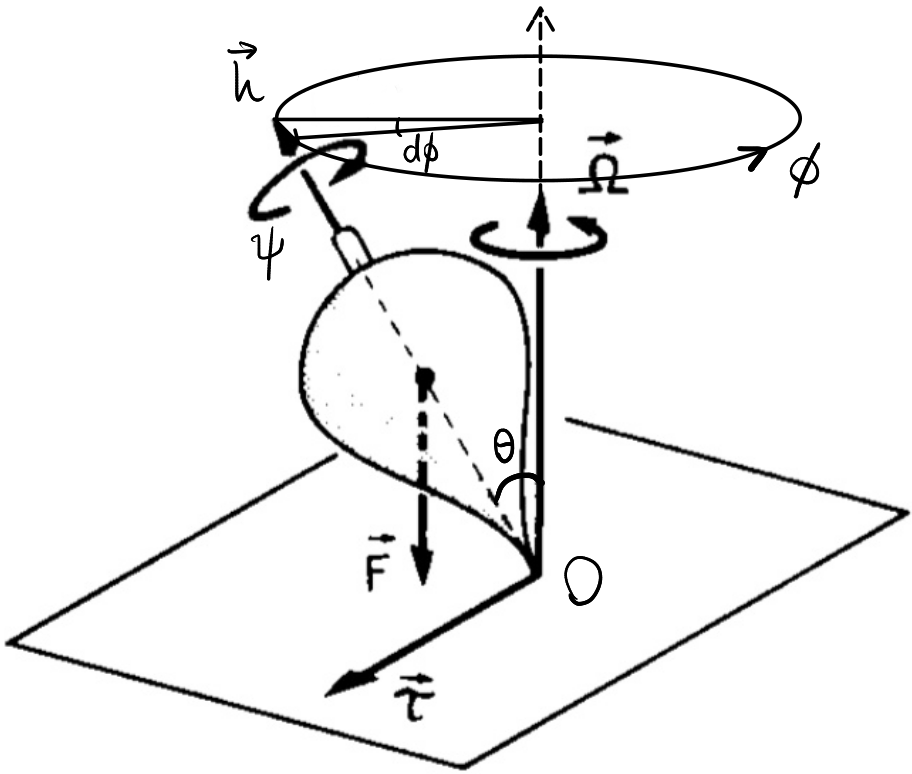
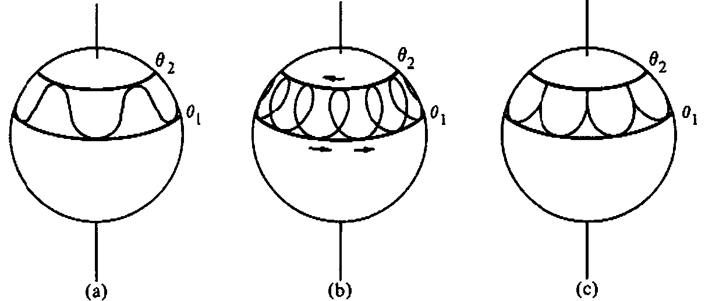

# Lecture 20, Nov 23, 2023

## Analysis of a Spinning Top

{width=70%}

* Consider a general spinning top spinning about its axis of symmetry, with the contact point fixed; what is the rate of the precession of $\uvec h$ about the vertical axis?
* In general we have 2 contributors to $\uvec h$: the spin of the top itself and the wobbling; we will assume that the top is spinning fast enough that almost all $\uvec h$ lies in the spinning of the top itself
* We also assume the angular velocity has constant magnitude
* We want $\diff{\phi}{t}$, where $\dphi$ is a small change to the angle of the projection of $\uvec h$ onto the horizontal plane
	* $\dd\phi = \frac{\dd h}{h\sin\theta}$ where $\theta$ is the angle made with the vertical axis (note $\theta$ is called the *nutation angle*)
* $h = J_a\nu$ where $\nu$ is the spin rate and $J_a$ is the axial moment of inertia
* The change in $\uvec h$ is due to the only externally applied force -- gravity
	* Gravity acts at the centre of mass, which is a distance $r$ from $O$
	* Therefore it exerts a torque $\uvec\tau = m\uvec gr\sin\theta = \uvec h^\dota$
	* The magnitude is then $\tau = mgr\sin\theta = \diff{h}{t}$
* Substitute relevant quantities: $\diff{\phi}{t} = \frac{\diff{h}{t}}{J_a\nu\sin\theta} = \frac{mgr\sin\theta}{J_a\nu\sin\theta} = \frac{mgr}{J_a\nu}$
	* This is the *precession rate*
* To analyze the full motion, we will use the Lagrangian formulation; consider a 3-1-3 set of Euler angles $\phi, \theta, \psi$ where the 3-axis is the vertical axis
	* Recall: $\bm\omega = \bm S(\theta, \psi)\cvec{\dot\phi}{\dot\theta}{\dot\psi} = \cvec{\dot\phi\sin\theta\sin\phi + \dot\theta\cos\psi}{\dot\theta\sin\theta\cos\psi - \theta\sin\psi}{\dot\phi\cos\theta + \dot\psi}$
	* The kinetic energy is $T = \frac{1}{2}\bm\omega^T\bm J\bm\omega$, where $\bm J = \diagthree{J_t}{J_t}{J_a}$ (assuming symmetry)
		* We will call the transverse moments of inertial $J_t$ and the axial one $J_a$
	* Expanding this out: $T = \frac{1}{2}J_t(\dot\theta^2 + \phi^2\sin^2\theta) + \frac{1}{2}J_a(\dot\phi\cos\theta + \dot\psi)^2$
	* The potential energy is taken at the centre of mass and so $V = mgr\cos\theta$
* Notice $L$ is not dependent on $\phi$ and $\psi$, so $\pdiff{L}{\dot\phi}$ and $\pdiff{L}{\dot\psi}$ are constant (these are the angular momenta about the two axes)
	* Note these are called *cyclic* or *ignorable* coordinates
	* $\pdiff{L}{\dot\phi} = J_t\dot\phi\sin^2\theta + J_a\cos\theta(\dot\phi\cos\theta + \dot\psi) = J_t\omega _\phi$
	* $\pdiff{L}{\dot\psi} = J_a(\dot\phi\cos\theta + \dot\psi) = J_a\nu$
	* With the assumption that $\dot\phi \ll \dot\psi$ we can write the first equation as $J_t\dot\phi\sin^2\theta + J_a\nu\cos\theta = J_t\omega _\phi$
* Finally the equation in $\theta$: $J_t\ddot\theta + (J_a - J_t)\phi^2\sin\theta\cos\theta + J_a\dot\phi\dot\psi\sin\theta - mgr\sin\theta = 0$
	* We see that even with no non-conservative forces, the nutation angle still changes
	* The faster that the top is spinning, the less the nutation changes, which is why normally it seems almost constant to us

{width=80%}

