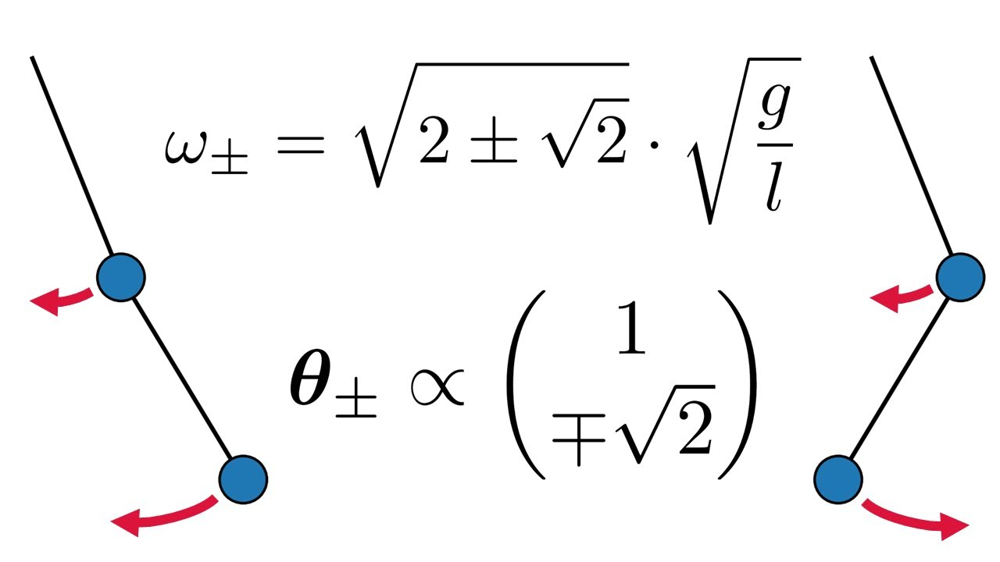

# Lecture 22, Nov 30, 2023

## Modal Analysis

* Consider first the unforced equation of motion, $\bm M\ddot{\bm q} + \bm K\bm q = \bm 0$
* Substituting in the test solution $\bm q_0e^{\lambda t}$ gives us $(\lambda^2\bm M + \bm K)\bm q_0 = \bm 0$
	* Clearly, this is satisfied for the trivial solution $\bm q_0 = \bm 0$, but we want some non-quiescent solution
	* For $\bm q_0$ to be nonzero, we need $\det(\lambda^2\bm M + \bm K) = 0$; this resembles an eigenproblem where instead of identity we have $\bm M$
	* There will be multiple such $\lambda$ and $\bm q_0$
* $\lambda _\alpha^2$ are then the eigenvalues and $\bm q_\alpha$ the eigenvectors; $\det(\lambda^2\bm M + \bm K) = 0$ is the characteristic equation or eigenequation
	* In general the eigenequation gives us an $n$-th order polynomial in $\lambda^2$
	* Consider multiplying both sides by the Hermitian of $\bm q_\alpha$: $\lambda _\alpha^2\bm q_\alpha^H\bm M\bm q_\alpha + \bm q_\alpha^H\bm K\bm q_\alpha = 0$
		* $\bm M$ is real and symmetric, so $\bm q_\alpha^H\bm M\bm q_\alpha$ is real; furthermore its positive-definiteness means this is also always greater than 0
		* $\bm K$ is real and symmetric, so $\bm q_\alpha^H\bm K\bm q_\alpha$ is also real
		* $\lambda _\alpha^2 = -\frac{\bm q_\alpha^H\bm K\bm q_\alpha}{\bm q_\alpha^H\bm M\bm q_\alpha}$ so indeed $\lambda$ is real
		* Further, $\bm K > 0 \implies \lambda _\alpha^2 < 0$, or $\lambda _\alpha = \pm j\omega _\alpha$
		* By extension, the $\bm q_\alpha$ are real
* Do $\bm q_\alpha$ form a basis?
	* Consider $\lambda _\alpha^2\bm q_\beta^T\bm M\bm q_\alpha + \bm q_\beta^T\bm K\bm q_\alpha = 0$ and $\lambda _\beta^2\bm q_\alpha^T\bm M\bm q_\beta+ \bm q_\alpha^T\bm K\bm q_\beta= 0$
	* Subtracting the two equations gives $(\lambda _\alpha^2 - \lambda _\beta^2)\bm q_\alpha^T\bm M\bm q_\beta = 0$ (note we can do this since the terms are scalars)
	* Then $\bm q_\alpha^T\bm M\bm q_\beta = \twocond{> 0}{\lambda _\alpha^2 = \lambda _\beta^2}{0}{\lambda _\alpha^2 \neq \lambda _\beta^2}$
	* WLOG normalize the $\bm q$ vectors with respect to $\bm M$, then $\bm q_\alpha^T\bm M\bm q_\beta = \delta _{\alpha\beta} \implies \bm Q^T\bm M\bm Q = \bm 1$ where $\bm Q = \rvec{\bm q_1}{\cdots}{\bm q_m}$
		* Note we might get repeated eigenvalues, but we can always diagonalize due to the symmetry of $\bm M$
	* Plugging back into the first equation, $\lambda _\alpha^2\delta _{\alpha\beta} + \bm q_\alpha^T\bm K\bm q_\beta^T \implies \bm q_\alpha^T\bm K\bm q_\beta^T = \twocond{-\lambda _\alpha^2}{\alpha = \beta}{0}{\alpha \neq \beta}$
	* So we can also write $\bm Q^T\bm K\bm Q = -\Lambda^2$
* Let $\bm q(t) = \sum _{\beta = 1}^n \bm q_\beta\eta _\beta(t)$
	* $\alignedimp[t]{\sum _{\beta = 1}^n \bm M\bm q_\beta\ddot\eta _\beta + \sum _{\beta = 1}^n \bm K\bm q_\beta\eta _\beta = \bm f}{\sum _{\beta = 1}^n \bm q_\alpha^T\bm M\bm q_\beta\ddot\eta _\beta + \sum _{\beta = 1}^n \bm q_\alpha^T\bm K\bm q_\beta\eta _\beta = \bm q_\alpha^T\bm f}{\sum _{\beta = 1}^n \delta _{\alpha\beta}\ddot\eta _\beta + \sum _{\beta = 1}^n -\lambda _\alpha^2\eta _\beta = \bm q_\alpha^T\bm f}{\ddot\eta _\alpha - \lambda _\alpha^2\eta _\alpha = f_\alpha}$
	* We have uncoupled the system of differential equations
	* $\bm q_\beta$ are the *mode shapes*, and $\eta _\beta(t)$ are the *modal coordinates*; $\bm q_\alpha\eta _\alpha$ is a *mode* of vibration
	* Note that if $\bm K$ were positive definite, we would get all negative $\lambda _\alpha^2$, giving oscillatory motion; then $\omega _\alpha^2 = -\lambda _\alpha^2$ are the *natural frequencies* of vibration

### Double Pendulum Revisited

* Recall: $\bm M = ml^2\mattwo{2}{1}{1}{1}, \bm K = mgl\mattwo{2}{0}{0}{1}$
* Clearly $\bm K$ is positive definite here, so let's write $\lambda^2$ as $-\omega^2$
* We want to solve $\det(-\omega _\alpha^2\bm M + \bm K) = 0$
* Let $\mu _\alpha^2 = -\omega _\alpha^2\frac{l}{g}$, so that $\det\mattwo{-2\mu _\alpha^2 + 2}{-\mu _\alpha^2}{-\mu _\alpha^2}{-\mu _\alpha^2 + 1} = 0$
* Expanded: $\mu^3 - 4\mu^2 + 2 = 0 \implies \mu^2 = 2 \pm \sqrt{2}$
* Therefore the modal frequencies are $\omega _1 = \sqrt{(2 - \sqrt{2})\frac{g}{l}}, \omega _2 = \sqrt{(2 + \sqrt{2})\frac{g}{l}}$
* Solve the eigenequation to get $\frac{\theta _{1,2}}{\theta _{1,1}} = \sqrt 2$ and $\frac{\theta _{2,2}}{\theta _{2,1}} = -\sqrt{2}$
* For each of the modes, at any time, the ratio of the coordinates remains the same
* Notice that in the second mode, we have a *node* -- a point that does not move
	* In general, for an $n$ degree of freedom system, we will have $n$ modes; mode $n$ will have $n - 1$ nodes

{width=50%}

