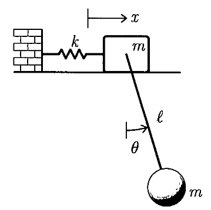
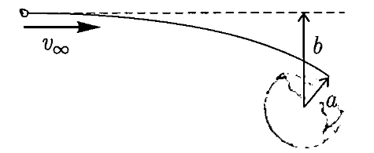
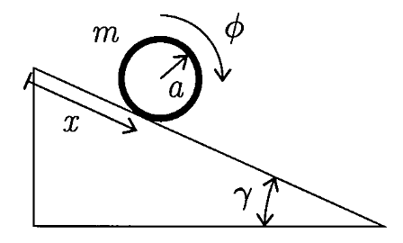

# Lecture 23, Dec 5, 2023

## Exam Review

{width=30%}

* Consider a system with a mass $m$ on a horizontal frictionless plane, connected to inertial space by a spring of stiffness $k = \frac{mg}{l}$, with $x$ measured from the equilibrium position; a pendulum of length $l$ and mass $m$ is connected to the mass, with $\theta$ measured from vertical
	a. Derive the potential energy for the system
		* $V = \frac{1}{2}kx^2 - mgl\cos\theta$
		* Approximate to second order: $V = \frac{1}{2}kx^2 - mgl\left(1 - \frac{1}{2}\theta^2\right) = \frac{1}{2}kx^2 - mgl + \frac{1}{2}mgl\theta^2$
		* We want this in the form of $\frac{1}{2}\bm q^T\bm K\bm q$, ignoring constant terms
		* Let us define $\bm q = \cvec{x}{l\theta}$ so that the units are consistent
		* $\bm K = \mattwo{k}{0}{0}{\frac{mg}{l}} = k\bm 1$ (note no $1/2$ in the matrix, since the factor is outside)
	b. Derive the kinetic energy for the system
		* The velocity of the bob is the vector sum of the block's velocity and the bob's velocity relative to the block
		* By the cosine law: $v^2 = \dot x^2 + l^2\dot\theta^2 - 2l\dot x\dot\theta\cos(\pi - \theta) = \dot x^2 + l^2\dot\theta^2 + 2l\dot x\dot\theta\cos\theta$
		* $T = \frac{1}{2}m\dot x^2 + \frac{1}{2}mv^2 = \frac{1}{2}m\left(2\dot x^2 + l^2\dot\theta^2 + 2l\dot x\dot\theta\cos\theta\right)$
		* We want this in the form of $\frac{1}{2}\dot{\bm q}^T\bm M\dot{\bm q}$
		* To second order: $T = \frac{1}{2}m(2\dot x^2 + l^2\dot\theta^2 + 2l\dot x\dot\theta)$
		* $\bm M = m\mattwo{2}{1}{1}{1}$ (note no $l$ terms in the matrix since these are in $\bm q$ itself)
	c. What are the linearized equations of motion?
		* $\bm M\ddot{\bm q} + \bm K\bm q = \bm 0$
		* Notice that $\bm K$ is symmetric and positive definite, so all modes are stable (purely imaginary eigenvalues)
	d. Determine the frequencies of vibration
		* This requires us to solve for the eigenvalues
		* $\det(\lambda^2\bm M + \bm K) = 0$
		* Since we know $\lambda$ are purely imaginary, let $\lambda^2 = -\omega^2$
		* $\det(-\omega^2\bm M + \bm K) = \det\left(\mattwo{k - 2m\omega^2}{-\omega^2 m}{-\omega^2 m}{k - m\omega^2}\right) = 0$
		* Let $\mu^2 = \frac{\omega^2 m}{k}$, then $\det\left(\mattwo{-2\mu^2 + 1}{-\mu^2}{-\mu^2}{-\mu^2 + 1}\right) = 0$ (after dividing through by $k$)
		* $\mu^4 - 2\mu^2 + 1 = 0 \implies \mu^2 = \frac{3}{2} \pm \frac{\sqrt{5}}{2}$
		* $\omega^2 = \frac{k}{m}\left(\frac{3}{2} \pm \frac{\sqrt{5}}{2}\right) \implies \omega _1 = \sqrt{\frac{k}{m}\left(\frac{3}{2} - \frac{\sqrt{5}}{2}\right)}, \omega _2 = \sqrt{\frac{k}{m}\left(\frac{3}{2} + \frac{\sqrt{5}}{2}\right)}$
	e. Determine and sketch the mode shapes of vibration
		* This requires us to solve for the eigenvectors
		* Plug in $\omega^2$ to $(-\omega _\alpha^2\bm M + \bm K)\bm q_\alpha = \bm 0$
		* $\bm q_1 \propto \cvec{-1 + \sqrt{5}}{3 - \sqrt{5}}, \bm q_2 \propto \cvec{-1 - \sqrt{5}}{3 + \sqrt{5}}$
		* The first node has both the block and pendulum on the same side, while the second node has the block and pendulum on different sides in opposing motion
* In general it usually helps to make the coordinates dimensionally consistent, so that the mass and stiffness matrices are dimensionally consistent, which usually makes the math easier

{width=30%}

* Consider a meteor approaching from infinity with $v_\infty = \sqrt{\frac{\mu}{a}}$, where $a$ is the radius of the Earth and $\mu$ is the reduced mass of the meteor and Earth; let the perpendicular distance from the centre of the Earth to the asymptotes of the hyperbolic orbit be $b$; what would $b$ be if the meteor were to just skim the surface of the Earth?
	* We know this orbit will be hyperbolic, since if it were parabolic, we'd have $v_\infty = 0$
	* The specific energy is $e = \frac{1}{2}v^2 - \frac{\mu}{r}$
	* The specific angular momentum at infinity is $h = bv_\infty$ (since $b$ is the moment arm, and $v_\infty$ is the velocity)
	* When skimming the Earth, we have $h = av_p$, but due to conservation of angular momentum we have $av_p = bv_\infty$ so $b = \frac{av_p}{v_\infty}$
	* To get $v_p$ we use energy conservation: at infinity $e = \frac{1}{2}v_\infty^2$ (since $r \to \infty$); when skimming the Earth, $e = \frac{1}{2}v_p^2 - \frac{\mu}{a}$
	* Therefore $v_p^2 = 2\left(\frac{1}{2}v_{\infty}^2 + \frac{\mu}{a}\right) = \frac{3\mu}{a} \implies v_p = \sqrt{3}v_\infty$
	* Therefore $b = \frac{a\sqrt{3}v_\infty}{v_\infty} = \sqrt{3}a$

{width=30%}

* Consider a uniform hoop of mass $m$ and radius $a$ rolling without slipping on an incline of angle $\gamma$; the distance travelled by the hoop is $x$ and its rotation angle is $\phi$
	a. What is the constraint in Pffafian form?
		* $\dx - a\,\dphi = 0$
	b. Derive the equations of motion using Lagrange multipliers and solve for the translational acceleration down the incline
		* $T = \frac{1}{2}m\dot x^2 + \frac{1}{2}I\dot\phi^2 = \frac{1}{2}m(\dot x^2 + a^2\dot\phi^2)$
		* For the hoop, $I = ma^2$ since all the mass is concentrated at a radius of $a$
		* $V = mgh = -mgx\sin\gamma$
		* No virtual work since the constraint forces do no work
		* In the form $\Xi _1\,\dx + \Xi _2\,\dphi = 0$ we have $\Xi _1 = 1, \Xi _2 = -a$
		* $\diff{}{t}\left(\pdiff{L}{\dot x}\right) = m\ddot x, \pdiff{L}{x} = mg\sin\gamma, \diff{}{t}\left(\pdiff{L}{\dot\phi}\right) = ma^2\ddot\phi, \pdiff{L}{\phi} = 0$
		* Recall: $\diff{}{t}\left(\pdiff{L}{\dot q_k}\right) - \pdiff{L}{q_k} = \sum _j\lambda _j\Xi _{jk}$ so the equations of motion are:
			* $\diff{}{t}\left(\pdiff{L}{\dot x}\right) - \pdiff{L}{x} = \lambda\Xi _1 \implies m\ddot x - mg\sin\gamma = \lambda$
			* $\diff{}{t}\left(\pdiff{L}{\dot\phi}\right) - \pdiff{L}{\phi} = \lambda\Xi _2 \implies ma^2\ddot\phi = -a\lambda$
			* $\Xi _1\,\dx + \Xi _2\,\dphi = 0 \implies \dot x - a\dot\phi = 0$ which we can integrate
		* Solving gives $\ddot x = \frac{1}{2}g\sin\gamma$

