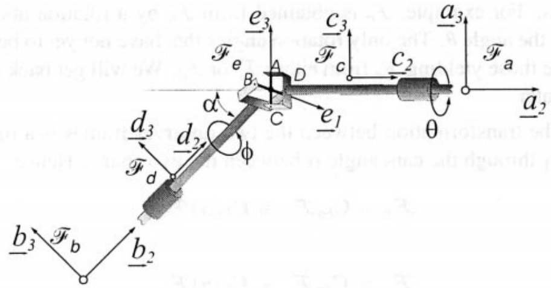

# Lecture 3, Sep 14, 2023

## Rotation Matrices

* Recall that for $\uvec v = \vcx F_a^T\bm v_a = \vcx F_b^T\bm v_b$ we have $\bm v_a = \bm C_{ab}\bm v_b$, so substituting in the relation gives us $\vcx F_a^T\bm C_{ab}\bm v_b = \vcx F_b^T\bm v_b$, which gives us $\vcx F_a^T\bm C_{ab} = \vcx F_b^T$, or $\vcx F_a = \bm C_{ab}\vcx F_b$
	* Dot product in different frames: $\uvec u \cdot \uvec v = \bm u_a^T\vcx F_a \cdot \vcx F_b^T\bm v_b = \bm u_a^T\vcx F_a \cdot \vcx F_a^T\bm C_{ab}\bm v_b = \bm u_a^T\bm C_{ab}\bm v_b$
* *Principal rotations* are rotations about one of the basis vectors
	* Example: rotation about $\uvec b_1$: $\matthreeb{1}{0}{0}{0}{\cos\theta}{\cos\left(\frac{\pi}{2} - \theta\right)}{0}{\cos\left(\frac{\pi}{2} + \theta\right)}{\cos\theta} = \matthreeb{1}{0}{0}{0}{\cos\theta}{\sin\theta}{0}{-\sin\theta}{\cos\theta} = \bm C_1(\theta)$
	* We use the notation $\bm C_n(\theta)$ to represent a principal rotation matrix about the $n$th basis by $\theta$
	* $\bm C_2(\theta) = \matthreeb{\cos\theta}{0}{-\sin\theta}{0}{1}{0}{\sin\theta}{0}{\cos\theta}$
	* $\bm C_3(\theta) = \matthreeb{\cos\theta}{\sin\theta}{0}{-\sin\theta}{\cos\theta}{0}{0}{0}{1}$
* We can form compound rotation matrices by multiplying principal rotation matrices, e.g. $\bm C_{ac} = \bm C_{ab}\bm C_{bc}$
	* Notice that the subscripts match and kind of "cancel out"

## Example: Universal Joint

{width=50%}

* Example: for a universal joint as pictured, if we turn the front shaft by an angle $\theta$, what is the angle $\phi$ that the rear shaft turns?
	* The front and rear shafts are at an angle $\alpha$
	* Reference frames $a$ and $b$ are fixed to the two ends of the shaft respectively (and do not rotate); the frames $c$ and $d$ rotate with the shafts; the frame $e$ is attached to the spider
		* $\vcx F_b = \bm C_{ba}\vcx F_a = \bm C_1(\alpha)\vcx F_a$
		* $\vcx F_c = \bm C_{ca}\vcx F_a = \bm C_2(\theta)\vcx F_a$
		* $\vcx F_d = C_{bd}\vcx F_b = \bm C_2(\phi)\vcx F_b$
	* Since one arm of the spider is fixed to the front shaft and the other is fixed to the rear shaft, the two arms are parallel to the two shafts respectively
		* $\uvec e_1 = \uvec d_1$
		* $\uvec e_3 = \uvec c_3$
	* With the connection between the reference frames now established, we can relate everything to frame $a$
		* $\uvec e_1 = \uvec d_1 = \cvec{1}{0}{0}^T\vcx F_d = \bm 1_1^T\vcx F_d = \bm 1_1^T\bm C_2(\phi)\vcx F_b = \bm 1_1^T\bm C_2(\phi)\bm C_1(\alpha)\vcx F_a$
		* $\vcx F_e = \bm C_{ec}\vcx F_c = \bm C_3(\psi)\vcx F_c$
			* Since $b$ and $e$ share a common axis $\uvec e_3 = \uvec c_3$ they must be related by a principal rotation through axis 3; we don't know what the angle is, but we will declare it $\psi$ and hope that it cancels
		* $\uvec e_1 = \bm 1_1^T\vcx F_e = \bm 1_1^T\bm C_3(\psi)\vcx F_c = \bm 1_1^T\bm C_3(\psi)\bm C_2(\theta)\vcx F_a$
	* Now we can equate $\uvec e_1$ and solve for the relations: $\bm 1_1^T\bm C_2(\phi)\bm C_1(\alpha) = \bm 1_1^T\bm C_3(\psi)\bm C_2(\theta)$
	* The matrix equation can be expanded to obtain:
		* $\cos\phi = \cos\theta\cos\psi$
		* $\sin\alpha\sin\phi = \sin\psi$
		* $\cos\alpha\sin\phi = \sin\theta\cos\psi$
	* We can divide equation 3 by equation 1 to get $\cos\alpha\tan\phi = \tan\theta$ for our final result

## Euler's Theorem

\noteThm{\textit{Euler's Theorem}: Any arbitrary rotation or sequence of rotations can be described by a single rotation about some axis.}

* Proof:
	* Consider some arbitrary rotation matrix $\bm C$ and the eigenvalue problem $\bm C\bm e = \lambda\bm e$
	* Take the Hermitian (transpose and conjugate) so $\bm e^H\bm C^H = \bar\lambda\bm e^H$
		* Since $\bm C$ is real, $\bm C^H = \bm C^T$, but the eigenvalues and eigenvectors could be complex
	* Multiply by the Hermitian again on both sides: $\bm e^H\bm C^T\bm C\bm e = \lambda\bar\lambda\bm e^H\bm e \implies \bm e^H\bm e = \lambda\bar\lambda\bm e^H\bm e$
	* $(\lambda\bar\lambda - 1)\bm e^H\bm e = 0$ and since the eigenvector is nonzero, $\lambda\bar\lambda = \abs{\lambda}^2 = 1$
		* This means $\lambda = \pm 1$ or $e^{\pm j\phi}$ (complex conjugate pairs)
	* Since $\bm C$ is a 3 by 3 matrix, there are 3 eigenvalues,
		* Since the determinant of $\bm C$ is the product of its eigenvalues, we know its eigenvalues are all positive, otherwise the determinant could be negative
		* This necessitates that the eigenvalues are $\lambda = 1, e^{\pm j\phi}$
	* Let the eigenvector with eigenvalue 1 be $\bm a$; then $\bm C\bm a = \bm a$, i.e. $\bm a$ is invariant under the rotation
		* This means it must be the axis of rotation!
	* Thus any rotation matrix has some axis of rotation, so any rotation or sequence of rotations corresponds to a rotation about some axis
	* It turns out that also $\phi$ is the angle of rotation (but this will not be proven right now)
* We can write any rotation in the form $\bm C = \cos\phi\bm 1 + (1 - \cos\phi)\bm a\bm a^T - \sin\phi\bm a^\times$ where $\bm a$ is the axis and $\phi$ is the angle

