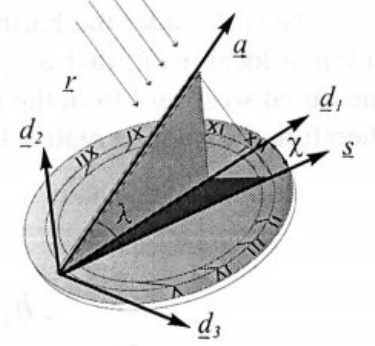
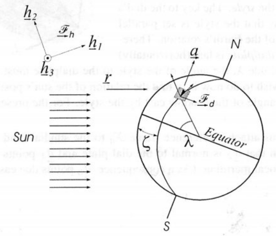
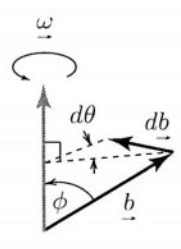

# Lecture 4, Sep 19, 2023

## Solving the Sundial

{width=30%}

{width=50%}

* A sundial's upper edge, the *style*, is made parallel to the Earth's axis of rotation, so the sun casts a shadow on the plane of the sundial; how should we draw the markings on the sundial to indicate time?
* We will establish a coordinate system with $\uvec d_1, \uvec d_3$ being in the plane of the sundial
	* The shadow cast by the style is $\uvec s = s_1\uvec d_1 + s_2\uvec d_3$
	* The angle the shadow makes with $\uvec d_1$ is $\chi$, so $\tan\chi = \frac{s_3}{s_1}$
	* The shadow $\uvec s$, style $\uvec a$, and the sun's rays $\uvec r$ are in the same plane, so we have $\uvec s = c\uvec a + \uvec r$ (since we don't care about the magnitude, we only need 1 coefficient)
	* Therefore $s_1\uvec d_1 + s_3\uvec d_3 = c\uvec a + \uvec r = \vcx F_d^T\cvec{s_1}{0}{s_3} = s_1\bm 1_1 + s_3\bm 1_3$
* We define another frame, the heliocentric frame $\vcx F_h$, which is aligned with $\vcx F_d$ at noon (when the rotation angle of the earth, $\zeta = 0$)
	* Consider the coordinate system formed by $\uvec a, \uvec h_3 \times \uvec a$ and $\uvec h_3$
	* The angle $\alpha$ between the sun's rays $\uvec r$ and the style/Earth axis $\uvec a$ is seasonally dependent
		* We can get break down $\uvec r$ into $\uvec a$ and a perpendicular component: $\uvec r = \cos\alpha\uvec a - \sin\alpha\uvec h_3 \times \uvec a$
		* $\uvec a = \vcx F_d^T\bm a = \vcx F_d^T\cvec{\cos\lambda}{\sin\lambda}{0}$ where $\lambda$ is the latitude
	* $\uvec r = \vcx F_h^T\bm r_h = \vcx F_h^T\left(\cos\alpha\bm a - \sin\alpha\bm 1_3^\times\bm a\right)$
* When the Earth rotates, the frame $\vcx F_d$ rotates about the axis $\uvec a$ by $\zeta$, so $\bm C_{dh} = \cos\zeta\bm 1 + (1 - \cos\zeta)\bm a\bm a^T - \sin\zeta\bm a^\times$
* Now we have $\uvec a$ and $\uvec r$ in frame $\vcx F_d$, we can use the equation before: $c\uvec a + \uvec r = \vcx F_d^T\cvec{s_1}{0}{s_3}$
	* This gives us 3 equations, when solved we get $\tan\chi = \frac{s_3}{s_1} = \sin\lambda\tan\zeta$
* In general, we want to express everything in the same frame to solve a problem; some vectors are more easily expressed in certain frames than others

## Rotation Representations

* We can represent any rotation with a rotation matrix, but it is overspecified since there are 9 components
* Using Euler's theorem, we can completely specify a rotation by the axis-angle pair $(\bm a, \phi)$, which has 3 components only (since $\bm a$ is normalized)
* We can also perform a series of 3 principal axis rotations; these are known as the Euler angles
	* Any sequence of 3 axes works, as long as you don't have a sequence of 2 consecutive identical rotations
	* e.g. $\bm C = \bm C_3(\theta _3)\bm C_1(\theta _2)\bm C_3(\theta _1)$ is a 3-1-3 set of rotations
		* The 3-1-3 set is the one that Euler used
	* In total there are $3 \times 2 \times 2 = 12$ different sets of rotations
	* Given $\bm C$, we can't always find a unique sequence of Euler angles that make up the rotation; this is referred to as a *singularity*
		* e.g. with the 3-1-3 set, if $\theta _2 = 0$ then we won't be able to distinguish $\theta _3$ from $\theta _1$
		* This is why in aerospace typically 1-2-3 or 3-2-1 is used; however any sequence has a singularity, it's just for some sequences the singularity occurs further from the reference point

## Kinematics

* Kinematics is the geometry of motion, with no regard for the laws of nature
* Rates of change like $\uvec v$ depend on the frame of reference that they are viewed from; when we take a derivative we must note the reference frame

{width=10%}

* Consider a vector $\uvec b$ of fixed length rotating about a fixed axis $\uvec a$ with some rate $\dot\theta$
	* Since $\uvec b$ is constant length, $\dd\uvec b$ is normal to $\uvec b$ and $\uvec a$, so $\dd\uvec b \propto \uvec a \times \uvec b$
	* Suppose that in time $\dt$, $\uvec b$ rotated $\dtheta$; then $\norm{\dd\uvec b} = \norm{\uvec b}\sin\phi\dtheta$
	* If we let $\uvec\omega = \uvec a\dot\theta$, then $\dtheta = \norm{\uvec\omega}\,\dt$ and so $\norm{\dd\uvec b} = \norm{\uvec\omega \times \uvec b}\,\dt$
	* Therefore we have $\dd\uvec b = \uvec\omega \times \uvec b\,\dt$ and so $\eval{\diff{\uvec b}{t}}{\vcx F_a} = \uvec\omega \times \uvec b$
* We will use the notation that $\uvec b_1^\dota = \eval{\diff{\uvec b_1}{t}}{\vcx F_a}$ and $\uvec b_1^\dotb = \eval{\diff{\uvec b_1}{t}}{\vcx F_b}$
* Since the axes of reference frames have constant length, we can use this for all 3 axis vectors
	* We denote ${\vcx F_b^T}^\dota = \uvec\omega^{ba} \times \vcx F_b^T = \rvec{\uvec\omega^{ba} \times \uvec b_1}{\uvec\omega^{ba} \times \uvec b_2}{\uvec\omega^{ba} \times \uvec b_3}$
		* The $\uvec\omega^{ba}$ is the angular velocity of $\vcx F_b$ with respect to $\vcx F_a$
	* ${\vcx F_b^T}^\dota = \uvec\omega^{ba} \times \vcx F_b^T = \vcx F_b^T{\bm\omega^{ba}}^\times \implies \vcx F_b \cdot {\vcx F_b^T}^\dota = \vcx F_b \cdot \vcx F_b^T{\bm\omega^{ba}}^\times \implies {\bm\omega^{ba}}^\times = \vcx F_b \cdot {\vcx F_b^T}^\dota$
* ${\bm\omega^{ba}}^\times = \vcx F_b \cdot {\vcx F_b^T}^\dota$ becomes our definition for angular velocity of frame $b$ with respect to $a$ in general

