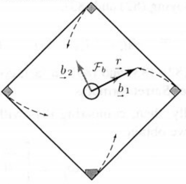

# Lecture 6, Sep 26, 2023

## Example Problem: Square-Dancing Ants

{width=20%}

* Consider 4 ants on the corners of a square with sides $a$; each ant directly walks towards the ant in front of it, so overall the ants all spiral inward; when the ants meet in the center, how far will each have walked?
* At any given time all the ants form a square provided their speeds are the same
* Let the speed of each ant be $v$, so that the path length $s$ being walked by the ants at any given time is related to $v$ as $v = \dot s = \diff{s}{t}$
* Construct our reference frame so that $\uvec b_1$ and $\uvec b_2$ point from the center of the square to two ants; $\uvec b_3$ then points out of the page
	* This reference frame rotates since the ants move
* Let $\uvec \rho$ be the position of one ant, so $\uvec\rho = \vcx F_b^T\cvec{\rho}{0}{0}$ since $\uvec b_1$ directly points towards the ant
* The velocity of the ant is $\uvec v = \vcx F_b^T\cvec{-\frac{v}{\sqrt{2}}}{\frac{v}{\sqrt{2}}}{0} = \uvec\rho^\dota = \uvec\rho^\dotb + \uvec\omega^{ba} \times \uvec\rho = \vcx F_b^T\cvec{\dot\rho}{0}{0} + \vcx F_b^T\cvec{0}{0}{\omega}^\times\cvec{\rho}{0}{0} = \vcx F_b^T\cvec{\dot\rho}{\omega\rho}{0}$
	* Therefore $-\frac{v}{\sqrt 2} = -\frac{\dot s}{2} = \dot\rho, \frac{v}{\sqrt 2} = \frac{\dot s}{\sqrt 2} = \omega\rho$
	* Integrating the first equation: $\rho = \frac{1}{\sqrt 2}(s_0 - s)$
	* We can determine $s_0$ by noting that at time 0, the distance $\rho = \frac{a}{\sqrt 2}$ and $s = 0$, so $s_0 = a$
	* Now we can set $\rho = 0$ to solve for $s$: $0 = \frac{1}{\sqrt 2}(a - s) \implies s = a$
* Therefore each ant travels precisely the same length as the sides of the square

