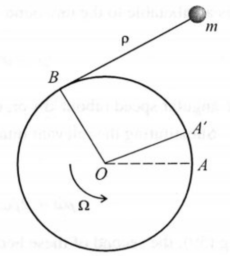

# Lecture 7, Sep 28, 2023

## Newton's Second Law in Noninertial Frames

* Kinematics was the study of the geometry of motion without regard for the laws of nature; now we move on to dynamics, where we attempt to describe the laws of nature
* We know that the law of inertia does not hold in an accelerating or rotating reference frame; what about Newton's second law?
* $\uvec f = m\uvec a = m\uvec r^\ddota$, with the derivative taken with respect to some inertial frame $\vcx F_I$
	* In another frame $\vcx F_b$, $\alignedeqntwo[t]{\uvec f}{mv^\dota}{m(\uvec v^\dotb + \uvec\omega^{bI} \times \uvec v)}{m\uvec r^\ddota}{m(\uvec r^\ddotb + 2\uvec\omega^{bI} \times \uvec r^\dotb + {\uvec\omega^{bI}}^\dotb \times \uvec r + \uvec\omega^{bI} \times (\uvec \omega^{bI} \times \uvec r))}$
	* So in $\vcx F_b$, $m\uvec r^\ddotb = \uvec f - 2\uvec\omega^{bI} \times \uvec r^\dotb - {\uvec\omega^{bI}}^\dotb \times \uvec r + \uvec\omega^{bI} \times (\uvec \omega^{bI} \times \uvec r)$
	* We can see this broken down into the Coriolis, tangential, and centrifugal forces

{width=35%}

* Example: Consider a spool with a bob attached to the end of the wire; if the spool is rotating in the opposite direction that the wire is being wound, the spool will actually unwind
	* Given that $\Omega$ is constant, what is $\rho(t)$ and $f_T(t)$?
	* Define our reference frames as $\vcx F_I$, the inertial frame, and $\vcx F_b$, a rotation reference frame with $\uvec b_1$ parallel to the string at all times
	* This gives $\uvec r = \vcx F_b^T\cvec{\rho}{a}{0} = \vcx F_b^T\bm r_b$ and $\uvec f_T = \vcx F_b^T\cvec{-f_T}{0}{0} = \vcx F_b^T\bm f_b$
	* Since $\vcx F_b$ is not an inertial frame, we must use the equation of motion for a rotating frame that we derived above
	* $\uvec f_T = m(\uvec r^\ddotb + 2\uvec\omega^{bI} \times \uvec r^\dotb + {\uvec\omega^{bI}}^\dotb \times \uvec r + \uvec\omega^{bI} \times (\uvec \omega^{bI} \times \uvec r))$
	* It is most convenient to express all quantities in frame $\vcx F_b$:
		* $\uvec\omega^{bI} = \vcx F_b^T\cvec{0}{0}{\dot\theta}$
			* $\theta = \angle AOB - \frac{\pi}{2} = \angle AOA' + \angle A'OB - \frac{\pi}{2} = \Omega t + \frac{\rho}{a} - \frac{\pi}{2}$
				* Note the $\frac{\rho}{a}$ term comes from the fact that the arc length from $B$ to $A'$ is $\rho$
			* $\dot\theta = \Omega + \frac{\dot\rho}{a}$
		* $\dot{\bm r}_b = \cvec{\dot\rho}{0}{0}, \ddot{\bm r}_b = \cvec{\ddot\rho}{0}{0}$
	* If we substitute these quantities back in, we get $\twopiece{-m\ddot{\rho} - m\rho\omega^2 = f_T}{\rho\dot\omega + 2\dot\rho\omega - a\omega^2 = 0}$ where $\omega = \Omega + \frac{\dot\rho}{a}$
		* Solving the DE in the second equation, we get $\rho(t) = a\Omega t$
		* Substitute back in to get $f_T = 4ma\Omega^3t$
	* The idealized math says that the spool will keep unwinding, however in reality drag will eventually match the centrifugal force, causing the spool to no longer unwind

