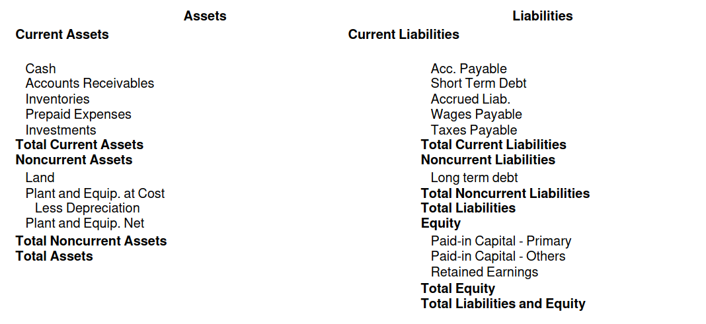
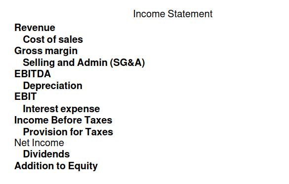

| Name | Factor | Expression | Notes |
|---|---|------|------|
| Future | $(P/F, i, N)$ | $(1 + i)^{-N}$ | |
| Annuity | $(P/A, i, N)$ | $\frac{1}{i} - \frac{1}{i(1 + i)^N}$ | First payment at end of year 1 |
| Arith. Grad. | $(P/G, i, N)$ | $\frac{1}{i^2}\left(1 - \frac{1 + iN}{(1 + i)^N}\right)$ | Starts at 0 at end of year 1; $P = A(P/A, i, N) + G(P/G, i, N)$ |
| Geom. Grad. | $(P/Geom, i, g, N)$ | $\frac{1 - \left(\frac{1 + g}{1 + i}\right)^N}{i - g}$ | Starts at $A$ at end of year 1; grows by $(1 + g)$ per year |

| Name | Expression | Notes |
|-----|----|---------------|
| Current | $\frac{\text{curr. assets}}{\text{curr. liab.}}$ | Ability to pay current liabilities; below 1 could be a sign of distress |
| Acid Test | $\frac{\splitfrac{\scriptstyle\text{cash} + \text{curr. receivables}}{\scriptstyle + \text{short term investments}}}{\text{curr. liabilities}}$ | Ability to pay liabilities if due immediately; better if > 1 |
| Inventory Turnover | $\frac{\text{COGS}}{\text{avg. inventory}}$ | How many times per time period the average inventory is sold. Higher is more efficient; tends to be smaller for larger companies |
| Days' Inventory | $\frac{\text{avg. inventory}}{\text{avg. COGS per day}}$ | Days to sell average inventory; lower is more efficient |
| Acc. Receivable Turnover | $\frac{\text{net credit sales}}{\text{net acc. payable}}$ | Number of times credit is collected per period |
| Days' Receivables | $\frac{\text{avg. acc. receivables}}{\text{avg. sales per day}}$ | How many days it takes to collect credit; lower is more efficient |
| Days' Payables | $\frac{\text{avg. acc. payables}}{\text{avg. COGS per day}}$ | How many days it takes to pay creditors; higher means more funds are retained, too high might be problematic |
| Debt Ratio | $\frac{\text{total liabilities}}{\text{total assets}}$ | Proportion of assets financed with debt; higher is more risky |
| Equity Ratio | $\frac{\text{total equity}}{\text{total assets}}$ | Proportion of assets financed with equity; higher is less risky |
| Times Interest Earned | $\frac{\text{income or EBIT}}{\text{interest expense}}$ | How many times income can cover interest |
| Profit Margin | $\frac{\text{net income}}{\text{net sales}}$ | How many dollars of profit per dollar of sales |
| Return on Assets (ROA) | $\frac{\text{net income}}{\text{total assets}}$ | How profitably the company uses its assets |
| Return on Equity (ROE) | $\frac{\text{net income}}{\text{total equity}}$ | How profitably the company uses equity |
| Earnings Per Share (EPS) | $\frac{\text{net income}}{\text{\# of shares}}$ | Amount of profit per share |
| Price To Earnings (P/E) | $\frac{\text{share price}}{\text{EPS}}$ | (Inverse) Relative value in shares; higher means stock is overvalued or high growth |
| Dividend Yield | $\frac{\text{dividend per share}}{\text{EPS}}$ | Dividends relative to stock price ; mature companies tend to pay more dividends |
| Market Capitalization | market value of all shares | Measure of size of company (large-cap (10B+), mid-cap (2-10B), small-cap (300M-2B)) |

* Interest: $i_e = \left(1 + \frac{i}{m/n}\right)^\frac{1}{n} - 1$ for interest rate $i$ per $m$ years, compounded every $n$ years
* Mortgage: $A = P(A/P, i, N)$ where $A$ is the monthly payment, $P$ is the principal, $i$ is the monthly interest rate
	* To recalculate monthly payment after a term: $P(F/P, i, n) - A(F/P, i, n)(P/A, i, n)$, then calculate new payment
* Bond: $P = C(P/A, i, N) + F(P/F, i, N)$ where $P$ is the sell price, $C$ is the coupon payment, $F$ is the face value, $i$ is the yield
	* First coupon paid 1 period later; higher yield makes bond sell for cheaper
	* If yield is higher than coupon, $P < F$; if yield is lower than coupon, $P > F$
	* When maturity period is not aligned with coupon payments, calculate price in the past and apply interest forward
* CAPM: $\mathbb E[R_i] = r_f + \beta _i(\mathbb E[R_{MP}] - r_f)$ where $r_f$ is the risk-free rate, $\displaystyle\beta _i = \frac{\sigma _{i,MP}}{\sigma _{MP}^2} = \frac{\rho _{i,MP}\sigma _i}{\sigma _{MP}}$
* $R_\text{WACC} = \frac{E}{E + D}R_E + \frac{D}{E + D}R_D(1 - t)$
* Project comparison: If projects have different time horizons: use LCM of project lifetimes (repeated lives), or use annual worth
* IRR: The interest (discount) rate that makes present worth 0; higher is more profitable, but note investment time/size
	* Simple investments have a unique IRR, non-simple ones may have multiple solutions
* (Discounted) payback period: time taken to recoup an investment; does not account for earnings after payback
* Incremental analysis (mutually exclusive projects): order by increasing first costs (starting with do nothing); calculate incremental IRR between new option and current option using $\Delta PW$ and $\Delta A$; if lower than MARR, keep current option; otherwise switch
* Depreciation: $BV_0 = B, BV_t = BV_{t - 1} - D_t = B - \sum _{k = 1}^t D_k$; **do not include in cash-flow analysis**
	* Straight line: $D_t = \frac{B - S}{N}$
	* Declining balance: $D_t = BV_{t - 1}d, d = 1 - \left(\frac{S}{B}\right)^\frac{1}{N}$ or $d = \frac{200\%}{N}$ (double declining balance)
	* Sum of the years' digits: $D_t = \frac{N - t + 1}{SOYD}(B - S), SOYD = \frac{N(N + 1)}{2}$
	* Units of production: $D_t = \frac{\text{Production in year }t}{\text{Total production}}(B - S)$
* Accounting: each transaction has a debit (increase to left/decrease to right) and credit (decrease to left/increase to right)
	* Net income = revenue - COGS - SG&A - depreciation - interest - taxes; retained earnings (equity) = net income - dividends
	* Primary accounts: assets (left), liabilities (right), equity (right); expenses (left), revenue (right)
	* Label transactions!
* Taxes: $CTF = 1 - \frac{td}{i_A + d}\left(\frac{1 + \frac{i_A}{2}}{1 + i_A}\right), CSF = 1 - \frac{td}{i_A + d}, PW = -FC \cdot CTF + S \cdot CSF \cdot (P/F, i_R, N) + (1 - t) \cdot PW_{\text{Cash Flows}}$
	* $PW = -FC + A(P/A, i, N) + S(P/F, i, N), AW = PW(A/P, i, N)$ (without taxes)
* Inflation: $(1 + i_R)(1 + f) = 1 + i_A$

{width=66%}
{width=33%}

