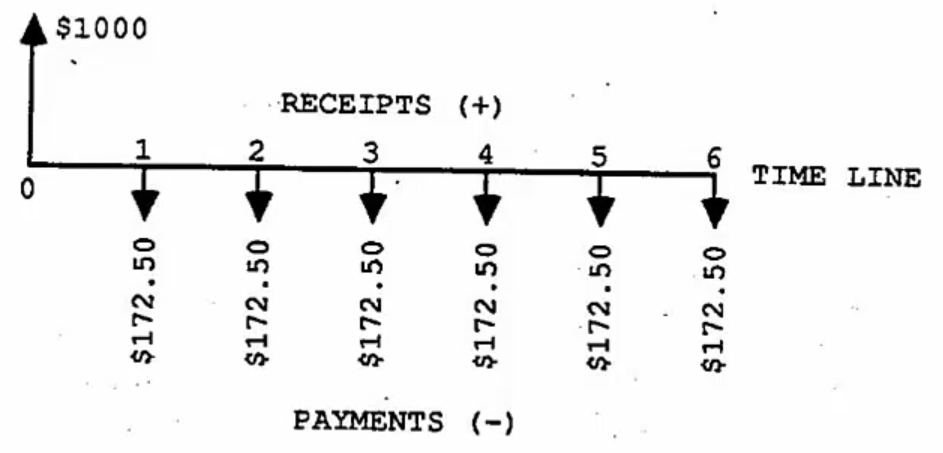

# Lecture 2, Sep 20, 2023

## Cash-Flow Analysis

### Cash-Flow Diagrams

* Categories of cash flows:
	* Start of project:
		* First (capital) cost: expense to build/buy/install
	* During the project:
		* Revenue cost: receipts from sales of products or services
		* Operation and maintenance (O&M) costs: expenses incurred on a regular basis (e.g. labour)
		* Overhaul: major expenditure that occurs partway through the life of an asset
	* At the end of the project:
		* Salvage value: money gained for sale or disposal of a product
		* Scrap value: value of the materials that the item is made of
		* Disposal costs: costs to dispose of the item
	* These are collectively referred to as *project life-cycle costs*
* A cash-flow diagram summarizes the timing and magnitude of cash-flows using arrows that go up/down
	* The $x$ axis (which is discrete) shows the timing of cash flows and $y$ axis shows their value
		* Down is usually cash outflow, up is inflow
		* Note the end of one period is the beginning of the next; a cash flow at the beginning of year 1 would be at time 0 (now)
			* Cash flows that occur during a period are assumed to occur at the end of the period
			* Interest is compounded once per period unless specified
	* Cash flows at the same time are summed

{width=50%}

* Cash-flows can be equivalent:
	* Mathematical equivalence: equivalence of cash-flows due to mathematical equivalence of time and money
		* Two cash-flows, $P_t$ at time $t$ and $F_{t+N}$ at time $t + N$ are mathematically equivalent with respect to the interest rate $i$ if $F_{t + N} = P_t(1 + i)^N$
	* Market equivalence: a consequence of the ability to exchange one cash-flow for another at zero cost
		* Once can exchange cash-flows between present and future amounts; *borrowing* to exchange a future cash-flow for a present one, and *lending/investing* to give up a present cash-flow for a future one
		* Example: if a T-bill of \$1000 due to mature in 6 months is selling for \$990.10, then the "market" has agreed that the appropriate interest rate is 1% over 6 months
		* The cash flow of \$1000 6 months in the future is equivalent to a \$990.10 right now
	* Decisional equivalence: due to indifferences on the part of decision maker among available choices
		* For a decision maker, two cash-flows $P_t, F_{t + N}$ are equivalent if they are indifferent about the two
		* The interest rate is not a priori information but rather implied (which can be calculated)

### Present Value of Cash-Flows

* There are 5 common types of regular cash flows:
	* Single payments (aka receipts): a single cash payment occurring at some time
	* Perpetuity: a cash flow of magnitude $A$ occurring at regular intervals indefinitely
	* Annuity: like a perpetuity but only over $N$ periods
	* Arithmetic gradient: like an annuity, but the amount increases by $G$ each period ($A$ the first time, $A + G$ the second time, $A + 2G$ the third time and so on)
	* Geometric gradient: like the arithmetic gradient but the amount grows by a factor of $1 + g$ each period
* Factor notation: to convert from cash flow $Y$ to $X$, use the factor $X = Y(X/Y, i, N)$ where $i$ is the interest rate and $N$ is the time period
	* $X$ and $Y$ are P (present), F (future), A (annuity), G (arithmetic gradient) or Geom (geometric gradient)
	* For the geometric gradient we also need the growth rate, so $X = G(X/G, i, g, N)$
	* Some factors have special names:
		* F/P: compound amount factor
		* P/F: present worth factor
		* A/F: sinking fund factor
		* F/A: series compound amount factor
		* A/P: capital recovery factor
		* P/A: series present worth factor
	* Reversing $X$ and $Y$ simply inverts the factor
* P/F, F/P factors can be derived by simply applying interest: $(F/P, i, N) = (1 + i)^N$
* $(P/A, i, N) = \frac{1}{i} - \frac{1}{i(1 + i)^N}$
	* This can be derived through a series sum or by noting that a perpetuity of amount $A$ has present value $\frac{A}{i}$, since the amount of interest per period is $A = Pi$
* For an arithmetic gradient, $P = A(P/A, i, N) + G(P/G, i, N)$ where $(P/G, i, N) = \frac{1}{i^2}\left(1 - \frac{1 + iN}{(1 + i)^N}\right)$
	* The first part, $A(P/A, i, N)$ is the value of the initial base annuity
	* The second part is the value of the growth
	* This can be derived by turning the arithmetic gradient into a series of annuities
	* $P = G\sum _{k = 1}^{N - 1} \frac{(P/A, i, N - k)}{(1 + i)^k}$ ignoring the annuity starting on year 1
* $(P/Geom, i, g, N) = \frac{1}{1 + g}(P/A, i^0, N)$ where $i^0 = \frac{1 + i}{i - g} - 1$
	* Equivalently $(P/Geom, i, g, N) = \frac{1 - \left(\frac{1 + g}{1 + i}\right)^N}{1 + g}$
	* Note for a geometric gradient cash flow, there is nothing at time 0, then at time 1 a cash flow of $A$, then at time 2 a cash flow of $A(1 + g)$ and so on

