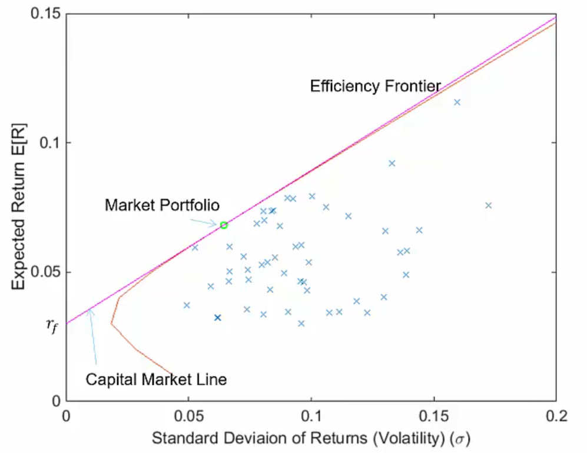

# Lecture 4, Oct 4, 2023

## Capital Asset Pricing Model (CAPM)

* Valuation is the analytical process of determining the current or projected worth of an asset or a company 
	* Performing a valuation requires projected cash-flows and an interest rate determined by risk
	* Data from "the market" (i.e. the stock market) is used to price risk
* Financial risk is defined as the uncertainty in a future payoff
* Modern portfolio theory (MPT) provides a mathematical framework for assembling a portfolio of assets to maximize return for a given risk level
	* The risk and return characteristics of an investment should not be viewed alone, but evaluated by how it affects the overall portfolio

{width=60%}

* Consider a portfolio of stocks; define the return vector for the $i$th stock as $\vec{R}_i = \cvec{r_{t_1}}{r_{t_2}}{\vdots}{r_{t_m}}$ where $r_{t_j}$ is the (continuous) return of that stock at time $t_j$
	* Define the volatility $\sigma$ such that $\sigma _i^2 = \var(\vec R_i)$, which we can calculate using past historical market data
	* If we assume that we can invest some fraction $x_i$ of our total capital in stock $i$, then we can try to maximize the expected return $E[\vec R_p]$ while trying to minimize risk $\sigma _p$
	* Optimizing this gives us an *efficiency frontier* (line in yellow); assuming that we can invest/borrow at the risk-free rate, we can draw a line from the risk-free rate that is tangent to the efficiency frontier; the tangent point is known as the *market portfolio* or *tangency portfolio*
		* The market portfolio is a theoretical portfolio that contains every single investment in existence, with each one weighted by its value; mathematically, this maximizes the return for a given volatility
		* Since the efficiency frontier is concave down, the market portfolio and the risk-free rate are the theoretically best investments given a certain level of risk
		* Thus if we assume all investors act perfectly rationally, everyone will try to invest at either the market portfolio or interest-free rate
		* Based on the proportion of investments in each of the two categories, we can calculate the overall return rate; an investor can also take on debt at the risk-free rate and invest it at the market portfolio which increases both risk and expected return, moving up the tangent line
	* This is Capital Asset Pricing Model (CAPM)
* Note that CAPM is an ideal mathematical model for something driven by investor behaviour, so it has to make some assumptions
	* Correlations between assets are fixed and constant forever (i.e. volatilities in stocks don't change and neither do their correlations)
	* All investors act perfectly rationally to maximize their economic utility
	* All investors have access to the same information at the same time
	* Investors have an accurate conception of possible returns (i.e. the probability beliefs of investors match the true distribution of returns)
	* No taxes or transaction costs
	* Investor behaviour do not influence stock prices
	* Any investor can lend and borrow an infinite amount at the risk-free interest rate
	* All securities can be divided into parcels of any size
* CAPM gives the expected return for asset $i$ as $E[R_i] = r_f + \beta _i(E[R_{MP}] - r_f)$ where $r_f$ is the risk-free rate and $\beta _i = \frac{\sigma _{i, MP}}{\sigma _{MP}^2} = \frac{\rho _{i, MP}\sigma _i}{\sigma _{MP}}$
	* $\beta$ is a measure of risk for the company, relative to the market as a whole
		* $\beta > 1$ means the company is more risky than the market, and $0 < \beta < 1$ means the company is less risky than the market
		* $\beta \leq 0$ is almost never seen
	* Theoretically if we plotted the return against $\beta$ for every single stock, it will lie on a perfect line
		* In reality if you did this it would not end well
	* $E[R_{MP}] - r_f$ is known as the *market premium* or *risk premium*, which is the difference in rate of return between the market portfolio and risk-free rate
	* We are modeling the company return as $R_{C,t} = \alpha _C + \beta _CR_{MP, t} + \varepsilon _{C, t}$
	* Volatility in $R_{MP, t}$ represents a systematic, or market risk, that is present throughout the entire market
	* Volatility in $\varepsilon _{C,t}$ represents an idiosyncratic, or firm-specific risk
	* The idea is that $E[\varepsilon _{C, t}] = 0$, so by diversifying their investments enough, a investor should be able to completely eliminate idiosyncratic risk
		* Therefore idiosyncratic risk has no inherent value, so investors should only be rewarded for market risk
* Any company can be broken down into 3 parts: assets, equity, and debt
	* The return on equity $R_E$ comes from CAPM
	* The return on assets is a weighted sum $R_A = \frac{E}{E + D}R_E + \frac{D}{E + D}R_D$

## Arbitrage

* In general arbitrage is the idea of taking advantage of inconsistencies in prices to be able to pay a lower price than what you should have
	* In financial markets arbitrage is the practice of taking advantage of a price difference between two or more markets
	* In academic use, it refers to the opportunity to achieve a risk-free gain at a rate greater than the risk-free rate
		* A fundamental assumption is that there is no true arbitrage, or the "no free lunch" assumption
	* Statistical arbitrage occurs when a gain is achieved at a higher risk than one should for a given level of risk
* Example: if you can buy a bushel of corn for \$10 today and enter into a forward contract to deliver the corn for a pre-settled price of \$12 per bushel one year from now, and it costs you nothing to store the corn; say you could borrow at 10%, then this is an arbitrage opportunity, because we could just borrow money to buy corn and then sell it a year later to get free money at no risk
	* However in the real world, as demand for corn increases the price will also increase
	* Assuming the forward price of \$12 does not change, the eventually the price right now would increase to \$10.91 so that we end up with no net gain
	* This is an example of a *future* or *forward contract*, which locks in a specific price for an asset; it is used by companies or investors to hedge against risks or speculate
		* A forward contract is an obligation to buy or sell at a specific price and time, and typically not traded
			* Sellers and buyers are involved in a forward transaction, and are both obligated to fulfill their end of the contract at maturity
		* Futures are similar but they are settled daily (not just at maturity), so they can be bought and sold at any time and are traded on exchanges
		* For this course we don't care about the difference
* In general to use the no-arbitrage principle to price an investment, we find two alternative investment paths and conclude that they must bring equal returns
* Example: given yields $r_{t_1}, r_{t_2}$ at two times $t_1, t_2$, calculate the appropriate forward rate that an investor could lock into today from $t_1$ to $t_2$
	* Suppose we invest $P_0$ today, then at $t_1$ we have $F_1 = P_0e^{r_{0,1}t_1}$, or at $t_2$ we have $F_2 = P_0e^{r_{0,2}t_2}$
	* If we take our money from $t_1$ and reinvest it, we have $F_2' = F_1e^{r_{1,2}(t_2 - t_1)}$
	* The no arbitrage principle says that $F_2 = F_2'$, otherwise there would be an arbitrage opportunity
	* Therefore we have $P_0e^{r_{0,2}t_2} = P_0e^{r_{0,1}t_1}e^{r_{1,2}(t_2 - t_1)} \implies r_{1,2} = \frac{r_{0,2}t_2 - r_{0,1}t_1}{t_2 - t_1}$
* Another strategy is to build a portfolio with the same risk as the investment, then by no-arbitrage the worth of this portfolio is the same as the original investment
* Example: a project will have a \$140 payoff if the market goes up or a \$30 payoff if the market goes down; the risk-free rate is 5%, the market portfolio is priced at \$100 and will be worth \$120 if the market goes up, or \$95 if the market goes down; what is the valuation of the project?
	* We want to replicate a portfolio so that it has the same risk/payoff as the project
	* We will buy $a$ units of the market portfolio and $b$ units of the risk-free investment
		* Note $a$ and $b$ could be negative, in which case we would be borrowing
	* In the up-market case then our payoff would be $120a + 1.05b = 140$; in the down-market case the payoff is $95a + 1.05b = 30$
		* Note that in both cases the risk-free payoff is $1.05$ since regardless of market the interest is still 5%
		* Using this we can solve to get $a = 4.4, b = -369.53$
	* Therefore the project is worth $100a + 1b = 70.48$
		* Note that we did not use any probability of the market going up or down at this point
	* If the probability if the market going up is 60%, what is the expected return on the MP and project?
		* For the MP the expected payoff is $120 \cdot 0.6 + 95 \cdot 40 = 110$, so the return is $\frac{110}{100} - 1 = 10\%$
		* For the project it is $\frac{140 \cdot 0.6 + 30 \cdot 0.4}{70.48} - 1 = 36.2\%$
		* Notice that the project has much higher return, because its volatility is much greater
	* What if the expected payoff was \$140 regardless of the market?
		* This means the project is now risk-free, so we discount by the risk-free rate $\frac{140}{1.05} = 133$

