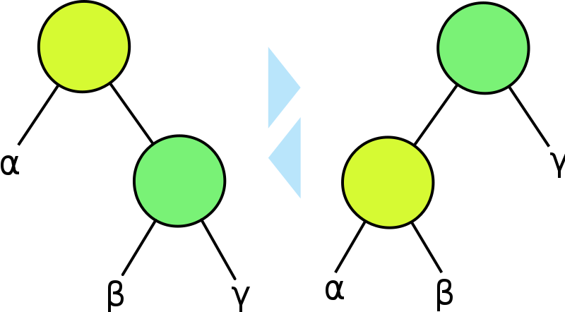

# Lecture 4, Sep 20, 2023

## Binomial Heaps Continued

* Another operation is $\operatorname{DecreaseKey}(T, x, k)$ which decreases the priority of $x$ to $k$
	* This can be implemented simply in $O(\log n)$ time in both binomial and binary heaps by moving the element up
* $\operatorname{Remove}(T, x)$ removes the element $x$; this can also be implemented in $O(\log n)$ time for binomial heaps
* Even though a single Insert operation takes $O(\log n)$, inserting $k$ keys in sequence has a cost of at most $2k$ key-comparisons as long as $k > \log n$

## Dictionaries

\noteDefn{Given a set $S$ of elements with keys, a \textit{dictionary} provides the operations:
\begin{itemize}
	\item $\operatorname{Search}(S, x)$: returns element with key $x$ if it is in $S$, else "not found"
	\item $\operatorname{Insert}(S, x)$: inserts $x$ in $S$
	\item $\operatorname{Delete}(S, x)$: deltes $x$ from $S$
\end{itemize}}

* If we naively implement this with a linked list, we get $\Theta(1)$ insert, but $\Theta(n)$ search and delete; can we find a structure that does each operation in $\Theta(\log n)$ time?
	* We can try a binary search tree

\noteDefn{A \textit{binary search tree} is a binary tree in which for each node, all the keys in its left subtree are smaller or equal to itself, and all the keys in its right subtree are bigger or equal to itself.}

{width=60%}

* Given a node in the BST, we can *rotate* it:
	* Left rotation: the node goes "down" and the right child is "lifted up"
		* The right child becomes the new parent; the original node becomes its left child
		* The original left subtree of the right child now becomes the right child of the original parent
	* Right rotation: the node goes "down" and the left child is "lifted up"
		* The left child becomes the new parent; the original node becomes its right child
		* The original right subtree of the left child now becomes the left child of the original parent
* BSTs can be searched recursively: given a key to search for, if it's bigger than the current node, search the right subtree; if it's smaller than the current node, search the left subtree; if it's equal to the current node, return the current node
* Insert works in the exact same manner as search to find a parent node that has an empty space
* Deletion has a few cases:
	* If the node to be removed is a leaf, simply remove it
	* If the node has one child, remove it and replace it with its child
	* If the node has both children, replace it with its *successor*, which is the leftmost node in its right subtree; the successor will either have 1 child or no children
* For all operations in a BST, the worst-case runtime is directly proportional to its height
	* For an unbalanced BST, in the worst case the height is the same as its size; however if we keep the tree balanced, we can do all the operations in $O(\log n)$ time

