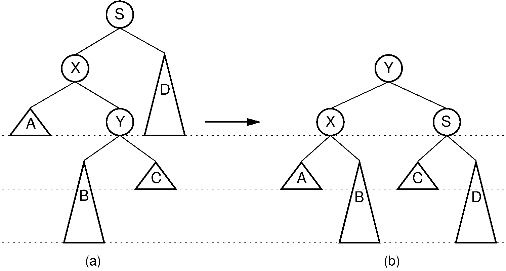

# Lecture 6, Sep 27, 2023

## AVL Trees Continued

{width=60%}

{width=60%}

* In general for insertion, to rebalance there are 4 distinct cases:
	* Left-heavy node with left-heavy left child: rotate right on node
	* Left-heavy node with right-heavy left child: rotate left on left child, then rotate right on node
	* Right-heavy node with right/left-heavy right child: symmetric to the above cases
* In all 4 cases we can prove that the BST property is kept, the BFs are restored, and the height of the balanced tree is the same as before when the new node was inserted
* To insert:
	* Insert the node into the tree; set its balance factor to 0
	* Go from the node to the root, and for each node in the path:
		* Adjust the BF: if coming from the left, decrease BF, if coming from the right, increase BF
			* If the BF becomes 0, stop going up the tree
		* If the BF is outside the range $[-1, 1]$, rebalance as one of the cases above
			* After rebalancing, stop going up the tree
		* If the BF is nonzero and no rebalance was needed, keep going up the tree
* Balancing takes constant time and we do it at most once per insert
* Since we have to first insert the node and then possibly update the BF of all its parents, the complexity of insert is $O(\log n)$
* For delete, the operations are similar but now since the tree gets shorter, we do at most $O(\log n)$ rotations

