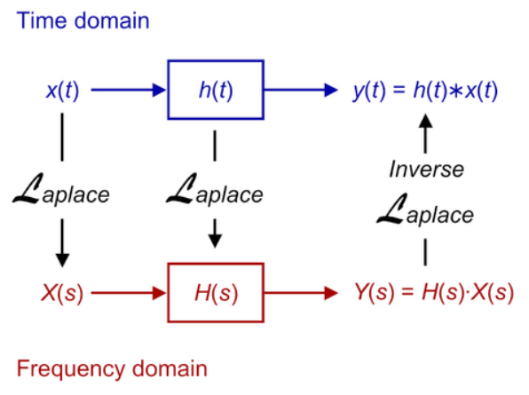

# Lecture 1, Sep 8, 2023

## The Need for Frequency Domain Analysis

{width=40%}

* Frequency domain analysis techniques allows us to more easily design filters that manipulate different frequencies in signals
* We can pass the input signal through a Fourier transform to get sinusoids, which are very easy to work with in the Laplace domain with e.g. Bode plots (change of output vs. frequency), from which we can directly find the output signal of a filter
	* Bode plots can be obtained from both a theoretical design and a real circuit, and even from elements like motors that aren't circuits but behave similarly

\noteNote{Generally, not every time domain function has a Laplace transform and not every function in the Laplace domain has an inverse. However in this course we will assume that the transforms and inverses always exist for sake of simplicity.}

## Poles and Zeroes

\noteNote{Complex numbers in this course are represented as $$s = \sigma + j\omega$$ where $j$ is the imaginary unit, $j^2 = -1$, and $\sigma$ and $\omega$ are the real and imaginary parts respectively.

When we wish to represent a pure frequency, we will use only the imaginary $j\omega$, where $\omega$ is the frequency of the signal in radians/s.}

* Complex functions are represented as $F(s) = F_x + jF_y$
	* $F$ can represent a signal, or a transfer function
* A complex function $G(s)$ is *analytic* in a region if $G(s)$ if it and all its derivatives all exist; these are known as *ordinary points* and don't tell you much
	* Points where $G(s)$ is not analytic are *singular points*, which are important indicators of what the signal looks like or how the transfer function behaves

\noteDefn{Singular points where $G(s)$ or its derivatives approach infinity are known as \textit{poles} of the function; if $\lim _{s \to p} G(s) = \infty$ and $$G(s)(s + p)^n$$ has a finite, non-zero value at $s = -p$, then it is a pole of order $n$.}
\noteDefn{Singular points where $G(s)$ or its derivatives approach zero are called \textit{zeroes} of the function.}

* Poles indicate places where the frequency response changes in a filter; e.g. where the frequency cutoff between pass and block happens
* Zeros determine behaviour indirectly by interacting with poles; they somewhat cancel out the effect of a pole
	* Using zeros, we can add zeros to change the system's behaviour
* Example: $\frac{(s + z)}{(s + p)}$ has a zero at $s = -z$ and a pole at $s = -p$
	* If $z$ and $p$ are far apart, the zero doesn't really do much
	* As the zero and pole get closer, they interact in the transient (short-term) domain
	* If $z = p$, the pole and zero can also cancel out
* Example: $G(s) = \frac{K(s + 2)(s + 10)}{s(s + 1)(s + 5)(s + 15)^2}$
	* Note how we factored the signal into a form where the poles and zeros are easily identified
	* Poles: 5 total at $s = 0, -1, -5, -15$ (last one is order 2)
		* We will see that when poles are stacked on each other, it amplifies their effect
	* Zeroes: 2 (finite) total at $s = -2, -10$
		* Strictly speaking we will also have 3 more zeros at $s \to \pm\infty$, since the numerator is degree 2 and denominator is degree 3
	* Based on this, we can see 3 terms exponentially decaying, 1 step (constant), and some transient up-down behaviour in the signal; we can see this by looking at properties of the Laplace transform:
		* Terms that are $\frac{1}{s + \alpha}$ are exponential decay $e^{-\alpha t}$
			* Note that $\alpha$ has to be a purely real number for it to be exponential decay
		* Terms that are $\frac{1}{s}$ are steps
		* The poles at -1, -5, and the zero at -2 influence each other to lead to transient behaviour

\noteImportant{As a general rule of thumb, if the poles and zeros are in the same order of magnitude, they will interfere leading to transient behaviour; the closer the pole is to the zero, the greater the effect in the short term but the more they cancel in the long term.}

* Note that functions that grow faster than an exponential do not have Laplace transforms since they do not converge, but we never want to analyze these functions anyway
* The linearity of the Laplace transform allows us to break time domain signals into sinusoids, which are very easy to work with
* Some common Laplace transforms:
	* A decaying exponential transforms to $\frac{A}{s + \alpha}$ where $\alpha$ is a positive real constant
	* A step transforms to $\frac{A}{s}$
	* A ramp function (e.g. $f(t) = t$) transforms to $\frac{A}{s^2}$
	* A sinusoid transforms to $\frac{A\omega}{s^2 + \omega^2}$
		* This means if we have a pair of poles at $s = \pm j\omega$, it corresponds to a sinusoid

{width=60%}

* Notes for the figure:
	* Poles are often marked with X on the imaginary plane
	* Points labelled $A$ are purely real and negative, so they are of the form $\frac{1}{s + \alpha}$ which gives us exponential decay
		* The further away the pole is from zero (i.e. bigger $\alpha$), the faster the decay
	* The point labelled $B$ is of the form $\frac{1}{s}$ which gives us a unit step or constant offset
	* All points on the right are exponential growth (unstable poles), which are intangible in real circuit design, so in practice we don't care about them
	* Points labelled $C$ are purely imaginary and come in conjugates, which are sustained oscillations (sinusoids)
	* Points labelled $D$ have both imaginary and negative real parts, which gives us an exponentially decaying sinusoid
		* The frequency is $\sin(\omega t)$ and decay follows $e^{-\sigma t}$

