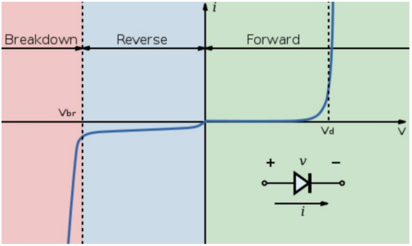

# Lecture 11, Oct 14, 2023

## Introduction to Diodes

* The diode is our first *active* semiconductor device, i.e. a component with a nonlinear relationship between $V$ and $I$
* Diodes have two principal states, *forward* or *reverse bias* (i.e. on/off)
	* A diode passes currents in forward bias and blocks currents in reverse bias
	* A forward bias has higher voltage at the anode than the cathode and current flows in this direction
* Made of semiconducting silicon which are doped to create positive (P-type) or negative (N-type) charge carriers, forming a PN junction
	* Both P-type and N-type materials have low resistance on their own
	* In the interface between the two regions, we have a depletion region, where the charge carriers "cancel", leaving the high resistivity of the bulk crystalline in a small region
	* Applying a reverse bias tries to push electrons from the N-type material into the P-type, expanding the depletion region and causing no current to pass through due to the high resistance
	* Applying a forward bias does the opposite and shrinks the depletion region
		* With a smaller voltage the region shrinks but still exists, causing some but not a lot of current to flow
		* After reaching a critical voltage, the depletion region is fully eliminated and now resistance is low and potentially large currents can pass
* For an ideal diode, we have two regions: in the reverse bias region $V < 0$, the diode becomes an open circuit and $I = 0$; in forward bias $I > 0$, so $V = 0$ and we model the diode as a closed circuit
	* Using a diode with an op-amp circuit creates an output that is similar to ideal
	* This model is suitable for low-fidelity, quick analyses because it can produce ambiguous results
	* Note the problem here is that we can't really define where the diode switches between the two states, since $V = 0$ when the diode is a closed circuit
		* This means that to use the model, we need to first take a guess at the voltage bias on the diode, solve the circuit, and then confirm that our guess was correct
		* If we assume reverse bias, and find a positive voltage on the diode, we need to flip it
		* If we assume forward bias, and find a negative current across the diode, we need to flip it

{width=50%}

* In reality the behaviour of the diode looks more like the graph above
* Improved model 1: constant voltage model
	* Under some fixed voltage $V_{D_0}$, we model the diode as an open circuit
	* Above this fixed voltage, the diode acts as a closed circuit but with a voltage drop
	* We model it as a constant voltage source of voltage $V_{D_0}$ to represent the constant voltage drop across the diode when it's conducting
		* Note this is not a true voltage source because it cannot deliver current!
	* 0.6 to 0.7V is a typical voltage drop for a silicon diode
	* As with the ideal model, we can start by assuming reverse bias, then checking if the diode has a voltage greater than $V_{D_0}$; if it is, then we assume forward bias and solve the circuit again
	* With this model, we can also calculate the power dissipation as $P = IV_{D_0}$
* Improved model 2: piecewise-linear model
	* Use an added series resistance to model the change in $V$ vs. $I$ in forward bias
	* In forward bias, we replace the diode with both a voltage drop of $V_{D_0}$ and a series resistance $r_D$
		* The condition for forward bias is now $V > V_{D_0}$
		* With this model, we no longer have an ambiguity in the condition check since the same variable is used for both forward and reverse checks
	* This has better fidelity, but $r_D$ needs to be fitted to real life conditions
		* The value of $r_D$ can change for low vs. high currents, so if we fit it in one range it will be increasingly less accurate in the other
	* This model is good for a quick analysis of the current and power dissipation through the diode
* Improved model 3: exponential model
	* This model is more accurate but not suitable for hand calculation
	* Forward bias is modelled as $I_D = I_S\left(e^{\frac{V_D}{nV_T}} - 1\right)$
	* Reverse bias is modelled as a constant small reverse current $I_D = -I_S$, so that we avoid ambiguity when checking later
	* The parameters come from the underlying physics:
		* $I_S$: saturation current, on the order of $\SI{1e-12}{A}$ to $\SI{1e-15}{A}$; this is the current that flows through the bulk crystalline structure (diffusion of minority carriers)
		* $V_T$: thermal voltage, usually $25\si{mV}$ at room temperature; this models the thermal response of the diode
			* Sometimes diodes can heat up, which causes them to pass more current, which in turn causes them heat up even more in a positive feedback loop
		* $n$: ideality factor, typically 1-2; this accounts for inaccuracies in our model
	* This model has near-perfect fidelity, but is not suitable for hand calculation
	* Procedure:
		1. Assume some initial guess for $I_D$ using the constant voltage model
		2. Calculate the diode voltage from $I_D$ by reversing the model
		3. Treat the diode as a constant voltage drop we just calculated, and find the current through the diode by solving the rest of the circuit
		4. Repeat the previous steps until the change to the diode current between iterations is small, which indicates that we've reached a sufficient degree of precision
	* We could also start with a voltage guess and iterate based on that, but since the model is much less sensitive to current, having a bad current guess is much better than having a bad voltage guess
* If a sufficiently large reverse voltage is applied, the diode can break down
	* The large electric field creates additional temporary charge carriers, causing an avalanche effect; substantial reverse current can flow in breakdown
	* This effect is not permanent and can be reversed if the voltage/current drops
	* Most of the time this is undesirable; it's hard to take advantage of because the breakdown voltage is hard to predict
* The transition between forward and reverse modes takes a nonzero amount of time, during which current can flow in the wrong direction
	* The *reverse recovery time* $T_{rr}$ is the time required for the transition
	* During $T_{rr}$, even though the voltage should put the diode into reverse bias, it will keep conducting
	* This can lead to destructing of the diode
	* Some diodes are faster; a typical diode recovers in about 1ms, with special diodes (e.g. Schottky) bringing this down to 10ns or less
	* However there is a tradeoff between the reverse recovery time and other design parameters

