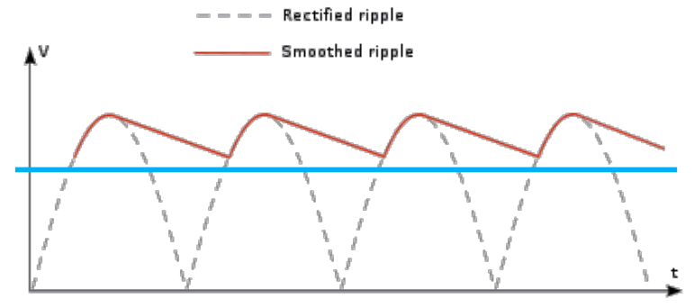
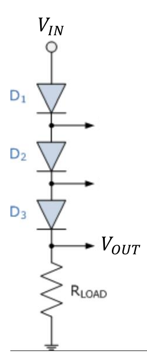

# Lecture 12, Oct 18, 2023

## Regulator Circuits

{width=50%}

* The goal of a regulator is to produce a constant DC output voltage (generally from a higher input voltage) which is constant and steady under load variation
* A regulator is often attached to the output of an AC rectification circuit, which is noisy and contains ripples
* We want the output of our regulator to look like the blue plot above, even if the input voltage varies or if the output load draws varying amounts of current
* Two properties of regulators are of interest:
	* *Line regulation*: holding output constant while input voltage changes
		* This is usually analyzed under the worst-case load current scenario
		* For simple regulators, the highest load current is typically the worst-case scenario; for more complex regulators this can be the lowest load current
		* This is generally quantified as the difference between $V_{OUT}$ at maximum $V_{IN}$ and $V_{OUT}$ at minimum $V_{IN}$ (both at the worst load current), normalized by the design $V_{OUT}$ (nominal value)
			* Note sometimes the $V_{OUT}$ at max or min input voltage are used as normalization for more complex circuits
		* Line regulation is often expressed as a percentage, which would be the percent change in $V_{OUT}$ for every 1% change in $V_{IN}$
			* Single digit values are good, double digit values are generally poor
	* *Load regulation*: holding output constant while load current changes
		* For simple regulators, the lowest input voltage is typically the worst-case scenario
		* This is generally quantified as the difference between $V_{OUT}$ at minimum load and $V_{OUT}$ at maximum load (both at the worst input voltage), normalized at the $V_{OUT}$ at maximum load
			* Note we are doing min minus max, because generally with a higher load we expect the output voltage to go down
			* Some manufacturers will normalized by $V_{OUT}$ at minimum load or nominal $V_{OUT}$
	* Load and line regulation are signed quantities, but they are typically positive unless there is feedback in the circuit
* For most simple (no active feedback) regulator circuits, the ends of the input/current draw ranges are usually where the regulator behaves the poorest
* Most regulator circuits take advantage of the fact that the voltage drop across a diode in forward bias is nearly constant
	* Typically if a regulator circuit is working, diodes will be in forward bias mode
* Let's try to design a regulator with the following requirements:
	* Input voltage varies from 10-15V
	* Load current varies from 0-1A
	* Desired output is 9V

{width=10%}

* Example: series diode regulator
	* $R_{LOAD}$ is a placeholder load which can draw varying amounts of current as specified above
	* We will be using the piecewise-linear model with $V_{D_0} = \SI{0.5}{V}$ and $r_D = \SI{0.1}{\ohm}$
	* On a high level we expect the output to be a constant voltage offset from the input due to the series diodes
	* This regulator has poor line regulation, but good load regulation
	* To find line regulation, we solve the circuit for $V_{IN} = \SI{10}{V}$ to $\SI{15}{V}$; in both cases we solve with $I_{LOAD} = \SI{1}{A}$ since it is our worst-case scenario
		* Assuming forward bias on all diodes, we have 3 resistors $r_D$ in series and 3 voltage sources $V_{D_0}$ in series
		* Note generally when diodes are in series with no connections in-between, they will always have the same state
		* At $V_{IN} = \SI{10}{V}, I_{LOAD} = \SI{1}{A}$ each $r_D$ has a voltage drop of $\SI{0.1}{V}$ and each $V_{D_0}$ has a voltage drop of $\SI{0.5}{V}$, resulting in $\SI{8.2}{V}$
		* At $V_{IN} = \SI{15}{V}$, the analysis is similar and we get $\SI{13.2}{V}$
		* The line regulation is then $\frac{13.2 - 8.2}{9} = 55.6\%$, which is very bad
		* Note for this circuit, it doesn't matter what load current we chose
	* To find load regulation, we solve the circuit for $I_{LOAD} = \SI{0}{A}$ to $I_{LOAD} = \SI{1}{A}$
		* First assume $V_{IN} = \SI{10}{V}$, then at $I_{LOAD} = \SI{0}{A}$ we have $\SI{8.5}{V}$ and at $I_{LOAD} = \SI{1}{A}$ we have $\SI{8.2}{V}$
			* The load regulation is $\frac{8.5 - 8.2}{8.2} = 3.7\%$ which is pretty good
		* If we solve at $V_{IN} = \SI{15}{V}$, we get $\SI{13.5}{V}$ at no load and $\SI{13.2}{V}$ at maximum load
			* The load regulation is $\frac{13.5 - 13.2}{13.2} = 2.3\%$, which is better than the minimum input voltage case
			* This confirms that the minimum input voltage is the worst case

