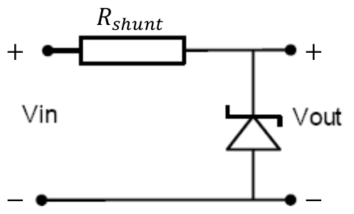
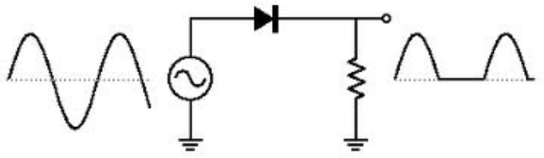

# Lecture 13, Oct 20, 2023

## Diode Shunt Regulator

{width=20%}

* The idea is that we're shunting the current that the load is not using through the diodes
* We expect this to have good line regulation since here $V_{out}$ is essentially equal to the constant voltage drop across all the diodes
	* We can also design it for good load regulation
* Our operating condition are the same as the previous example:
	* Input voltage from 10-15V
	* Load current from 0-1A
	* Desired output is 9V
* We will modify the circuit to have 15 diodes in series instead of 3, all with a piecewise linear model; we will use a shut resistance of $R_{SHUNT} = \SI{3.5}{\ohm}$
* Since the diodes are all in series, they will share the same state, which we assume to be forward bias
	* Each diode is replaced with a constant voltage drop of $\SI{0.5}{V}$ and a series resistance of $\SI{0.1}{\ohm}$
	* This leads to a total voltage drop of $\SI{7.5}{V}$ and resistance of $\SI{1.5}{\ohm}$
* Line regulation: test two cases, $V_{IN} = \SI{10}{V}$ and $V_{IN} = \SI{15}{V}$, under a load current of $I_{LOAD} = \SI{0}{A}$
	* In this case the worst-case scenario is reached when the diodes are on the edge of being in reverse bias; this generally happens when we don't pull enough current or pull too much, but it is the former case that is more common
	* Node equation at output: $\frac{V_{OUT} - V_{IN}}{R_{SHUNT}} + I_LOAD + \frac{V_{OUT} - 7.5}{1.5} = 0$ 
	* At $V_{IN} = \SI{10}{V}, V_{OUT} = \SI{8.25}{V}$
	* At $V_{IN} = \SI{15}{V}, V_{OUT} = \SI{9.75}{V}$
	* The line regulation is $\frac{9.75 - 8.25}{9} = 16.7\%$, which is okay (but not very good)
		* The problem is that the design point for the circuit is different -- the value of $R_{SHUNT}$ is selected so that we can deliver larger currents; if we had chosen a larger resistance and limited our current range, we will see much better performance
* Load regulation: test two cases, $I_{LOAD} = \SI{0}{A}$ and $I_{LOAD} = \SI{1}{A}$, under an input voltage of $V_{IN} = \SI{10}{V}$
	* For pretty much all regulators without feedback, the worst case occurs with minimum input voltage; at minimum input voltage we're the most susceptible to losing forward bias on the diodes
		* This is referred to as the "dropout voltage", which is the minimum difference between $V_{OUT}$ and $V_{IN}$
	* At $I_{LOAD} = \SI{0}{A}, V_{OUT} = \SI{8.25}{V}$
	* At $I_{LOAD} = \SI{1}{A}, V_{OUT} = \SI{6.5}{V}$
		* Note if we had assumed that the diodes are all in forward bias, we would have found $V_{OUT} = \SI{7.25}{V}$; this would mean less than $\SI{0.5}{V}$ per diode, so we lose forward bias
		* In reverse bias we simply have $V_{OUT} = V_{IN} - R_{SHUNT}I_{LOAD} = \SI{6.5}{V}$
	* The load regulation is $\frac{8.25 - 6.5}{6.5} = 26.9\%$ which is quite bad
* This is a pretty good voltage regulator if we make sure that it does not drop out, so for higher current outputs we need to make sure that the input voltage stays high
* Note that in practice the power consumption of this circuit is quite high

## Zener Diodes

{width=50%}

* A zener diode is a diode engineered to undergo reverse breakdown non-destructively at a specific voltage
	* In forward bias it behaves similar to a regular diode, but in reverse we're able to get a very specific breakdown voltage that can be quite large
	* Typically zener diodes are used in reverse bias in its zener region
* Most often zener diodes are analyzed using a piecewise linear model; we will use a constant voltage model
	* We can replace a zener diode with just a constant voltage source, provided the reverse voltage is high enough
	* Note that because most diodes have a low voltage dissipation, for a larger zener voltage we will have very low current ratings
	* We neglect the linear resistance since most of the time we will have low current

{width=40%}

* Example: for the zener shunting regulator above, select the zener voltage $V_Z$ and $R_{SHUNT}$ and determine the current range it operates in; assume $V_{OUT} = \SI{10}{V}$ and $V_{IN}$ is in the range of 12-18V, and the zener diode can dissipate 0.5W of power
	* If we use a constant voltage model we immediately see that $V_{OUT} = V_Z$, so we can select the zener voltage as 10V immediately
	* The worst-case scenario for the input voltage is $V_{IN} = \SI{18}{V}$, which will give the highest current draw
		* Higher $V_{IN}$ pushes more current through the shunt, which in the worst case will all go through the diode
		* Under this scenario and assuming $I_{LOAD} = \SI{0}{A}$ the diode dissipates a power of $V_{OUT}\frac{18 - V_{OUT}}{R_{SHUNT}} = \SI{0.5}{W}$, which we can solve to get $R_{SHUNT} = \SI{160}{\ohm}$
		* Note we always want to make $R_{SHUNT}$ smaller because this limits the maximum amount of current we can draw
	* To see how much current we can draw, we need to consider the worst case $V_{IN}$
		* The critical point is when $\frac{V_{IN} - V_{OUT}}{R_{SHUNT}} \leq V_Z$ which is when the diode drops out
		* We also need $I_D \geq 0$ and $I_D = \frac{V_{IN} - V_Z}{R_{SHUNT}} - I_{LOAD}$; so when $V_{IN} = \SI{12}{V}$ and $I_D = 0$ we get a current limit of $\SI{12.5}{mA}$ (which is higher for a higher $V_{IN}$)
* Zener voltage references are the standard if we want to produce a precise voltage at a low current

## Rectifier Circuits

{width=50%}

* A rectifier circuit converts an input AC voltage into an output DC voltage
* In the example half-wave rectifier above, the diode will allow current to pass through whenever the AC voltage is positive, and block it when the voltage is negative
	* However this is produces an output that is far from DC since whenever the AC voltage goes negative, our DC voltage goes to zero
* To counteract this we use components that can store energy -- capacitors and inductors; this will give us a wavelike output, which we can describe as DC plus some *ripple*
	* The amount of ripple is proportional to the current drawn and inversely proportional to the capacitance
	* Note that this puts a large reverse voltage on the diode, so we need to select the diode accordingly
	* If we attach a capacitor however, we get a large current spike when both the load and capacitor are getting current; therefore we need to make sure that the peak current rating for the diode is high enough
		* This also increases the reverse voltage; in the worst case, we can see up to twice the original value

