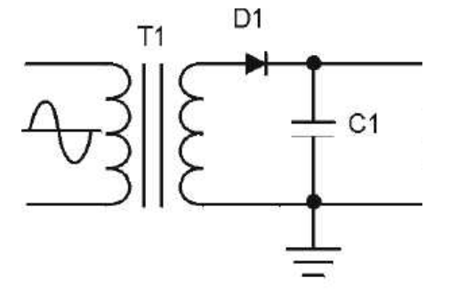

# Lecture 14, Oct 25, 2023

## Regulator Design

* Diode selection is made more complex in a rectifier with a capacitor:
	* Input current only flows for a short period of time each cycle, which charges the capacitor and supplies the load -- this leads to a significant current spike, so we need to ensure the peak repetitive surge current of the diode is high enough
	* Peak reverse voltage across the diode also increases significantly, since the output voltage stays high while the input voltage drops negative -- the voltage drop is now close to twice the peak voltage minus the diode drop
		* Smaller ripple makes the peak reverse voltage closer to this
		* $PIV = 2V_p - V_{D_0}$
* The high peak current draw is a problem for power distribution grids, so we usually use some form of *power factor correction* to account for this
	* We can put an inductor in series with the input current; since the inductor resists change in current, this smoothes out the peaks (in theory, while in practice this doesn't work too well)

{width=80%}

* The ripple voltage $V_{RIPPLE}$ is typically defined as the peak-to-peak voltage difference of the output (distance between the two blue lines)
* For a capacitor, $V_{RIPPLE} = \frac{I_{LOAD}}{fC}$
	* Here we assume that the load current is roughly constant, which makes a straight-line approximation of the capacitor discharge valid
	* A larger capacitor and higher frequency (so peaks are closer) reduce the amount of ripple
* Note that in rectifier circuits, we typically use a *transformer*, which is a pair of coupled inductors wrapped around the same core; this steps down the line voltage and adds isolation between our circuit and the input
	* If the input (*primary*) winding is $N_P$ and the output (*secondary*) winding is $N_S$, then the output voltage is $V_S = V_P\frac{N_S}{N_P}$
* Sometimes we will use the RMS voltage of the input AC signal, which can be converted into peak voltage by multiplying by $\sqrt 2$

{width=50%}

* Example: design the above half-wave rectifier by selecting $C_1$ and the RMS secondary voltage required for $T_1$, and specify the minimum PIV for $D_1$; the power supply will be regulated by a circuit that outputs $\SI{5}{V}$ DC and requires an input of at least $\SI{7}{V}$; we want $\SI{20}{mV}$ peak-to-peak ripple, given a maximum load current of $\SI{1}{A}$ and $f = \SI{60}{Hz}$; assume $V_{D_0} = \SI{1.0}{V}, I_{D} = \SI{1}{A}$
	* Note that typically instead of targeting a small ripple input to the regulator, we typically leave the ripple rejection to the regulator
	* We can use the formula to solve for $C_1$ from the amount of ripple; we get $C \geq \SI{0.833}{F}$ (which is quite unrealistic)
	* Adding the ripple to the minimum output voltage and adding the capacitor voltage drop gets us a secondary voltage of about $\SI{8}{V}$ (where we have ignored the ripple voltage since it is comparatively small), or $\SI{}iiiiiiiiiiiiiiiiiiiiiiiiiiiiiiiiiiii9999999999999999999999999999999999999999999999999999999999999999999999999999999999{V}$ RMS
