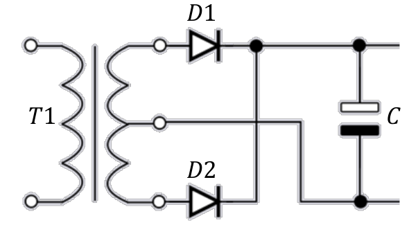
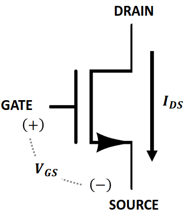
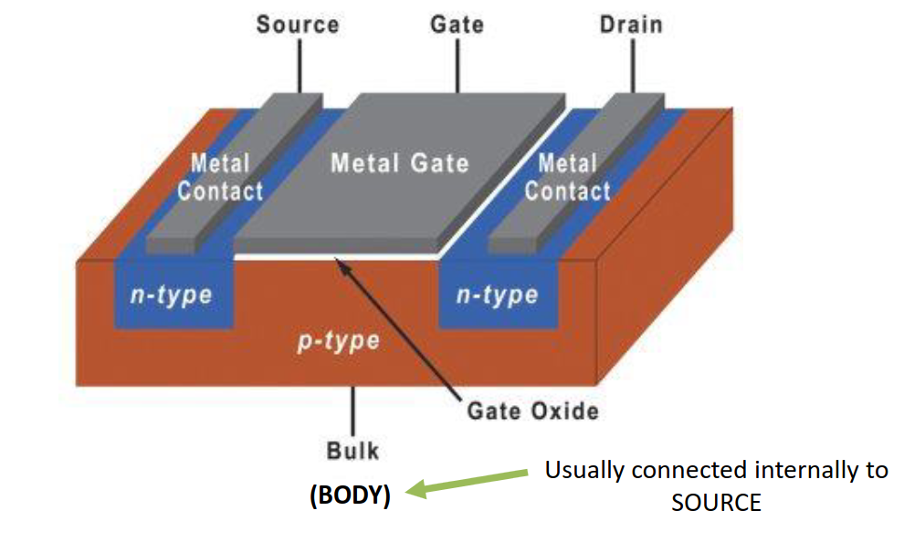
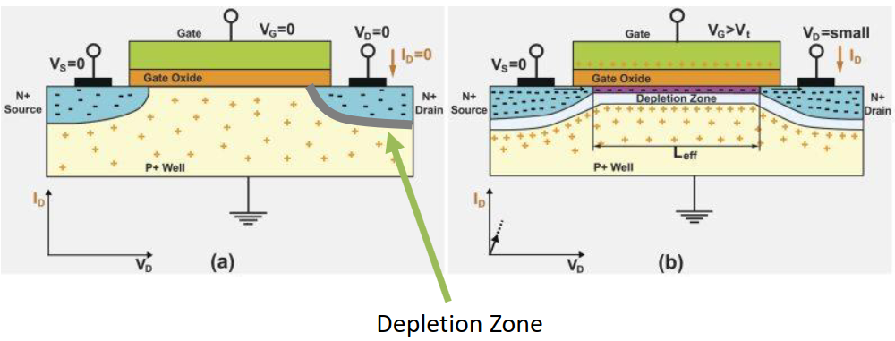
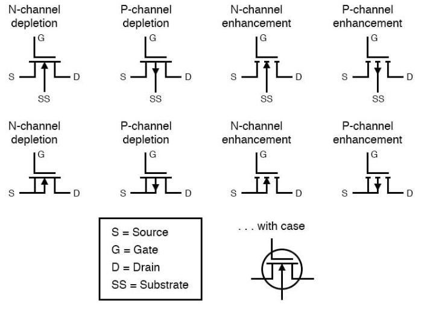
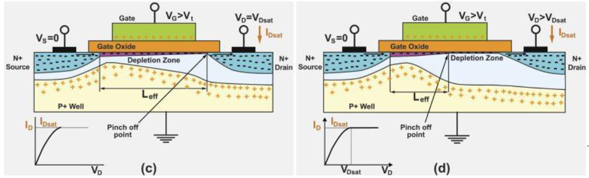
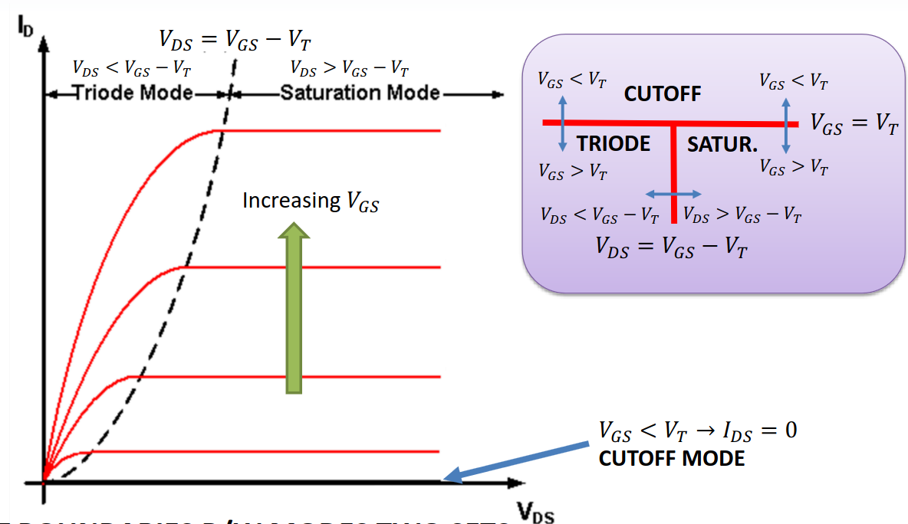
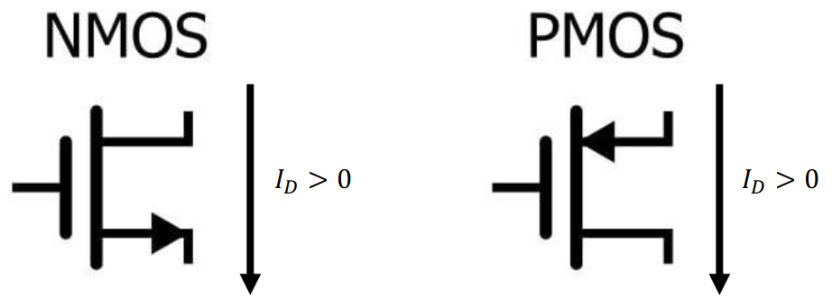
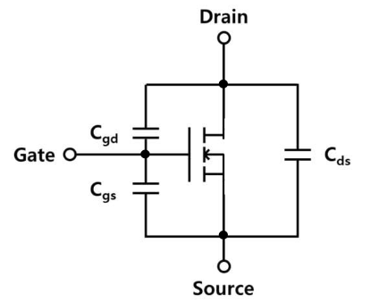

# Lecture 15, Oct 27, 2023

## Full-Wave Rectifier Example

{width=40%}

* Example: design the circuit above by selecting $C_1$ and the RMS center-tapped secondary voltage for the transformer $T_1$ and determining the PIV required for the diodes; the power supply is regulated by a regulator that outputs $\si{10}{V}$, requiring a voltage of at least $\SI{12}{V}$ and has $\SI{40}{dB}$ of ripple rejection; we want the overall output of the power supply to have $\SI{20}{mV}$ ripple given a max load of $\SI{1}{A}$ and $f = \SI{60}{Hz}$; assume $V_{D_0} = \SI{1.0}{V}$ at $I_D = \SI{1}{A}$
	* A ripple rejection means that the input ripple to the regulator will be reduced by a factor of $\SI{40}{dB}$, i.e. divided by 100
	* This means we can tolerate up to $\SI{2}{V}$ p-p of ripple from the rectifier
	* We need the peak voltage minus the diode drop minus the ripple to stay above $\SI{12}{V}$
		* $\frac{V_{SEC_p}}{2} = 12 + 2 + 1 = \SI{15}{V}$
		* Multiply by 2 to get the peak-to-peak voltage of the secondary, and convert to RMS
		* $V_{SEC_{p-p}} = \SI{21.2}{V}$ (RMS, CT)
	* $V_{R_{p-p}} = 2 = \frac{I_{LOAD}}{2fC} \implies C = \SI{4170}{\micro F}$
		* Note that we'll get 2 peaks for every full cycle of the AC, so in effect by using a full-wave rectifier we have doubled the frequency
		* Sometimes we need to pick the capacitor's working voltage, which we can determine by checking the maximum voltage, in this case $\SI{14}{V}$ ($12 + 2$)
		* This will be an electrolytic capacitor
	* Note that our peak inverse voltage doesn't change compared to the half wave rectifier case; it's still $PIV = 2V_{IN_p} - V_{D_0} = \SI{29}{V}$
		* The peak input voltage is half of the secondary peak to peak voltage
* Typically a more efficient rectifier will increase the frequency of the input AC to achieve smaller capacitance requirements

## Transistors and MOSFETs

{width=30%}

* MOSFET stands for Metal Oxide Semiconductor Field Effect Transistor
* Transistors are active, three-terminal devices that provide a path for (potentially large) currents to flow, along with an input control
* For a MOSFET, the control signal is called the *gate*, while the input and output for the current are the *drain* and *source
	* $V_{GS}$ is defined as the relative voltage between gate and source
	* Applying some $V_{GS}$ will cause current $I_{DS}$ between drain and source; just like a diode, under normal circumstances drain to source is the only direction that current can flow
		* This is a *transconductance amplifier*, since a (possibly small) voltage input controls (a possibly large) a current output
* In general we have 3 different states for the MOSFET where two are conducting states; one of these states is associated with switching applications (on/off), another one is associated with amplification

{width=50%}

{width=70%}

* A MOSFET has the following structure:
	* The bulk material is made of p-type semiconductor
	* Two cavities are made where n-type semiconductor is filled in; one is connected to the source, one is the drain
	* A gate oxide layer acts as insulation between the metal gate and the body
	* Where the two meet, we have a depletion zone where current cannot conduct -- this gives us a default state of high resistance
	* Right now we have 4 terminals; to get this to a regular transistor we short the body and source
* The MOSFET is made active by applying a potential to the gate
	* If the gate has a potential relative to the body, the charge carriers in the p-type body is separated and drawn to the surface
	* This knocks off a little bit of the depletion zone, so we get a continuous path (channel) between drain and source
	* This can be accomplished with depletion-mode or enhancement-mode
* Like a diode, in order to form the channel, we need a minimum threshold voltage $V_T$ which $V_{GS}$ must reach, below which the MOSFET remains in cut-off
	* Usually in the order of a few volts
	* Note this doesn't yet tell us about how much current can flow or how much we can control the current

{width=70%}

* Note that there are many different MOSFET symbols, all made to reflect the actual construction of the MOSFET; however they don't really change the math much, so we will use the simplified symbol (first image in this section)
	* The separation between the gate and the source/drain implies that at least at DC, current cannot flow into the gate
* Once the channel is created, current can flow with varying resistance from drain to source; there are 2 modes:
	* *Triode mode*: unrestricted channel, small drain to source voltage/resistance
		* This is the "switching" mode
		* Low power is dissipated because we have low resistance, so the switching is efficient
		* We can use this as a switch to control a larger current with a small voltage
			* However we don't get any control over how much current passes through even as we vary $V_{GS}$
		* This requires $V_{GS} > V_T$ and $V$ from drain to source is small
		* Typically we set up $V_{GS} \gg V_T$ because the larger our gate voltage, the more current we can pass through with the MOSFET still remaining in triode mode
	* *Saturation mode*: restricted channel with *pinch-off*
		* This requires $V_{GS} > V_T$ but $V_{GS} \approx V_T$
		* Now we have $V_{DS}$ being potentially large
		* The degree of pinch-off varies proportionally with $V_{GS}$, so the output current flow is proportional to the input voltage
		* In this mode, we have a transconductance amplifier

{width=70%}

* When $V_{GS} < V_T$, the MOSFET is always in cut-off mode with no current flowing anywhere, so we model the MOSFET as an open circuit
* When $V_{GS} \geq V_T$, the MOSFET is in one of two conducting modes
	* The triode mode is modelled as a fixed, low-value resistance $r_{DS_{ON}}$
		* The current is not really dependent on $V_{GS}$
	* The saturation mode is modelled as a current source that is a direct function of input voltage, $I_{DS} = f(V_{GS})$
		* This much current flows pretty much regardless of what is attached to the terminals
	* Note that the exact boundary between the two modes is dependent on the applied voltage
		* $V_{DS} = V_{GS} - V_T$ is the exact boundary between the two modes
	* We can also have devices on the boundary between two modes
		* On the boundary, both sets of mode equations apply

{width=90%}

* The exact formula for triode mode is $I_{DS} = \frac{k_n'W}{L}\left((V_{GS} - V_T)V_{DS} - \frac{1}{2}V_{DS}^2\right)$
	* This requires $V_{GS} \geq V_T$ and $V_{DS} \leq V_{GS} - V_T$
	* But typically $V_{DS}$ is very small so the second term can be ignored, giving us a linear approximation
		* Note that this approximation relies on $V_{GS} \gg V_T$, so we typically design to this
	* Therefore we have $I_{DS} \approx \frac{k_n'W}{L}(V_{GS} - V_T)V_{DS}$
		* This gives us an equivalent resistance of $\frac{1}{\frac{k_n'W}{L}(V_{GS} - V_T)} = r_{DS_{ON}}$
		* Note that this does depend on $V_{GS} - V_T$ but the dependence is relatively small
	* We don't typically calculate this ourselves; rather the datasheet gives this value, usually at a fixed large value of $V_{GS}$
	* But note that this means we're fitting it to a specific $V_{GS}$ (typically the more vertical bits to the left), so if we're operating close to the boundary we will get wrong results
		* $\frac{k_n'W}{L}$ also depends on the gate voltage so we can't simply use the formula
* In saturation mode, the output current has effectively no dependence on $V_{DS}$, so $I_{DS}$ is a function of $V_{GS}$ only; however this is a nonlinear effect; $I_{DS}$ increases faster the larger $V_{GS}$ gets
	* This gives us model of $I_D = \frac{1}{2}k_n'\frac{W}{L}(V_{GS} - V_T)^2$
	* The model parameters may be known from material properties but are usually fitted to a datasheet
		* These numbers are different from the ones in triode mode!
	* Nonlinear amplification is bad because it introduces distortion to our signal (BJTs do much better in this aspect)
	* To fix the nonlinearity, we will limit the range of $V_{GS}$ to a small delta around the central value (*operating point*); now we can linearly approximate the result
		* This is called a *small signal model*

{width=40%}

* Note that so far we've been talking about an N-type MOSFET (NMOS), since it has N-type doping for the source and drain; if we flipped the regions, we get a P-type MOSFET (PMOS)
	* The main difference is that the direction of current flips; in a PMOS the current flows from source to drain
	* We also reverse the inequalities in all of our condition checks, but otherwise keep the same models
	* A different value is also used for $k_p'$
	* $I_D$ is taken as positive but positive $I_D$ is $I_{SD}$ (source-to-drain) instead of $I_{DS}$
	* For a PMOS $V_{GS}$ is typically negative in triode/saturation, and $V_T$ is also negative

{width=20%}

* In real life the construction of the MOSFET introduces a parasitic capacitance from gate to source (there are also gate-to-drain, drain-to-source parasitic capacitances but these are small)
	* Typically $C_{GS} \sim \SI{5}{pF} - \SI{50}{nF}$
	* This introduces a time limit for switching since we need to charge the capacitor
	* This can also draw large transient currents when $V_{GS}$ changes rapidly, so we will need a driver IC or series gate resistors to mitigate this issue

