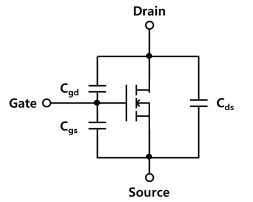

# Lecture 16, Nov 1, 2023

## MOSFET Real-World Issues

{width=20%}

* In real life the construction of the MOSFET introduces a parasitic capacitance from gate to source (there are also gate-to-drain, drain-to-source parasitic capacitances but these are small)
	* Typically $C_{GS} \sim \SI{5}{pF} - \SI{50}{nF}$
	* This introduces a time limit for switching since we need to charge the capacitor
	* This can also draw large transient currents when $V_{GS}$ changes rapidly, so we will need a driver IC or series gate resistors to mitigate this issue

{width=40%}

{width=20%}

* The construction creates 2 unintended PN junctions between the body and source/drain, which acts as a diode
	* Since we short body to source, one of these will be shorted out; however, the body-drain diode (known as the *body diode*) will now exist between the source and drain
	* If the drain-to-source voltage is too large, this diode will enter reverse breakdown and cause issues; this limits the max allowable $V_{DS}$ in all modes
	* This diode can also make the MOSFET conduct even when it is in cut-off; this happens when $I_D < 0$
	* Sometimes we want a diode in this location (e.g. motor driver) but this is a really bad diode
	* Generally we place external diodes with better specifications to fix the problem

{width=80%}

* The thin oxide layer under the gate is very easy to damage; typically $V_{GS}$ is limited to $\pm\SI{10}{V}$ or $\pm\SI{20}{V}$
	* This means static discharge can easily damage the oxide layer
	* Most modern ICs and devices with MOSFETs now have additional ESD protection for this reason

## Design Examples

{width=40%}

* Example: design the circuit above for a drain current of $\SI{1}{mA}$ and a drain voltage of $\SI{0}{V}$; the transistor has $V_T = \SI{1}{V}$, $k_n' = \SI{60}{\micro A/V^2}, L = \SI{3}{\micro m}, W = \SI{100}{\micro m}$
	* We assume that gate current is 0 at DC, so current into the drain must be the same as current out of the source
		* Therefore generally we use drain current, source current, and drain-to-source current interchangeably
	* Note we always use uppercase subscripts for DC and lowercase subscripts for small signals
	* We usually start at the drain-to-source path
	* Since the voltage at $V_D$ is 0, we know the voltage and current across the resistor $R_D$ immediately
		* $R_D = \frac{V_{DD} - V_D}{R_D} = \SI{2.5}{k\ohm}$
	* Now we need to relate $V_S$ to $V_D$ by determining the mode of operation for the MOSFET
		* We will assume one of the conduction modes (since we have a nonzero drain current, it cannot be in cut-off mode)
		* Recall that for saturation, $V_{DS} > V_{GS} - V_T \implies V_D - V_S \geq V_G - V_S - V_T \implies V_D \geq V_G - V_T \implies V_D - V_G > V_T \implies V_{GD} < V_T$
			* This is satisfied in our example
		* Note that in general, we won't always be able to determine the MOSFET's mode of operation directly like this
		* However in general in saturation mode, we typically expect drain to source currents on the order of milliamps or drain/source resistances on the order of kilohms
	* In saturation current is a direct function of $V_{GS}$ so we can find $V_{GS}$ using the MOSFET parameters and find $V_S$ given $V_G$
		* This will yield us two values $\SI{0}{V}$ or $\SI{2}{V}$, but we can eliminate one since we require $V_{GS} > V_T$
		* At this point we can check our assumption of saturation mode
	* This gives us $V_S = V_G - V_{GS} = \SI{-2}{V}$
	* Now we can solve for $R_S = \frac{V_S - V_{SS}}{I_D} = \SI{500}{\ohm}$
		* Typically in many designs the source resistance is the smaller of the two

{width=40%}

* Example: find the drain and source voltage of the MOSFET above, and select a resistor to replace the current source with, without changing the source or drain current
	* We expect the MOSFET to be in saturation mode
	* We have $V_G = \SI{0}{V}, I_D = \SI{2}{mA}$
	* The drain voltage can be calculated by as $V_D = V_{DD} - R_DI_D = \SI{2}{V}$
		* Note when we solve the equation we will get 2 possible values, but one of them will give us cutoff instead of saturation
	* $V_{GD} = \SI{-2}{V} < V_T$ so we are indeed in saturation mode
	* Now use $I_D = \frac{1}{2}k_n\frac{W}{L}\left(V_{GS} - V_T\right)^2$, with $I_D = \SI{2}{mA}$ to solve for $V_{GS} = \SI{4}{V}$
		* Again we will get 2 values, but one of them gives us cutoff
	* So $V_S = V_G - V_{GS} = \SI{4}{V}$
	* We can now solve for an equivalent resistance value that can replace the current source: $I_S = I_D = \SI{2}{mA} = \frac{V_S - V_{SS}}{R_S}$ to get $R_S = \SI{3}{k\ohm}$

