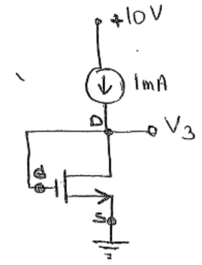
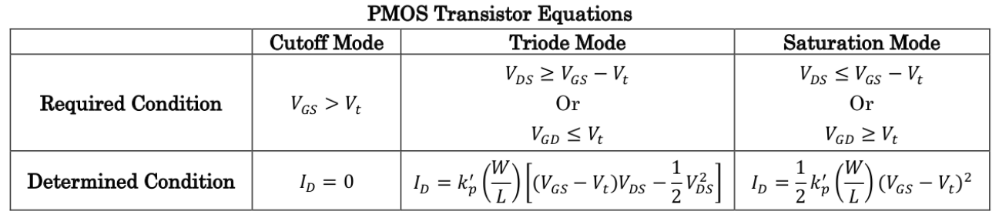
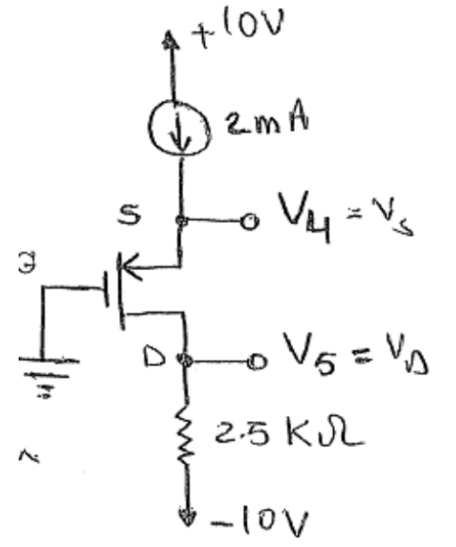

# Lecture 17, Nov 15, 2023

## More Design Examples

{width=30%}

* Example: feedback biasing: for the MOSFET circuit above, find the drain and source voltage and select a resistor to replace the current source
	* $V_S = 0$
	* $I_D = I_S = \SI{2}{mA}$ still because we assume a gate current of 0 at DC
	* $V_{GD} = 0$ forces us to be in saturation, since $V_{GD} < V_T$
	* $I_D = \frac{1}{2}k_n'\frac{W}{L}(V_{GS} - V_T)^2$, so we can solve for $V_{GS}$ and pick the one that gives us saturation: $V_{GS} = \SI{3.414}{V}$
	* $V_G = V_S + V_{GS} = V_D$ to solve for $V_{GS}$
	* With $V_{DD}$ and $V_D$ and the current going through, we can find $\SI{1}{mA} = \frac{V_DD - V_D}{R_D} \implies R_D = \SI{6.59}{k\ohm}$
	* By itself, this circuit doesn't do much, but we can use it to provide a stable reference current, as a building block in a current source circuit

## PMOS Circuits

{width=90%}

* For a PMOS, we have to flip the equations as above
* Positive current is defined as source to drain
* Note that $V_T$ is negative for a PMOS, but otherwise has the same magnitude

{width=40%}

* Given $V_T = \SI{-2}{V}$, find $V_D, V_S$, determine an equivalent source resistor; assume $k_p' = \SI{1}{mA/V^2}$
	* We know $I_S = I_D = \SI{2}{mA}$, which already gives us $V_D = V_{SS} + R_DI_D = \SI{-5}{V}$
		* Note the "negative supply" is still called $V_{SS}$ even though it's now connected to the drain
	* $V_{GD} = V_G - V_D = \SI{5}{V} > \SI{-2}{V} = V_T$, so we have saturation mode
	* $I_D = \frac{1}{2}k_p'\frac{W}{L}(V_{GS} - V_T)^2$ to get $V_{GS} = \SI{-4}{V}$ as the voltage that avoids cutoff
	* $V_S = V_G - V_S = \SI{4}{V}$
	* Sanity check: we should normally have $V_S > V_D$ (typically the terminals will be laid out such that the higher voltages are higher on the page)
		* Due to saturation mode, we expect $V_S$ to be quite a bit larger, which is the case
	* This gives $R_S = \SI{3}{k\ohm}$

