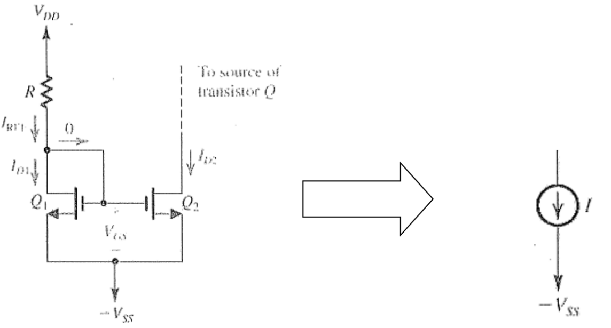
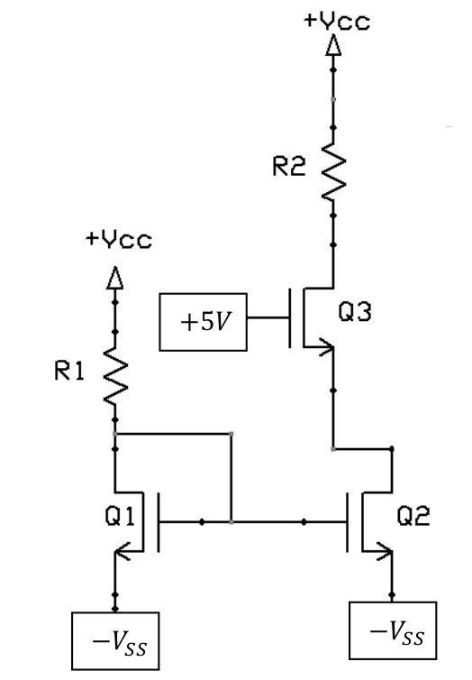
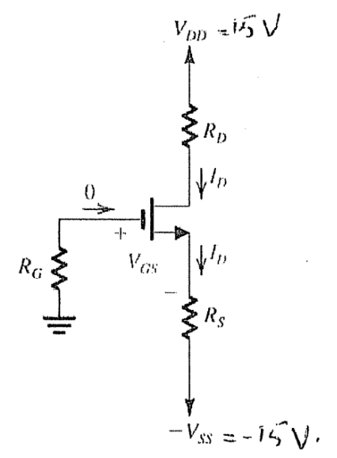

# Lecture 18, Nov 17, 2023

## Biasing MOSFET Amplifiers

* To design an amplifier, we have to go through 2 stages:
	* First we set up the circuit to operate at a specific DC configuration
		* This determines the *biasing* of the amplifier
		* This gives us some parameters that determine the amplifier operation -- input/output resistance, voltage gain, and indirectly, the voltage limits
	* We will then use capacitors to inject an AC signal and extract the resulting signal
* Note capital letters are generally pure DC, while lowercase letters are AC
* For a single MOSFET there are generally 3 possible amplifier configurations: common source, common drain, and common gate
	* The "common" terminal is the terminal that is not coupled to an input/output
* There are several ways to do biasing:
	* Fixed $V_{GS}$ biasing: fixing $V_{GS}$, where source and gate are connected to some constant voltage
		* This is the simplest, but least useful because it is very sensitive to $V_{GS}$ and has a small operating range
		* The circuit might have a lot of gain, but it will be very sensitive to tolerances
		* We are essentially overconstraining the problem
	* Fixed $V_G$ biasing: fixing $V_G$ and adding a source resistor
		* An increase in current leads to an increased voltage drop across the resistor, which raises $V_S$
		* With a fixed $V_G$, this decreases $V_{GS}$ and decreases the current -- this is negative feedback
		* This gives us a much wider range of operation -- $V_{IN}$ can be a much larger range and still have good gain
		* Introducing the source resistor reduces the output range, which can be fixed using a capacitor, either replacing or in parallel with the source resistor (*bypass capacitor*)
	* Feedback biasing: connect the drain and gate together, with a gate resistor between them
		* Since no current flows into the gate at DC, the resistor has no impact on the gate resistance, so we just have $V_D = V_G$
		* $V_{DG} = 0$ which makes the MOSFET always in saturation (with some limitations)
	* Constant current source (CCS) biasing: connecting a constant current source at the source to set the DC drain/source current
		* We can add a bypass capacitor from source to ground, so for AC the capacitor grounds the source
		* We can implement the current source using a *current mirror*
* The operating range is restricted due to the modes of the transistors
	* Usually at one end we will get triode mode on some resistors and the other end will give us cutoff mode
	* In both cases we would usually get clipping
	
{width=80%}

* The current mirror shown above behaves equivalently to a constant current source
	* Note the current $I_{D_1}$ is mirrored in $I_{D_2}$
	* This only works if the MOSFETs stays in saturation; $Q_1$ is feedback biased, so it will always be in saturation, but note $Q_2$ does not have this guarantee
		* $Q_1$ in saturation creates some $V_{GS}$, which will be copied exactly by $Q_2$
		* Assuming that $Q_2$ has the same parameters, we copy the current in $Q_1$ exactly to $Q_2$

{width=35%}

* Example: design the above circuit so that all transistors operate in saturation, the current source provides $\SI{2}{mA}$, and the drain of $Q_3$ has a quiescent (i.e. bias point) of $\frac{V_{CC}}{2}$; assume $V_{DD} = V_{SS} = \SI{15}{V}, k_n' = \SI{4}{mA/V^2}, W = \SI{250}{\micro m}, L = \SI{5}{\micro m}, V_T = \SI{4}{V}$
	* We know that $Q_3, Q_2$ must have $I_D = I_S = \SI{2}{mA}$, and due to the current mirror we want $Q_1$ to have this as well
	* At DC we want the drain voltage to be $\SI{7.5}{V}$
	* Starting with the current mirror:
		* $Q_1$ is always in saturation since $V_{DG} = 0$
		* $I_{D_1} = \frac{1}{2}k_n'\frac{W}{L}(V_{GS_1} - V_T)^2 = \SI{2}{mA}$
		* We can now solve for $V_{GS_1} = \SI{4.14}{V}$, discarding the other result of $\SI{3.86}{V}$ since that gives us cutoff
		* Note that the current in this branch cannot go through any of the gates, so $I_{D_1}$ is also the current through $R_1$
		* Therefore $V_{D_1} = V_{G_1} = V_{GS_1} - V_{SS} = \SI{-10.86}{V}$ and use this to find $R_1 = \SI{12.93}{k\ohm}$
	* Note $V_{GS_1} = V_{GS_2}$, so if $Q_2$ is in saturation, we will also get $\SI{2}{mA}$ on the right
		* We will solve the circuit with this assumption and then check the mode of $Q_2$ later
	* Given that we know $V_{D_3}$ and $I_{D_3} = I_{D_2}$ we can solve for $R_2 = \SI{3.75}{k\ohm}$
	* We've already found all component values, but we need to go back and check our assumptions
		* For $Q_3$, $V_{DS_3} = V_{D_3} - V_{S_3}$; we need to check if this is greater than $V_{GS_3} - V_T = V_{GS_2} - V_T$ (since all transistors are the same and must give $I_D = \SI{2}{mA}$)
		* Since $V_{GS_3} = V_{GS_2} = \SI{4.14}{V}$, this gives us $V_{S_3} = V_{G_3} - V_{GS_3} = \SI{0.86}{V}$ -- use this to check that the inequality is satisfied and $Q_3$ is in saturation
		* We also have $V_{D_2} = V_{S_3} = \SI{0.86}{V}$, so $V_{DS_2} = \SI{15.86}{V} > V_{GS_2} - V_T = \SI{0.14}{V}$, so $Q_2$ is also in saturation
	* Note the saturation mode equation is an approximation since there are other real world effects; in the real world voltages will be slightly different

## Small Signal Amplifiers

* The general idea is that we will couple in an AC signal to our MOSFET circuit using capacitors, which will be amplified
* The DC operating point (biasing) of the amplifier restricts its operating range and also how it behaves as an amplifier -- voltage gain, effective resistance, effective source/output resistance
* We will often bias the amplifier to operate "halfway" between the boundaries of cut-off and triode mode

{width=30%}

* Example: design the circuit above so that the MOSFET operates halfway between cut-off and triode mode, with $I_D = \SI{2}{mA}, V_T = \SI{0.8}{V}, k_n' = \SI{50}{\micro A/V^2}, W = \SI{200}{\micro m}, L = \SI{4}{\micro m}$
	* The output will idle at some value and any time-changing signal will vary the output level
	* This output level is a function of $I_D$
	* $R_D$ will give us the drain current and $R_S$ will shift the DC centre value
	* At the boundary between cutoff and saturation, both equation will apply; we need to get $V_{DS}$ from these equations
	* If $I_D = 0$, then $V_D = V_{DD}$ since no current flows through the resistor, and $V_S = -V_{SS}$; this can give us a value for $V_{DS}$
	* At the boundary of triode, $V_{DS} = V_{GS} - V_T$
	* $V_{DS} = 0.6V_{GS} + 14.6$
	* We can get a final condition by using the saturation mode equations
	* This gives us $V_{GS}$ and $V_{DS}$ and lets us find $R_S$ and $V_D$
	* Doing this however gets us very skewed limits -- we're very close to cutoff`

