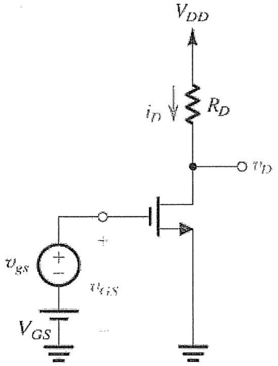
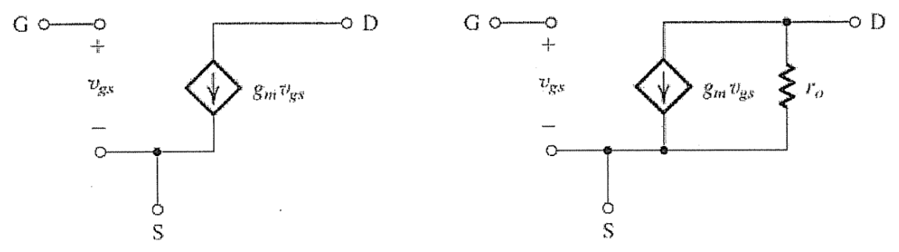
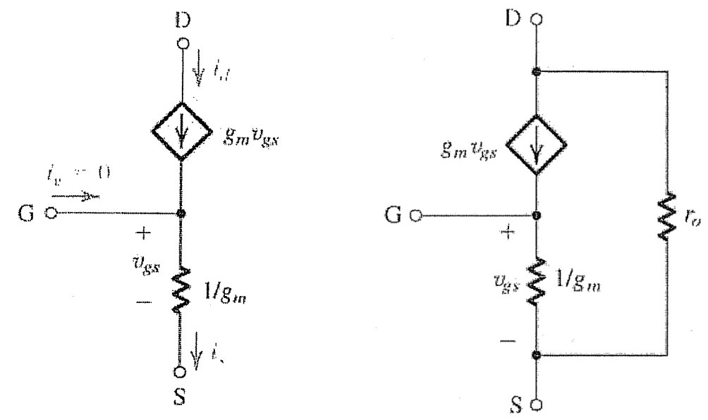

# Lecture 19, Nov 22, 2023

## Small Signal Models

* To model our amplifiers, we need 3 quantities: the voltage gain $A_V$, the input resistance/impedance $R_{IN}$ and the output resistance/impedance $R_{OUT}$; to get these quantities, we need a model of small signals
	* We will mix DC and AC signals, assuming that the AC component is small
* Notation: All DC signals are represented with capital letter subscripts
	* $V_{IN} + v_{in} \to V_{OUT} + v_{out} = V_{OUT} + A_Vv_{in}$
	* $V_{OUT}$ is a function of $V_{IN}$ only and $v_{out}$ is a function of $v_{in}$
	* Note that often we will drop the DC parts, so that we have $v_{in} \to v_{out} = A_Vv_{in}$, where $A_V$ is the voltage gain
* The amplifier quantities $A_V, R_{IN}, R_{OUT}$ are all functions of the DC bias point, but we assume that the DC bias point is fixed
	* This means we can solve for the 3 quantities first, and use any leftover adjustments to account for other quantities; note that often these quantities will already be overconstrained

{width=40%}

* We can thus eliminate any DC components in the circuit and consider the time-varying components only; e.g. we can eliminate DC voltage sources (including at $V_{DD}$ and $V_{SS}$)
* However the MOSFET model is nonlinear, so we must Taylor expand it and use an approximation
	* $i_D = \frac{1}{2}k_n'\frac{W}{L}\left((V_{GS} + v_{gs}) - V_T\right)^2$
	* Expanding this, we will get a DC component plus $k_n'\frac{W}{L}(V_{GS} - V_T)v_{gs}$
	* $g_m = k_n'\frac{W}{L}(V_{GS} - V_T)$ is the *MOSFET transconductance parameter*, so $i_d = g_mv_{gs}$
	* Generally we will have some target, which we can use to solve for $g_m$ and other parameters, and finally find the DC bias point using these parameters; we can also make other adjustments if we have more variables to work with

{width=80%}

* Now we can replace the MOSFET with an equivalent default model, once we have the transconductance parameter
	* The model on the left accounts for the small signal itself and is the simplest possible model
	* The model on the right also accounts for channel-length modulation
		* This is a constant small signal current that always flows regardless of the applied voltage
		* This portion of the current isn't proportional to $v_{gs}$; this comes from the inaccuracies in our model
	* The resistance can be found as $r_o = \frac{\abs{V_A}}{I_D}$; for drain currents in the milliamp range, this is often in the range of 10 to $\SI{100}{k\ohm}$
		* $I_D$ is the DC drain current; $V_A$ is a process parameter and is usually given (related to the MOSFET material properties)
	* The model on the right is more accurate, however we will often avoid using it, because usually it makes the analysis much more complicated without having too much effect

{width=60%}

* Using circuit transformations, we can get several equivalent models; the one shown above is the T-model
	* This model is often much easier for calculating input and output resistances, if we are looking into the source or drain
	* Note that even though there appears to be a path from gate to ground, there would still be no gate current, due to the current from the current source exactly equalling the current through the resistor
	* The diagram on the right also incorporates channel-length modulation, which usually makes the analysis much more complicated
* The following procedure can be used to remove the DC bias point and its associated effects, leaving us with only the small signal part
	1. Solve the circuit to determine the DC bias point/quiescent (Q) point and calculate $g_m, r_o$ for all MOSFETS
		* This is often given in most problems
	2. Replace the MOSFET with one of the previous models
	3. Replace all capacitors with a short, open, or constant impedance
		* This is because we usually assume an input of fixed frequency, so capacitors have constant impedances
		* Based on the relative size of the capacitor, we can decide which one to replace by; if the capacitor is sufficiently large, then it looks like a short circuit in AC; otherwise it may look like an open circuit or constant impedance
			* Usually coupling and bypass capacitors will be replaced by a short
			* There are some capacitances we don't have control of, e.g. the MOSFET parasitic capacitance; in this case we use an open circuit or constant impedance
		* In an exam scenario, it will normally be a short circuit
	4. Replace all DC constant voltage sources with short circuits (so that it effectively has a DC voltage of 0)
		* This means wherever we have a DC supply voltage, we will get a ground connection -- this includes $V_{SS}$ and $V_{DD}$
		* The only source of excitation is usually the MOSFET model itself
	5. Replace all DC constant current sources with open circuits (so that it effectively has a DC current of 0)
	6. Solve the resultant circuit to determine the gain, resistances, etc

