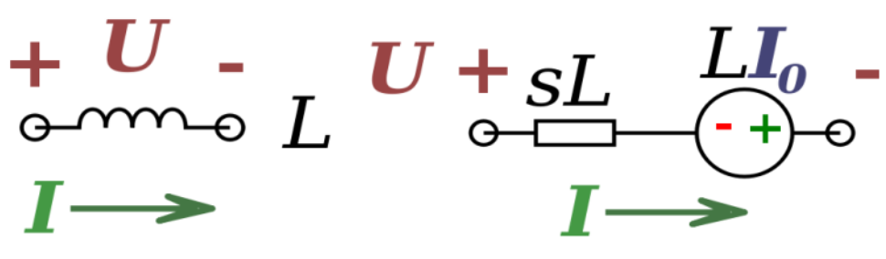
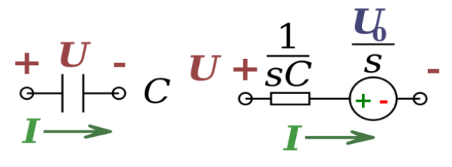
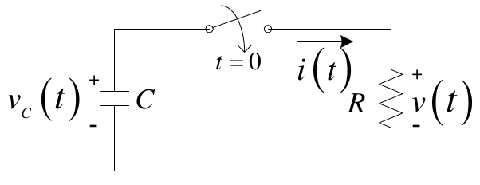
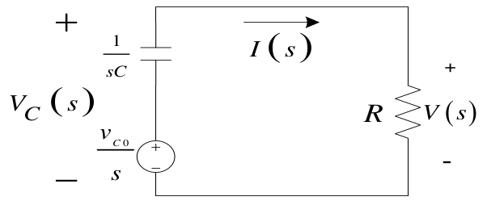

# Lecture 2, Sep 13, 2023

## Key Properties of the Laplace Transform

* The basic impulse function is given by $g(t) = \twocond{\lim _{t_0 \to 0} \frac{A}{t_0}}{0 < t < t_0}{0}{\text{elsewhere}}$
	* $\laplace{g(t)} = A$
* Multiply by $e^{-\alpha t}$ in time domain is a shift in frequency domain
	* $\laplace{e^{-\alpha t}f(t)} = F(s + \alpha)$
	* By shifting the signal in the frequency domain, we introduce an exponential decay in the signal -- this can be used to remove poles that we don't want to modify the steady-state behaviour
* A change of time scale in the time domain corresponds to a scaling in frequency domain
	* $\laplace{f\left(\frac{t}{a}\right)} = aF(as)$
	* This allows us to manipulate frequencies while keeping other important information such as phase intact
* Differentiation in time domain is equivalent to multiplication by $s$ in the frequency domain
	* $\laplace{\diff{}{t}f(t)} = sF(s) - f(0)$
	* Note that if there is an impulse at $t = 0$, two separate Laplace transforms must be used
	* This allows us to implement differentiation circuits
* Final value theorem: $\lim _{t \to \infty} f(t) = \lim _{s \to 0} sF(s)$
	* To find the steady-state behaviour for a stable, settling system, we can use this limit in the frequency domain, which is often much easier to evaluate
* Initial value theorem: $\lim _{t \to 0^+} f(t) = \lim _{s \to \infty} sF(s)$
	* This can be used to find the initial conditions, provided the limit exists in the Laplace domain
* Multiplication by $t$ in the time domain is differentiation in frequency domain:
	* $\laplace{t^nf(t)} = (-1)^n\diffn{n}{}{s}F(s)$
* Convolution in time domain is multiplication in Laplace domain:
	* $\laplace{f_1(t) * f_2(t)} = \laplace{\int _0^t f_1(t - \tau)f_2(\tau)\,\dd\tau} = F_1(s)F_2(s)$
	* This can be used to easily determine the output of a system given some input signal

## Circuits in Frequency Domain

* In frequency domain Ohm's law becomes $V(s) = I(s) \cdot Z$
	* The impedance $Z$ has both real and imaginary components, unlike in normal Ohm's law
* Resistors behave the same regardless of frequency, so $Z = R$ for resistors
* However capacitors and inductors behave differently depending on frequency

{width=30%}

* An inductor in frequency domain is separated into two parts: the impedance $Z = sL$ for the steady-state conditions, and another part that responds to initial conditions; when we analyze steady-state behaviour, we can ignore the second part
	* $v(t) = L\diff{i(t)}{t} \implies V(s) = sLI(s) - Li(0)$
	* Notice that for DC current, $s = j\omega = 0$ so the inductor becomes an open circuit in steady state
	* For higher frequencies, $s$ increases so the impedance also increases

{width=30%}

* A capacitor similarly has impedance $Z = \frac{1}{sC}$ and another part responding to initial conditions
	* $i(t) = C\diff{v(t)}{t} \implies I(s) = CsV(s) - CV(0) \implies V(s) = \frac{1}{sC}I(s) + \frac{1}{s}V(0)$
	* For DC current, the capacitor behaves as an open circuit (infinite impedance)
	* For higher frequencies, the impedance decreases
* Any calculations that we could do with Ohm's law in time domain, we can do in frequency domain with impedances
	* This applies to techniques such as nodal analysis, mesh current, etc
	* Crucially, superposition also holds

\noteSummary{To transform circuits into the frequency domain:
\begin{itemize}
	\item Resistor: $Z = R$
	\item Inductor: $Z = sL$ plus a source with voltage $V(s) = Li(0)$ for initial conditions
	\item Capacitor: $Z = \frac{1}{sC}$ plus a source with voltage $V(s) = \frac{v(0)}{s}$ for initial conditions
\end{itemize}}

{width=35%}

{width=35%}

* Example: consider the circuit above where the capacitor is charged to a voltage of $v_c = v_{c_0}$; the switch is closed at time $t = 0$; find the resistor voltage $v(t)$
	* First transform the circuit into frequency domain as shown above; note the capacitor transforms into two sources due to initial conditions
	* $\frac{v_{c_0}}{s} - I(s)\frac{1}{sC} - I(s)R = 0$
		* Note that we're looking for $V(s) = I(s)R$
		* $I(s)\left(R + \frac{1}{sC}\right) = \frac{v_{c_0}}{s} \implies I(s) = \frac{\frac{v_{c_0}}{s}}{R + \frac{1}{sC}} = \frac{\frac{1}{R}}{s + \frac{1}{RC}}v_{c_0}$
			* Tip: to save time, avoid merging terms or normalizing until the very end
			* To normalize, we should do it so that the highest power of $s$ in the dominator has a coefficient of 1
			* We can clearly see that there is a pole at $s = -\frac{1}{RC}$, corresponding to an exponential decay as we expected
		* Multiplying by $R$ we get $V(s) = \frac{1}{s + \frac{1}{RC}}v_{c_0}$ so $v(t) = u(t)v_{c_0}e^{-\frac{1}{RC}t}$

