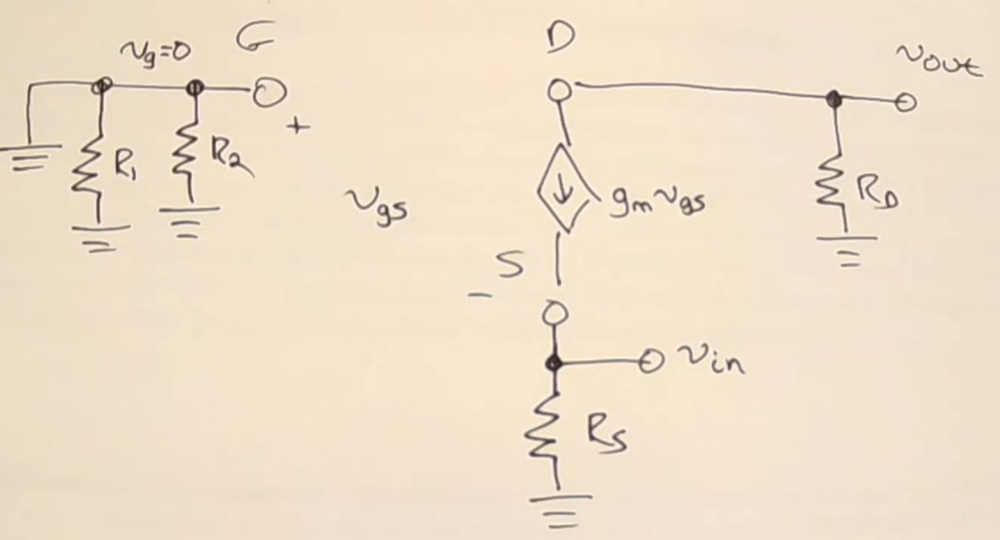
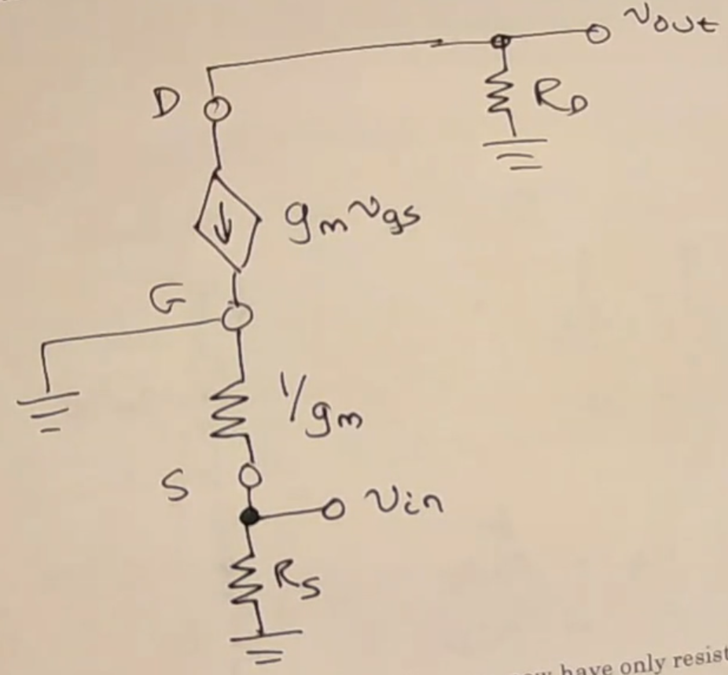
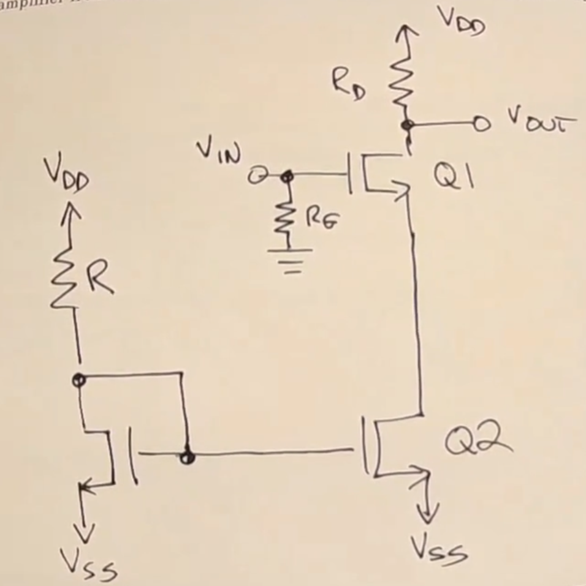
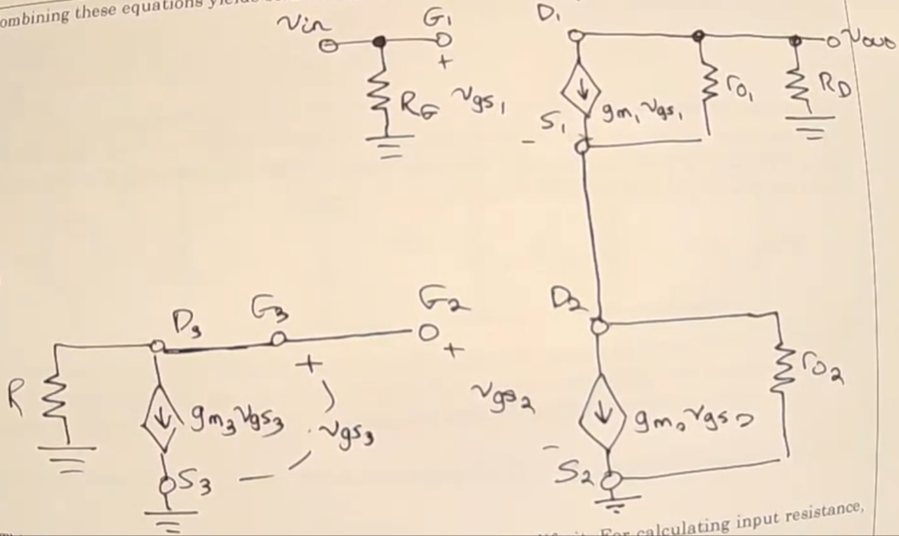
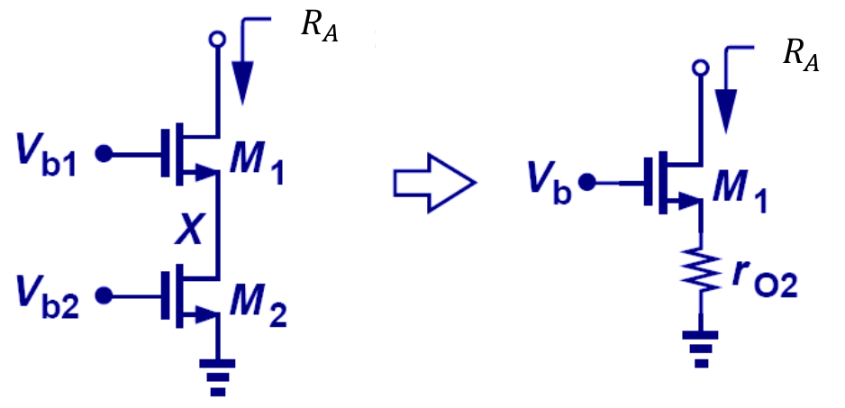

# Lecture 20, Nov 24, 2023

## Example: Common Source Amplifier

{width=90%}

{width=80%}

* Example: find the open circuit voltage gain, input resistance, and output resistance of the amplifier above
	* First transform the circuit:
		* Replace coupling capacitors$ $C_{C1}, C_{C2}$ and bypass capacitor $C_S$ with short circuits
		* Everything in the first circle is the driving input source; this is what gives us the time-varying signal, which gets driven through some finite output impedance
			* This is not a part of our amplifier, so quantities here should not appear in our solution
			* We define $v_{in}$ at the node right after this, between $R_{sig}$ and $C_{C1}$
		* The circle at the top right is the load, so like the input source, we also don't consider it as a part of our amplifier
		* Short circuit the voltage source at $V_{DD}$ and replace the current source with an open circuit
			* Notice that if we didn't have the bypass capacitor, the circuit would not work, because after removing the current source the source would be floating
		* Replace the MOSFET with the default model
	* We will start by calculating the open-circuit voltage gain; for this we assume no loading effects whatsoever
		* Later on we will account for loading effects externally, so for now we won't consider it
		* Start by writing a node equation at $v_{out}$ (the drain): $\frac{v_{out}}{R_D} + \frac{v_{out}}{r_0} + g_mv_{gs} = 0$
			* Note since we're calculating open loop gain, there's no current flowing in or out of the output
		* $v_{gs} = v_g - v_s = v_{in} - 0 = v_{in}$ so we have $\frac{v_{out}}{R_D} + \frac{v_{out}}{r_0} + g_mv_{in} = 0$ which we can now use to solve for $A_{v_0} = \frac{v_{out}}{v_{in}}$
		* This works out to $A_{v_0} = -g_m(r_0 \parallel R_D)$ or $-g_mR_D$ if ignoring channel length modulation
		* Note that since $g_m$ and $R_D$ are always positive, this is an inverting amplifier
	* Generally, common source amplifiers have high open-loop gain (more amplification) and high input resistance (loads input less), but generally high output resistance (susceptible to output loading)
		* These are often used near the input -- the large gain bumps the signal up from the noise floor and the high input resistance is good
	* Now find the input resistance $R_{in} = \frac{v_{in}}{i_{in}}$
		* For this circuit, it is trivial: $R_{in} = R_G$ since no current goes through the gate
		* We can simply take a large $R_G$ to increase the input resistance
			* $R_G$ is part of the DC bias point but not any of the other variables, so we can more or less take it to be anything we want
	* The output resistance is $R_{out} = \frac{v_{out}}{i_{out}}$
		* Note we need to assume some value for $v_{in}$ to do this calculation
		* We assume $v_{in} = 0$ to avoid double counting gain effects (i.e. we assume overall input voltage is constant)
		* If $v_{in} = 0, v_{gs} = 0$ so we get no current through the current source
		* Therefore the equivalent resistance is $r_0 \parallel R_D$ or $R_D$ without CLM
	* Notice that we need a high $R_D$ to get high open loop gain, but this raises the output resistance

## Amplifier Equivalent Models

{width=70%}

* The amplifier circuit we solved for above could be replaced by the equivalent model above, where the amplifier is in the middle; using this we can completely abstract away the amplifier
* The amplifier is replaced by $R_{in}$ to ground, the voltage source $A_{v_0}v_{in}$ and output resistance $R_{out}$
	* Notice that $R_{in}$ forms a voltage divider with $R_{sig}$ and $R_{out}$ with $R_L$
	* Both loading effects will reduce $A_{v_0}$; we only get this total gain with a zero $R_{sig}$ and infinite $R_L$
* Otherwise the actual gain is $A_{v_\text{total}} = \left(\frac{R_{in}}{R_{in} + R_{sig}}\right)A_{v_0}\left(\frac{R_L}{R_L + R_{out}}\right)$

## Example Amplifiers

{width=50%}

{width=70%}

{width=50%}

* Example: Find the same 3 quantities in the circuit above, ignoring channel length modulation
	* First transform the circuit
		* $R_L$ is part of the load and $R_i$ is part of the source, so both can be removed
		* Replace $C_1, C_2, C_3$ with short circuits, $V^+$ and $V^-$ to ground
		* Replace the MOSFET with the default model
	* Note that after shorting the capacitors, $v_g = 0$ so we can effectively ignore $R_1, R_2$
	* For $A_{v_0}$ we can write a node equation at $v_{out}$: $\frac{v_{out}}{R_D} + g_mv_{gs} = 0$
		* $v_{gs} = v_g - v_s = 0 - v_{in}$
		* Therefore $\frac{v_{out}}{R_D} - g_mv_{in} = 0$
		* $A_{v_0} = g_mR_D$
	* Notice that the open-loop gain is positive, so this is a non-inverting amplifier
	* Furthermore we can tweak $g_m$ and $R_D$ to potentially get a large open-loop gain
	* $R_{in}$ and $R_{out}$ are more complicated to solve due to the current source; we can redraw the circuit with the T-model to simplify things
	* With the T-model, we can easily tell that $R_{in} = R_S \parallel \frac{1}{gm}$
	* For $R_{out}$, with a $v_{in} = 0$ we have no current through the current source, so $R_{out} = R_D$

{width=70%}

{width=70%}

* Example: similar to the common source amplifier we solved before, but using a current mirror and no bypass capacitor
	* Note that this is not a proper amplifier, since we do not have a bypass capacitor
	* Normally this would not be solvable if we replaced the current mirror with a current source, but real world CLM effects provide a path for current
	* Use the same procedure to transform this circuit:
		* Replace $V_{DD}, V_{SS}$ with shorts to ground
		* Remove input source and load
	* Notice that $v_{gs_1}$ is a function of $v_{in}$, but $v_{gs_2}$ and $v_{gs_3}$ are not
		* The sources of both of these MOSFETs are grounded, and there is no path from $v_{in}$ to their gates
		* In this scenario, we can assume $v_{gs_2} = v_{gs_3} = 0$ to simplify the circuit
	* Now we can eliminate the current source from the second MOSFET, leaving us with only $r_{0_2}$, a large resistance to ground
	* This is equivalent to having a source resistor on the original MOSFET circuit
		* Source resistors usually act like localized negative feedback -- they reduce gain but improve some other parameters, such as lowering output resistance
		* However, unlike a normal source resistor, the CLM resistor is both hard to control and way too big
	* Write node equations:
		* At $v_{s_1}$ or $v_{D_2}$: $\frac{v_{s_1}}{r_{0_2}} + \frac{v_{s_1} - v_{out}}{r_{0_1}} - g_{m_1}v_{gs_1} = 0$
			* Note $v_{gs_1} = v_{in} - v_{s_1}$
		* At $v_{out}$: $\frac{v_{out}}{r_{0_1}} + \frac{v_{out} - v_{s_1}}{r_{0_1}} + g_{m_1}v_{gs_1} = 0$
		* Add the equations: $\frac{v_{s_1}}{r_{0_2}} + \frac{v_{out}}{r_{0_1}} = 0 \implies v_{s_1} = -\frac{r_{0_2}}{R_D}v_{out}$
		* Substitute into one of the equations, and $A_{v_0} = \frac{v_{out}}{v_{in}} = -\frac{g_{m_1}r_{0_1}R_D}{g_{m_1}r_{0_1}r_{0_2} + r_{0_1} + r_{0_2} + R_D}$
	* Sine the CLM resistances are high, this is approximately $\frac{R_D}{r_{0_2}}$
		* As expected, the negative feedback reduces the gain, approximately by dividing by the resistance value
		* However since $r_{0_2}$ is much bigger than $R_D$, we will have a gain much less than 1, so this is not practical
		* This is why source resistors are typically in the ohms or hundreds of ohms range
	* Input resistance is simply $R_G$, which has not changed
	* Recall that when calculating output resistance only, we assume an input voltage of zero to avoid double-counting gain effects
		* Assuming $v_{in} = 0$ gives us $v_{gs_1} = -v_{s_1}$, which is not necessarily zero
		* We can brute force this by using a test output current
		* However in this case we have a *cascode connection*, we can replace the entire thing with a single resistor to ground $R_A$
		* $R_A = (1 + g_{m_1}r_{0_1})r_{0_2} + r_{0_1} \approx g_{m_1}r_{0_1}r_{0_2}$
		* Therefore the output resistance is simply $R_A \parallel R_D$, but since $R_D$ is much smaller than $R_A$, the output resistance is still about $R_D$

{width=70%}

