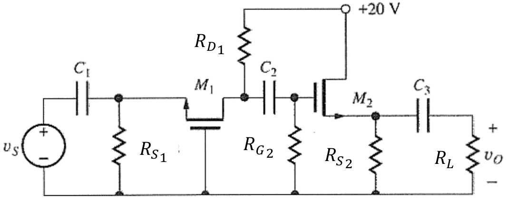
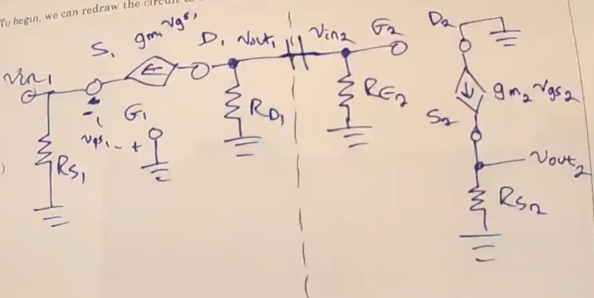

# Lecture 21, Nov 29, 2023

## Multi-Stage Amplifier Example

{width=70%}

{width=80%}

* Typically, for a multi-transistor amplifier, we can look at positions of the capacitors to draw dividing lines
	* Everything to the right of $C_1$ and the left of $C_3$ is the actual amplifier
	* $C_2$ divides the two individual amplifier stages
* Because we have a model for loading effects, we can analyze each stage separately
* The first stage is a common-gate amplifier, while the second stage is a common drain amplifier
* For a common-gate amplifier, as we have derived, $A_{v_{g_1}} = g_{m_1}R_{D_1}, R_{IN_1} = R_{S_1}\parallel \frac{1}{g_{m_1}}, R_{OUT_1} = R_{D_1}$
	* We can see that the standard results do not change if we draw this out in small signal domain
* For the common-drain amplifier:
	* Redraw the circuit using a T-model
	* For $R_{out}$:
		* Assuming $v_{in} = 0$, the gate is grounded
		* $R_{out} = R_{S_2} \parallel \frac{1}{g_{m_2}}$
		* Source resistors tend to be small (kilohms or smaller), but $\frac{1}{g_m}$ is usually in the range of ohms to tens of ohms, so the second term will dominate
		* This gives us an output resistance in the range of tens of ohms or smaller, which is good
	* For $R_{in}$, we simply have $R_{G_2}$, since no current flows into the gate
		* We can easily make $R_{in}$ relatively large
	* For $A_{v_0}$:
		* We can write a node equation at $v_{out_2}$
		* $\frac{v_{out_2}}{R_{S_2}} - g_{m_2}v_{gs_2} = 0$ where $v_{gs_2} = v_{in_2} - v_{out_2}$
		* $A_{v_0} = \frac{g_{m_2}R_{S_2}}{g_{m_2}R_{S_2} + 1}$
		* Note since typically $g_{m_2}R_{S_2} \gg 1$, the gain is close to unity; in fact, the gain cannot ever be greater than 1
	* This configuration is often called a source-follower -- typically, it follows the voltage at the source without amplification, but increases the available power that can be output
* The common-gate amplifier amplifies the voltage, while the common-drain amplifier amplifies the power
* Now we can solve for the input/output resistances and voltage gain for the whole circuit
	* $R_{in}$ for the whole circuit is simply $R_{in_1}$
	* $R_{out}$ for the whole circuit is simply $R_{out_2}$, assuming an input voltage of zero
	* We don't have information about the source and load, so we will find the open circuit gain $A_{v_0}$ for the whole circuit
	* $A_{v_0} = A_{v_{0_1}}A_{v_{0_2}}\frac{R_{in_2}}{R_{in_2} + R_{out_1}}$
	* In general, for multiple stages, the overall input resistance is the input resistance of the first stage; the overall output resistance is the output resistance of the last stage; the voltage gain is the product of all voltage gains, with a resistor divider between each pair of stages

