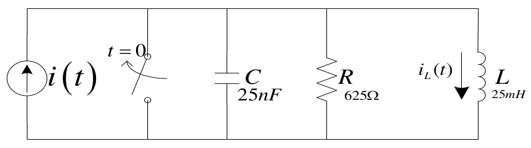
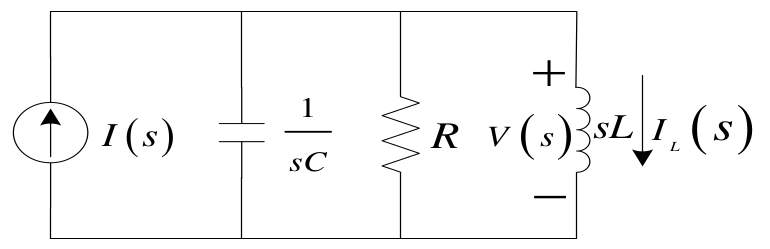
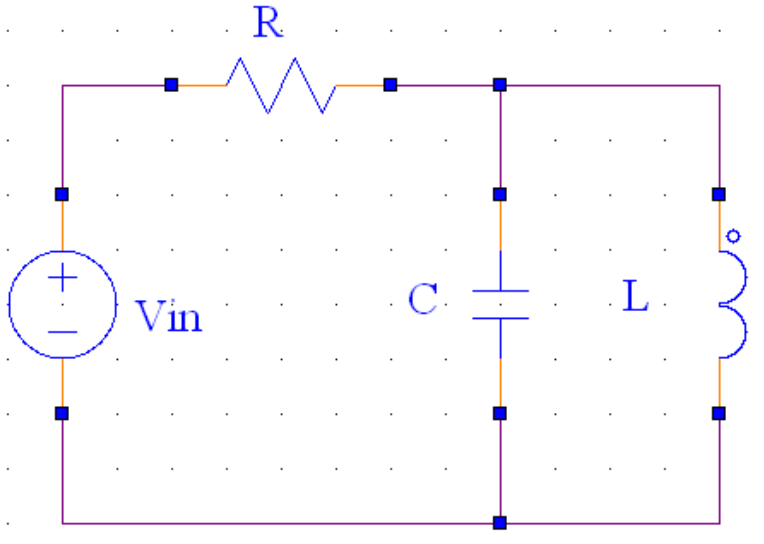

# Lecture 3, Sep 15, 2023

## Example: Solving For Steady-State Behaviour in the Frequency Domain

{width=50%}

{width=45%}

* Example: find the steady-state current through the inductor $i_L(t)$, given $i(t) = 24\si{mA}$ (DC) and no initial conditions
	* In the long term we expect all the current to go through the inductor; let's verify this
	* In the short term we expect the capacitor and inductor to cause oscillations
	* We will first solve for the voltage across the inductor using node voltage, making the bottom node the ground
		* $i(t) = 24u(t)[\si{mA}] \implies I(s) = \frac{0.024}{s}[\si{A}]$
		* $-I(s) + sCV(s) + RV(s) + \frac{V(s)}{sL} = 0 \implies V(s) = \frac{\frac{0.024}{s}}{sC + R + \frac{1}{sL}}$
		* Normalize: $\frac{\frac{0.024}{C}}{s^2 + \frac{1}{RC}s + \frac{1}{LC}}$
			* The $s^2$ in the denominator gives us two possible outcomes: two real-valued poles (two pure exponential decays) or a complex conjugate pair (decaying sinusoid)
	* $I(s) = \frac{V(s)}{sL} = \frac{\frac{0.024}{LC}}{s\left(s^2 + \frac{1}{RC}s + \frac{1}{LC}\right)}$
		* The additional $\frac{1}{s}$ this introduces would give us a unit step
		* The overall behaviour is a sudden increase at $t = 0$ with some small oscillations, which eventually decay to just a constant DC value
		* If we sub in the values we get: $\frac{\num{384e5}}{s(s + 32000 + 24000j)(s + 32000 - 24000j)}$
			* The 32000 is the rate of decay; the 24000 is the frequency of oscillation
	* To find the steady-state behaviour, we could inverse Laplace transform $I(s)$ and take the limit as $t \to \infty$, but it's much easier to use the Final Value Theorem and do it in the Laplace domain
		* $\lim _{t \to \infty} i(t) = \lim _{s \to 0} sI(s) = \lim _{s \to 0} \frac{\num{384e5}}{(s + 32000 + 24000j)(s + 32000 - 24000j)} = 0.024 [\si{A}]$
		* Note that we can only do this because all the poles of $I(s)$ have negative real parts, i.e. it trends towards a steady DC value
* Example: same problem as above, but the current source is now $i(t) = (0.024)\cos(40000t)$
	* At a fixed frequency, the impedance of the capacitor, resistor, and inductor all have fixed and finite impedances, so this behaves like 3 resistances in parallel; we would expect that the shape of the signal remains the same, but its amplitude decreases
	* $I(s) = \frac{0.024s}{s^2 + 40000^2}$
	* $-I(s) + sCV(s) + RV(s) + \frac{V(s)}{sL} = 0 \implies V(s)\left(sC + \frac{1}{R} + \frac{1}{sL}\right) = 0.024\frac{s}{s^2 + 40000^2}$
	* $V(s) = \frac{0.024}{C}\left(\frac{\cdots}{\left(s^2 + \frac{1}{RC}s + \frac{1}{LC}\right)(s^2 + 40000^2)}\right) = \frac{\cdots}{\left(s + 32000 \pm 24000j\right)(s \pm 40000j)}$
		* We have a combination of a sustained oscillation and a decaying oscillation
		* In the long term only the sustained oscillation will remain
	* What happens if we try to apply the FVT?
		* We end up with an $s^2$ in the numerator after cancelling terms, so the FVT tells us it is zero
		* However we know that the long-term behaviour is a sustained oscillation, not a DC zero
		* This does however tell us the DC offset, but it is misleading
	* To analyze this, we'll have to actually do the inverse Laplace transform
	* In reality, since the time constant is very large for the decaying oscillation, it will decay out in only half a cycle of the sustained oscillation, so its effect is barely noticeable

## Transfer Functions

\noteDefn{A \textit{transfer function} $H(s)$ in the frequency domain is the ratio of the output to input of a system in the Laplace domain: $$H(s) = \frac{Y(s)}{X(s)}$$ where $Y(s)$ is the output and $X(s)$ is the input in Laplace domain.}

* A transfer function captures the system's response to inputs, so if we have a transfer function, we can determine the system's response to any input
	* These can be derived from the circuit or measured by injecting a known signal
	* We can also go back from a transfer function to a practical circuit design
	* We can get the output by simply $Y(s) = H(s)X(s)$, which corresponds to a convolution in time domain
* We will restrict ourselves to circuits that are SISO (single-input, single-output); to work with MIMO systems, we need to use matrix notation
* We will also assume that $H(s)$ is time-invariant
* Crucially, if we have multiple circuits connected in series, the overall transfer function is just the product of all the individual transfer functions
	* This allows us to design circuits in blocks which drastically simplifies and speeds up design
	* Note that this assumes no loading effects!

\noteImportant{A \textit{loading effect} happens when the transfer function of the first circuit changes due to current drawn by the second circuit. This happens when the first circuit has finite output impedance and the second circuit has finite input impedance. When there are loading effects, we cannot simply multiply transfer functions.}

* Circuits made of regular passive components always have loading effects, but we can use op-amps to get rid of them
	* The ideal op-amp can drive any load, so it would have no loading effect at all

{width=40%}

* Example: find the transfer function of the circuit above, where the output $v_{out}(t)$ is taken from the top-right node
	* For the capacitor and inductor, $Z_{eq} = \frac{1}{\frac{1}{sL} + sC} = \frac{\frac{s}{C}}{s^2 + \frac{1}{LC}}$
	* Now we can treat it as a voltage divider, so $V_{out}(s) = V_{in}(s)\frac{Z_{eq}}{Z_{eq} + R}$
	* $H(s) = \frac{V_{out}(s)}{V_{in}(s)} = \frac{\frac{s}{RC}}{s^2 + \frac{1}{RC}s + \frac{1}{LC}}$
	* This circuit is a *band-pass filter* -- it passes only a narrow band of frequencies, and for frequencies higher or lower, it essentially eliminates them
	* What happens if the output was connected to another copy of the circuit?
		* We expect loading effects to happen since the circuit is made of only passive components
		* Let $V_x(s)$ be the voltage at the output of the first circuit
		* $\frac{V_x - V_{in}}{R_1} + \frac{V_x}{\frac{1}{sC_1}} + \frac{V_x}{sL_1} + \underbrace{\frac{V_x - V_{out}}{R_2}}_{\text{loading effect!}} = 0$
		* If we solve this and compare to what we get by multiplying transfer functions, we see that the $s^3$ and $s$ terms in the denominator are different

